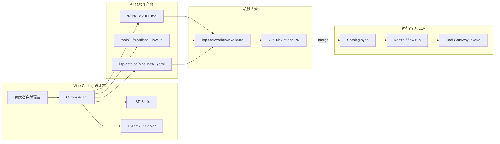

# IISP Agent 与 Vibe Coding 设计

> ⚠️ **已并入 [`IISP_DESIGN_FINAL.md`](./IISP_DESIGN_FINAL.md) Part VIII–X**。现行标准 v2.2：运行态 **仅 Kestra**；见 [`DOCS_INDEX.md`](./DOCS_INDEX.md)。

**版本**：v1.0（归档）  
**日期**：2026-06-09  
**状态**：归档 — 请阅读 **[`IISP_DESIGN_FINAL.md`](./IISP_DESIGN_FINAL.md)**

> Agent、MCP、Cursor Skills 的完整定稿见 **`docs/IISP_DESIGN_FINAL.md`** Part VIII–X。  
> 仓库内已落地：[`AGENTS.md`](../AGENTS.md)、[`.cursor/skills/`](../.cursor/skills/)、[`mcp/`](../mcp/)。

---

## 1. 核心原则（最简单的一条线）

```text
人描述意图 → AI 只产出「可校验文件」→ CLI/CI 校验 → Git PR → merge → Catalog sync → **Kestra** 运行（HTTP invoke）
```

| 原则 | 说明 |
|------|------|
| **Agent 在设计态，不在运行态** | 生产调度 **仅 Kestra**；`iisp flow run` 仅 dev dry-run |
| **AI 只写文件，不写平台内核** | 允许改：`skills/`、`tools/`、`iisp-catalog/pipelines/`；禁止改 Gateway、engine、scheduler |
| **契约先行** | 一切产出必须过 `iisp tool validate` / `iisp workflow validate` |
| **Cursor 即 IDE Agent** | 最简方案：**Cursor Skills + MCP**；可选后期加 Shell 对话页，共用同一套校验 API |
| **不另起编排 AI 引擎** | 编排「生成」= 生成 **Pipeline YAML** 进 Catalog，不是平台内新 DAG 引擎 |

---

## 2. 总体架构



**与 Windmill/Dify 的分工**：

| 产品 | 角色 | IISP 是否采用 |
|------|------|----------------|
| **Cursor + Skills + MCP** | 开发态 Agent，生成 Tool/Pipeline 文件 | ✅ **默认、最简** |
| **Dify**（可选） | 非开发用户对话生成 YAML 草稿 | 🔜 可选，产出仍进 Git PR |
| **运行时 LLM 编排** | 每步让模型决定调哪个 Tool | ❌ 不做 |

---

## 3. 两条 Vibe Coding 主路径

### 3.1 路径 A：新增工具（Vibe → Tool）

```text
1. 用户：「做一个按 SN 列表批量查 detail 表的工具」
2. Agent 读 Skill：iisp-create-tool（见 §6）
3. Agent 写 skills/<name>/SKILL.md（frontmatter + 输入输出）
4. Agent 执行：iisp tool init-from-skill → tools/<id>/
5. Agent 实现 tools/<id>/invoke.py + service.py（只调 lib/platform）
6. Agent 执行：iisp tool validate tools/<id>/tool.manifest.json
7. 人审 PR → 合并 → Registry 自动发现
```

**AI 不必理解** `workflow_engine` 或 Flask 路由；只需 **Tool Contract v1** + Manifest schema。

### 3.2 路径 B：新增编排（Vibe → Pipeline）

```text
1. 用户：「每天捞昨日 NG，查询后导出 COCO，等人上传后再归档并飞书通知」
2. Agent 读 Skill：iisp-compose-flow
3. Agent 调 MCP：list_tools → 仅选用 Registry 中存在的 tool_id
4. Agent 写 iisp-catalog/pipelines/<scene>/<flow_id>.yaml
5. Agent 执行：iisp workflow validate <path>
6. （可选）Agent 调 MCP：compile_kestra 或手写 pipelines/kestra/*.yaml
7. 人审 Catalog PR → sync → Edge cron 或 Hub Kestra 生效
```

**AI 产出的是 YAML 文件**，不是 Python 组合逻辑。

---

## 4. Agent 上下文包（给模型什么）

Agent 质量取决于**固定上下文**，平台需提供机器可读索引：

| 资源 | 路径 / API | 用途 |
|------|------------|------|
| 工具清单 | `GET /v1/tools` 或 MCP `list_tools` | 编排时只能引用已有 id |
| 工具 Schema | Manifest `params_schema` / OpenAPI | 填 Pipeline `params` |
| Pipeline 范例 | `iisp-catalog/pipelines/demo/welcome_flow.yaml` | Few-shot |
| 技能索引 | `iisp-catalog/skills-index.yaml` | 已有场景与 tool_id 映射 |
| 架构约束 | `ARCHITECTURE_FINAL.md` §5 解耦规则 | Cursor rule 引用 |
| 校验 CLI | `iisp tool validate` / `iisp workflow validate` | 生成后自检 |

**不**把整仓 `studio/` 源码塞给 Agent；只给 **OpenAPI + Manifest + 示例 YAML**。

---

## 5. MCP Server（最简 Agent 接口）

在 Platform Core 外挂一个轻量 **IISP MCP Server**（Python FastMCP 或 `@modelcontextprotocol/sdk`），与 Gateway 同进程或 sidecar。

### 5.1 建议首批 Tools（MCP）

| MCP Tool | 作用 |
|----------|------|
| `iisp_list_tools` | 返回 `[{id, label, params_schema, outputs}]` |
| `iisp_get_tool` | 单个 Manifest 详情 |
| `iisp_validate_manifest` | 校验 JSON / 路径 |
| `iisp_validate_pipeline` | 校验 YAML 字符串或路径 |
| `iisp_list_pipelines` | 读 catalog_cache 或仓内 pipelines |
| `iisp_init_tool_from_skill` | 包装 CLI init-from-skill |
| `iisp_catalog_sync` | 开发环境 sync（可选） |

**刻意不提供**（避免 Agent 绕过 PR）：

- 生产环境任意 `invoke` 写库（可只读 `invoke` 在 dev flag 下）
- 直接改 `config.json` / 数据库

### 5.2 配置

```text
.cursor/mcp.json  → 指向 iisp-mcp（本地 :5050/mcp 或 stdio 子进程）
```

贡献者 clone 仓后 Agent 即可列出工具、校验 Pipeline。

---

## 6. Cursor Skills（Vibe Coding 操作手册）

在仓库提供 **2 个必选 + 1 个可选** Skill（`.cursor/skills/` 或 `skills/.cursor/`）：

### 6.1 `iisp-create-tool`

触发：用户要新增工具、封装脚本、加 Capability。

**Agent 必须遵守**：

1. 先写 `SKILL.md`，再 `iisp tool init-from-skill`
2. `tool.manifest.json` 的 `id` 与 skill `name` 一致
3. `invoke.py` 只做参数映射，业务在 `service.py`
4. 禁止 import 其他 Tool 的 service
5. 完成后运行 `iisp tool validate`

### 6.2 `iisp-compose-flow`

触发：用户要编排、定时任务、组合查询/质检/归档。

**Agent 必须遵守**：

1. 逐步 `list_tools` 确认 `tool` 字段存在
2. 输出 Pipeline YAML schema（见 §7）
3. 用 `{{params.x}}` / `{{steps.<id>.outputs.y}}` 传参，禁止写 Python
4. 含人工步骤时，使用会返回 `waiting_human` 的 Tool，并在 YAML `notes` 标明 UI 路径
5. 完成后 `iisp workflow validate`

### 6.3 `iisp-review-pr`（可选）

触发：提交前检查解耦红线、是否误改 Platform Core。

---

## 7. Pipeline YAML 规范（Agent 输出格式）

Agent 生成编排时**必须**符合此结构（与 `orchestration/loader` 一致）：

```yaml
id: my_flow                    # 小写 snake，全局唯一
label: 人类可读名称
version: "1"
description: |                 # 可选，Agent 从用户原话摘要
  用户意图的一两句话

params_schema:                 # 与 Tool Manifest 同风格 JSON Schema
  type: object
  properties:
    time_window:
      type: object
  required: []

nodes:
  - id: query                  # 步骤 id，唯一
    tool: query                # 必须存在于 Registry
    params:
      strategy_id: daily_trawl
      time_window: "{{params.time_window}}"

  - id: export
    tool: curation-export
    params:
      task_id: "{{steps.query.outputs.task_id}}"

notes:                         # 可选，给人类运维
  - 人工上传 COCO 后调用 resume 或 Hub Kestra Pause
```

**校验规则**（`iisp workflow validate` 实现）：

- [ ] `id` / `nodes[].id` / `nodes[].tool` 命名合法  
- [ ] 每个 `tool` ∈ Registry  
- [ ] 模板引用的 `steps.*.outputs.*` 在上游 outputs 声明中存在（静态分析，能则做）  
- [ ] 无环（当前仅线性，后续 DAG 再扩展）  

---

## 8. CLI 扩展（Agent 闭环）

在现有 `scripts/iisp` 上增加：

```bash
# 已有
iisp tool init-from-skill skills/foo/SKILL.md --out tools/foo
iisp tool validate tools/foo/tool.manifest.json
iisp workflow validate iisp-catalog/pipelines/demo/welcome_flow.yaml

# 建议新增
iisp agent context --json          # 输出 tools 列表 + 范例路径，供 Agent 拉取
iisp workflow draft --describe "…" # 可选：调 LLM API 生成 YAML 到 stdout（CI 不用）
iisp workflow compile-kestra <yaml> # Hub：Pipeline DSL → Kestra YAML（可选）
```

**最简路径不需要 `workflow draft` 调 LLM**：Cursor 本身即 LLM，`draft` 仅给无 Cursor 的 Web 助手用。

---

## 9. 可选：Shell「Flow 助手」页（第二期）

若需 **非开发用户** Vibe 编排：

| 组件 | 实现 |
|------|------|
| UI | Shell `/flows/assistant` 简单 chat |
| 后端 | `POST /v1/agent/compose` → 调 OpenAI/本地模型 **structured output** → Pipeline YAML |
| 门禁 | 响应只进「草稿区」，用户点「校验」→ `validate` → 「提交 PR」走 Git API 或复制 YAML |

**与 Cursor 共用**：同一 `params_schema`、同一 `validate`、同一 Catalog PR 流程；**不**单独维护第二套编排逻辑。

可选接入 **Dify**：Dify 工作流输出 YAML → Webhook 开 PR；仍不进入运行态。

---

## 10. 安全与治理

| 项 | 做法 |
|----|------|
| 生产 invoke | Agent/MCP 默认只读；写操作仅 dev `IISP_AGENT_ALLOW_INVOKE=1` |
| 合并门禁 | PR 必过 `validate` + CODEOWNERS（Catalog 仓） |
| 幻觉 tool_id | validate 拒绝未注册 id |
| 敏感策略 | 策略 JSON 仍在 Catalog PR 审核，Agent 不直连生产 DB |
| 审计 | PR 即审计；可选记录 `skills-index.yaml` contributor |

---

## 11. 仓库布局（Agent 相关）

```text
DetForge-Studio/
├── .cursor/
│   ├── mcp.json                 # MCP 配置
│   └── skills/
│       ├── iisp-create-tool/SKILL.md
│       └── iisp-compose-flow/SKILL.md
├── AGENTS.md                    # 贡献者 Agent 红线（指向 ARCHITECTURE_FINAL）
├── mcp/
│   └── iisp_server.py           # MCP Server 实现
├── skills/                      # 业务场景 SKILL（L1）
├── tools/                       # Vibe 产出 Tool 包（L2）
├── iisp-catalog/
│   ├── pipelines/               # Vibe 产出 Flow（L3）
│   └── skills-index.yaml
└── docs/openapi/tools-v1.yaml   # Agent 读契约
```

---

## 12. 实施顺序（最简 MVP）

| 步骤 | 交付 | 工作量 |
|------|------|--------|
| **A1** | `AGENTS.md` + 两个 Cursor Skill 文档 | 0.5d |
| **A2** | `iisp agent context --json` | 0.5d |
| **A3** | 加强 `iisp workflow validate`（tool 存在性） | 1d |
| **A4** | MCP Server 4 工具：list_tools、validate_pipeline、validate_manifest、init-from-skill | 2d |
| **A5** | 文档示例：用 Cursor 从零 vibe 一个 demo Tool + demo Flow | 0.5d |
| **A6**（可选） | Shell Flow 助手或 Dify 草稿 | 3d+ |

**A1–A5 即可支撑「全员 Vibe Coding」**；A6 仅服务不会用 Cursor 的运维。

---

## 13. 与现有文档关系

| 文档 | 关系 |
|------|------|
| [`ARCHITECTURE_FINAL.md`](./ARCHITECTURE_FINAL.md) | 运行态边界；Agent 不得突破 §5 解耦 |
| [`SKILL_TO_TOOL.md`](./SKILL_TO_TOOL.md) | 路径 A 细节 |
| [`TOOLBOX_ORCHESTRATION.md`](./TOOLBOX_ORCHESTRATION.md) | Tool Contract、Kestra 集成 |
| [`UI_REDESIGN_CHECKLIST.md`](./UI_REDESIGN_CHECKLIST.md) | Flow 助手 UI 可挂 U3 流水线页 |

---

## 14. 成功标准

1. 新人 **只开 Cursor**，用自然语言完成 **1 个 Tool + 1 条 Pipeline**，无需改 Platform Core。  
2. 错误 tool_id / 非法 YAML **100% 被 validate 拦截**，进不了 main。  
3. 生产运行时 **零 LLM 依赖**，编排行为与手写 YAML 一致。  
4. Agent 上下文 **< 50k tokens**（OpenAPI + 工具列表 + 2 个范例），可重复、可缓存。

---

## 15. 修订记录

| 版本 | 日期 | 说明 |
|------|------|------|
| v1.0 | 2026-06-09 | 首版：设计态 Agent、Cursor+MCP、双 Vibe 路径 |
