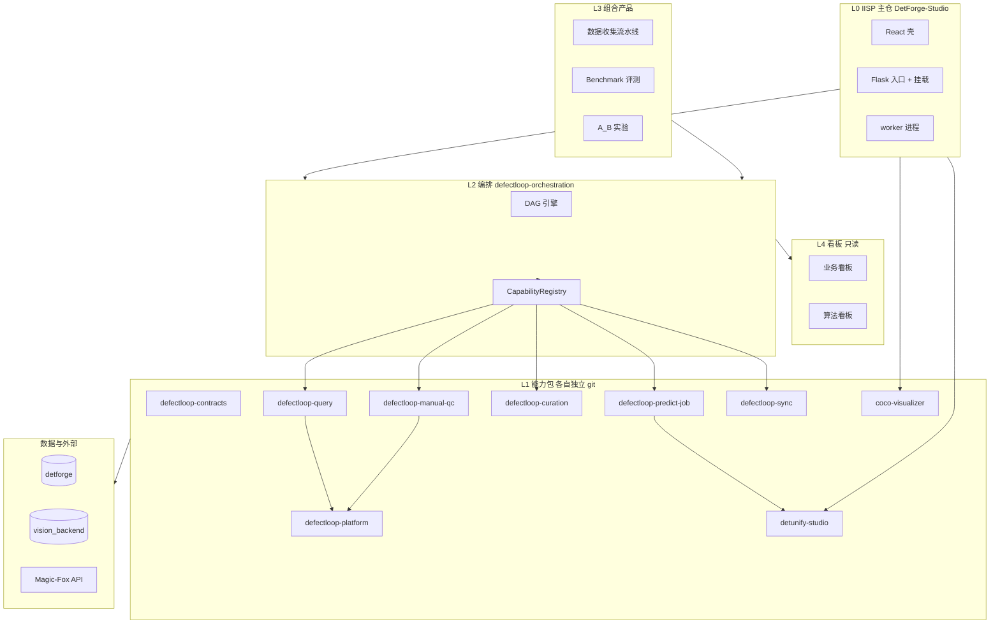
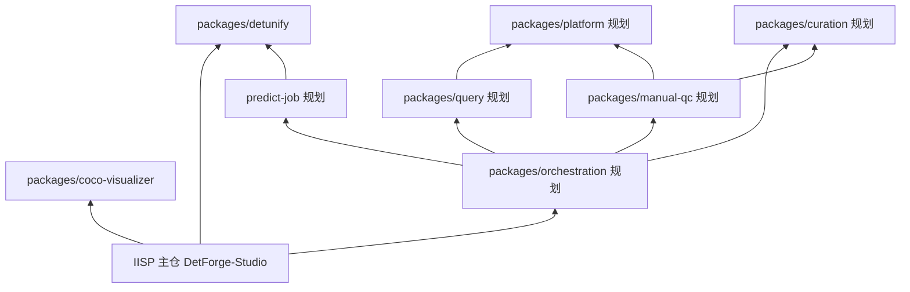
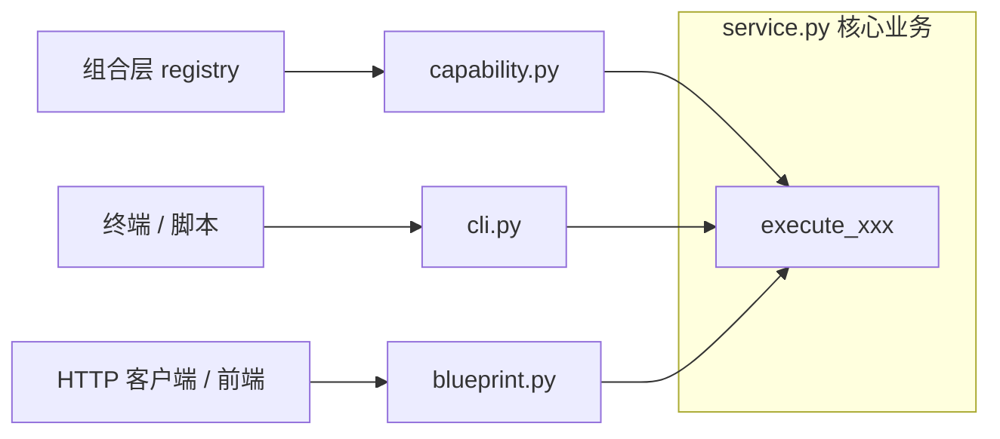
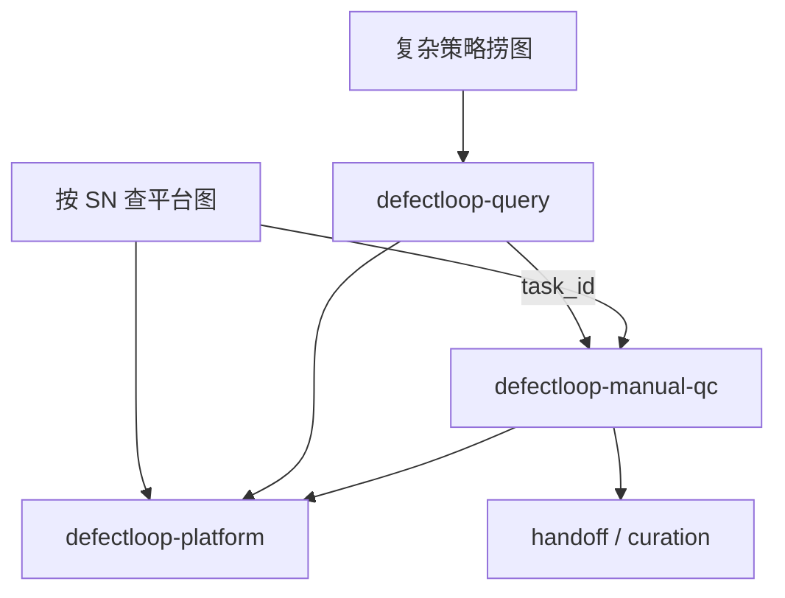
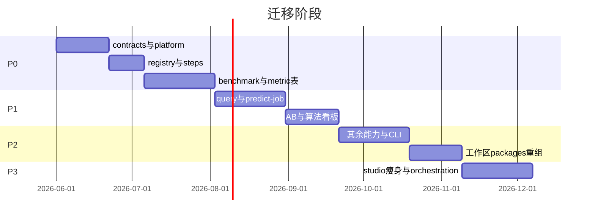

# IISP 可拆解架构设计（完整版）

**IISP** = **I**ndustrial **I**nspection **S**olutions **P**latform（工业检测解决方案平台）

**版本**：v0.4  
**状态**：设计评审稿 + 子模块集成已启动；**编排定稿：Kestra + Tool Contract v1**（见 [TOOLBOX_ORCHESTRATION.md](./TOOLBOX_ORCHESTRATION.md)）  
**关联**：[用户使用手册](./USER_GUIDE.md) · [工具箱与编排](./TOOLBOX_ORCHESTRATION.md) · [packages/README](../packages/README.md) · [数据闭环建设方案评审](https://zcnce50wan15.feishu.cn/wiki/H7RQwspDKiqDsPkFJu0cgIaFnuB) · [Benchmark 方法论](https://zcnce50wan15.feishu.cn/wiki/WD4Pwu5eWipfJPk0snGcY6RTnTg)

---

## 目录

1. [背景与目标](#1-背景与目标)
2. [现状：谁能单独起服务](#2-现状谁能单独起服务)
3. [总体架构](#3-总体架构)
4. [多仓库工作区](#4-多仓库工作区)
5. [Capability 接口契约](#5-capability-接口契约)
6. [三种入口：Capability / CLI / Blueprint](#6-三种入口capability--cli--blueprint)
7. [共享平台层（query ↔ manual-qc）](#7-共享平台层query--manual-qc)
8. [子模块拆解形态](#8-子模块拆解形态)
9. [组合层设计](#9-组合层设计)
10. [三类组合产品](#10-三类组合产品)
11. [数据模型](#11-数据模型)
12. [信息架构](#12-信息架构)
13. [迁移路线与风险](#13-迁移路线与风险)
14. [附录：现状→目标映射表](#14-附录现状目标映射表)

---

## 1. 背景与目标

### 1.1 背景

**IISP** 面向工业检测**解决方案**与数据闭环：平台库查询筛选、Magic-Fox 训练平台同步、DetUnify 在线/批量预测、人工质检、筛选归档、COCO/CSV 导出、评测流水线与看板。

**整个产品即本仓库**（历史目录名 `DetForge-Studio`）：**Flask + React SPA**（`:5050`）。子能力放在 **`packages/`** 下，以 **Git Submodule** 分别管理；主仓 `studio/` 承载尚未独立 git 的模块，逐步迁入 `packages/`。

组合能力**现状**仍由 [`workflow_engine.py`](../studio/forge/workflow_engine.py) 串联；**目标**为 **[Kestra](https://github.com/kestra-io/kestra) 主编排** + **IISP Tool Gateway**（`POST /v1/tools/{id}/invoke`），工具侧经 **Capability 注册表** 固化入参/出参，不再扩展自研 DAG 引擎（详见 [TOOLBOX_ORCHESTRATION.md](./TOOLBOX_ORCHESTRATION.md)）。

产品体系见飞书 [数据闭环建设方案评审](https://zcnce50wan15.feishu.cn/wiki/H7RQwspDKiqDsPkFJu0cgIaFnuB)：子模块 + 组合模块（收集策略、评测、A/B、看板）。

### 1.2 设计目标

| 目标 | 说明 |
|------|------|
| **单仓产品** | `DetForge-Studio` = IISP 全部代码的根；无外层多仓组装 |
| **子模块 git 分治** | `packages/<name>` 各自 submodule，独立仓库、独立发版 |
| **子模块可拆解** | 每个能力可 CLI、Blueprint 单独起服务 |
| **接口化交互** | 只传 `task_id` / `job_id` / `batch_id` / `coco_uri` / `metrics` |
| **共享不耦合** | 查询与质检共用 **`packages/platform`**（规划） |
| **组合层薄** | 外部 **Kestra** 编排 + IISP **Tool Contract v1** |
| **三类组合产品** | 数据收集、评测（Benchmark / A/B）、综合看板 |

### 1.3 设计原则（代码评审红线）

1. 编排侧（Kestra）只通过 **`POST /v1/tools/{id}/invoke`** 调用工具；进程内实现经 **`registry.execute`**，禁止编排 Flow 写 Python import。
2. 跨模块只传可序列化契约，禁止传 DataFrame 等 Python 对象。
3. 子模块禁止互相 import 业务实现；共用逻辑在 **`platform`** 共享包。
4. 数据库经 **`ServiceLocator`** 注入。
5. 看图、预测在 **`packages/coco-visualizer`、`packages/detunify`**（submodule），主仓通过挂载与路径解析集成。

### 1.4 架构选型（已确认）

| 维度 | 选型 | 说明 |
|------|------|------|
| 产品英文名 | **IISP** | Industrial Inspection Solutions Platform |
| **工作流编排** | **Kestra**（外部） | Flow 存 `iisp-catalog/pipelines/kestra/`；人工卡点用 Pause/Webhook |
| **工具调用** | **Tool Contract v1** | 统一 JSON invoke；Manifest 声明 inputs/outputs |
| 运行时解耦 | **Gateway + Registry** | HTTP/CLI/MCP 同源契约；Capability 为进程内实现 |
| Git 边界 | **单仓 + packages submodule** | 主仓 `DetForge-Studio`，子能力独立 git |
| 配置目录 | **iisp-catalog** | strategies + Kestra Flow + tool-pins |
| 路径解析 | **`studio/paths.py`** | `packages/*` → 发行包 `tools/*` → 历史 sibling |
| 旁路（可选） | n8n / Dify | 通知与 YAML 草稿，非主编排 |

---

## 2. 现状：谁能单独起服务

> 本节描述**当前代码**能力，与目标设计对比。

| 模块 | 能否单独起服务 | 现状入口 | 端口 |
|------|----------------|----------|------|
| **COCOVisualizer** | **可以** | `python app.py` / `coco-viz` | 6010 |
| **DetUnify-Studio** | **可以** | `python app.py`（`app/` 目录） | 6006 |
| **DetUnify 批量预测** | 半独立 | `scripts/predict_job_worker.py` 子进程 | — |
| **IISP 平台整体** | **可以** | `python app.py` | 5050（含全部 API + 前端） |
| **worker** | 半独立 | `python worker.py` | 通用作业进程，非按模块拆分 |
| **数据查询** | **不可以** | 路由在 `server/routes/api.py` | 必须跟 5050 |
| **人工质检** | **不可以** | 路由在 `server/routes/forge.py` | 必须跟 5050 |
| **筛选归档 / 同步 / 工作流** | **不可以** | 同上 | 必须跟 5050 |

**典型部署形态（现状）**：

```
用户只开 :5050
  ├ 查询 / 质检 / 归档 / 工作流 …（内嵌）
  ├ 挂载 /viz  → COCOVisualizer（也可单独 :6010）
  └ 挂载 /unify → DetUnify（也可单独 :6006）
```

**目标**：除 viz、unify 外，查询、质检、归档等也具备 **CLI + Blueprint + 独立小服务** 三件套；组合层通过 Capability 编排，不再 `import studio.query...`。

**已知重复实现（待收敛到共享层）**：

- 质检 [`forge_manual_qc.py`](../studio/forge/forge_manual_qc.py) 自实现 SN 查询 SQL、`img_path` 解析
- 查询 [`server/core.py`](../server/core.py) 的 `apply_img_paths` 逻辑与之重叠但未复用

---

## 3. 总体架构

### 3.1 分层图



### 3.2 分层职责

| 层 | 仓库/包 | 职责 | 用户可见 |
|----|---------|------|----------|
| **主仓** | `DetForge-Studio`（IISP） | UI、配置、路由、挂载、worker、`studio/` 能力 | `:5050` |
| **packages** | git submodule | coco-visualizer、detunify（已集成）；其余规划中 | 可独立端口 |
| **组合层** | `defectloop-orchestration` | DAG、流水线产品、调度、看板聚合 | 闭环产品页 / CLI |
| **能力包** | 各 `defectloop-*` + viz + unify | 原子能力 | 工具箱 / 独立服务 |
| **共享库** | `defectloop-contracts` + `defectloop-platform` | 契约类型、平台库访问 | 不直接面向用户 |
| **看板** | orchestration/dashboard | 只读 `metric_snapshot` | 综合看板 |

### 3.3 与数据闭环三大体系对齐

| 飞书体系 | 架构落点 |
|----------|----------|
| **标准体系** | `benchmark_registry`、策略/验收配置、`StandardProfile`（后续） |
| **状态体系** | `detforge` 写库 + `vision_backend` 读库 + `Artifact` 溯源链 |
| **迭代体系** | 组合产品 + `metric_snapshot` + 筛选归档 handoff |
| **工具化承载** | L1 能力包 + Capability/CLI/Blueprint |
| **知识化沉淀** | Playbook（后续）；策略 JSON、流水线模板 |

---

## 4. IISP 单仓与 packages 子模块

### 4.1 仓库模型

**一个产品仓库** = `DetForge-Studio`（IISP）。所有子能力在仓内 **`packages/`** 以 **Git Submodule** 分别管理；主仓保留 `server/`、`frontend/`、`studio/`、`worker.py`。

| packages 目录 | git 仓库 | 状态 | 单独使用 |
|---------------|----------|------|----------|
| **`coco-visualizer/`** | algo-boost/COCOVisualizer | **已集成** | `python app.py` → :6010 |
| **`detunify/`** | algo-boost/DetUnify-Studio | **已集成** | `app/app.py` → :6006 |
| `platform/` | （规划，新建 repo） | 待拆 | pip 库，query↔qc 共用 |
| `query/` | （规划） | 在 `studio/query` | CLI + Blueprint |
| `curation/` | （规划） | 在 `studio/curation` + `export` | CLI + Blueprint |
| `manual-qc/` | （规划） | 在 `forge_manual_qc` | CLI + Blueprint |
| `predict-job/` | （规划） | 在 `forge_predict` | CLI；推理用 detunify |
| `sync/` | （规划） | 在 `studio/sync` | CLI |
| `orchestration/` | （规划） | 在 `workflow_*` | 组合层 |
| `contracts/` | （规划） | 新建 | Capability 契约 |

`.gitmodules`（主仓根目录）示例（已生效）：

```ini
[submodule "packages/coco-visualizer"]
	path = packages/coco-visualizer
	url = git@github.com:algo-boost/COCOVisualizer.git
[submodule "packages/detunify"]
	path = packages/detunify
	url = git@github.com:algo-boost/DetUnify-Studio.git
```

初始化：`git submodule update --init --recursive` 或 `./scripts/bootstrap-submodules.sh`。

### 4.2 目录结构

```
DetForge-Studio/                    # IISP 主仓库
├── app.py                          # 平台入口 :5050
├── worker.py
├── .gitmodules
├── packages/                       # git submodule 子模块
│   ├── README.md
│   ├── coco-visualizer/            # submodule ✓
│   └── detunify/                   # submodule ✓
├── server/                         # Flask 组装、/viz /unify 挂载
├── studio/                         # 主仓能力（逐步迁入 packages/）
│   ├── query/ flow/ curation/ export/ sync/ forge/
│   └── paths.py                    # 解析 packages/* 路径
├── frontend/
├── strategies/
└── docs/
```

路径解析（[`studio/paths.py`](../studio/paths.py)）：优先 `packages/coco-visualizer`、`packages/detunify`，兼容发行包 `tools/COCOVisualizer` 与历史 `../COCOVisualizer` sibling。

### 4.3 依赖关系（禁止循环）



- **允许**：`manual-qc` → `platform`；`query` → `platform`
- **允许**：`manual-qc` → `curation`（handoff，现状已有）
- **禁止**：`manual-qc` → `query.strategy_executor`
- **推荐**：组合层 `query` 步 → `manual_qc` 步，中间只传 `task_id` / `batch_id`

### 4.4 COCOVisualizer / DetUnify 集成模式

| 模式 | COCOVisualizer | DetUnify-Studio |
|------|----------------|-----------------|
| **独立运行** | `coco-viz` → `:6010` | `app/app.py` → `:6006` |
| **嵌入 Studio** | Flask 挂 `/viz` | Flask 挂 `/unify` |
| **组合层** | `VizOpenCapability` → HTTP bridge | `PredictCapability` → 子进程 worker |
| **仓库** | `packages/coco-visualizer` submodule | `packages/detunify` submodule |

`defectloop-predict-job` 与 `detunify-studio` 边界：

- **DetUnify**：模型加载、逐图推理、临时上传对比 UI
- **predict-job**：`detforge.job` 队列、写 `predict_result`、与 Studio worker 集成

### 4.5 版本与发布

| 场景 | 做法 |
|------|------|
| 克隆 | `git clone --recursive` 或 `git submodule update --init --recursive` |
| 更新子模块 | `git submodule update --remote packages/coco-visualizer` |
| 发版 | IISP 主仓 tag + 各 submodule 指向固定 commit |
| CI | 主仓 pytest/e2e；子模块仓库各自 CI |

---

## 5. Capability 接口契约

### 5.1 核心类型

```python
# defectloop-contracts（或 studio/capabilities/base.py 迁移期）

from dataclasses import dataclass, field
from typing import Protocol


@dataclass
class Artifact:
    kind: str       # coco | csv | dir | report | metric | zip
    uri: str        # 逻辑 URI，如 exports/<task_id>/result.csv
    meta: dict = field(default_factory=dict)


@dataclass
class CapabilitySpec:
    id: str
    label: str
    description: str = ""
    params_schema: dict = field(default_factory=dict)
    required_inputs: list[str] = field(default_factory=list)
    output_keys: list[str] = field(default_factory=list)


@dataclass
class RunContext:
    run_id: str | None
    step_id: str | None
    params: dict
    inputs: dict                              # 上游 steps.outputs 聚合
    services: "ServiceLocator"


@dataclass
class CapabilityResult:
    status: str                               # done | skipped | waiting_human | failed
    outputs: dict = field(default_factory=dict)
    artifacts: list[Artifact] = field(default_factory=list)
    reason: str | None = None


class Capability(Protocol):
    id: str
    def describe(self) -> CapabilitySpec: ...
    def execute(self, ctx: RunContext) -> CapabilityResult: ...
    def preview(self, ctx: RunContext) -> CapabilityResult | None: ...
```

### 5.2 状态机对齐

与 [`workflow_engine.py`](../studio/forge/workflow_engine.py) `advance_run` 一致：

| status | 引擎行为 |
|--------|----------|
| `done` | step done，合并 outputs 到 `run.context.steps` |
| `skipped` | step skipped，分支传播 |
| `waiting_human` | 等待 `resume_run` |
| `failed` | 运行失败，通知 |

### 5.3 ServiceLocator

```python
class ServiceLocator:
    def db(self) -> "ForgeDbPort": ...
    def config(self) -> dict: ...
    def paths(self) -> "PathsPort": ...
    def platform(self) -> "PlatformPort": ...   # 封装 defectloop-platform
    def logger(self): ...
```

### 5.4 跨模块数据契约

| 键名 | 产出 | 消费 |
|------|------|------|
| `task_id` | query | predict, curation, export, viz |
| `job_id` | predict-job | query（predict_result）、dashboard |
| `batch_id` | curation | curation 后续、gate_human |
| `batch_code` | curation | handoff、看板 |
| `coco_uri` | curation, export | viz_client |
| `metrics` | eval | metric_snapshot, dashboard |
| `benchmark_id` | benchmark | ab_test, dashboard |

### 5.5 ModelRef（预测统一抽象）

```python
ModelRef = (
    {"kind": "local_registry", "model_id": int}
    | {"kind": "deployed", "approach_id": int, "deploy_id": int}
    | {"kind": "platform_train", "project_id": int, "train_model_id": int}
)
```

`PredictCapability` 内部分发至 DetUnify 子进程或 Magic-Fox API。

---

## 6. 三种入口：Capability / CLI / Blueprint

每个 L1 能力包提供**三种入口**，共用同一套 `service.py` 业务逻辑：



| 入口 | 谁用 | 典型场景 | 单独起服务 |
|------|------|----------|------------|
| **Capability** | 编排引擎 | 流水线自动串联 | 否（被 registry 调用） |
| **CLI** | 人 / 脚本 / CI | `defectloop-query run --strategy daily_trawl` | 是（无 Web） |
| **Blueprint** | 前端 / 其他服务 | `POST /api/query` | 是（小 Flask `:505x`） |

**目标示例**：

```bash
# CLI：仅查询
python -m defectloop_query.cli --strategy daily_trawl --time-preset yesterday

# CLI：仅质检 SN 查找
python -m defectloop_manual_qc.cli lookup --sn ABC123

# Blueprint：仅查询 API（独立小服务）
python -m defectloop_query.app --port 5051

# 完整产品：组装壳注册全部 Blueprint + 前端
cd packages/defectloop-studio && python app.py   # :5050
```

COCOVisualizer / DetUnify 更偏「**独立小应用 + WSGI 挂载**」，不一定是 Blueprint 形态，但同样满足「可单独起服务」。

---

## 7. 共享平台层（query ↔ manual-qc）

### 7.1 问题

人工质检需要按 SN 查 `product_detection_detail_result`、解析 `img_path`——与查询子模块读平台库的需求重叠。现状在 [`forge_manual_qc.py`](../studio/forge/forge_manual_qc.py) 与 [`server/core.py`](../server/core.py) **各写一套**，未复用。

### 7.2 原则

| 质检需要什么 | 用什么 | 不用什么 |
|--------------|--------|----------|
| 按 SN 查平台图 | `defectloop-platform.detail_repo` | 整个 `QueryCapability` |
| 复杂策略捞一批再质检 | 组合层先 `query` → 传 `task_id` | `import strategy_executor` |
| 客户图、复核、写 manual_qc | `defectloop-manual-qc` 独有 | — |
| 策略 + Flow + 采样 + task | `defectloop-query` 独有 | — |

### 7.3 defectloop-platform 内容

| 模块 | 职责 | 收敛来源 |
|------|------|----------|
| `platform.db` | `vision_backend` 连接 | `server/core.get_db_client` |
| `platform.image_paths` | `resolve_img_path(row)` | 合并 `_resolve_detail_img_path` 与 `apply_img_paths` |
| `platform.detail_repo` | `find_by_sn`、`find_by_id`、时段明细查询 | `forge_manual_qc._DETAIL_SELECT` |
| `platform.categories` | 缺陷类别 | `studio/query/defect_categories.py` |

```python
# 目标用法（质检）
from defectloop_platform.detail_repo import find_by_sn

records = find_by_sn(sn, limit=50)   # 已含 img_path

# 目标用法（查询）
from defectloop_platform.db import get_platform_client
# 查询模块在此基础上做 DataFrame、策略、筛选
```

### 7.4 场景分流



---

## 8. 子模块拆解形态

### 8.1 能力包内部结构（统一模板）

```
defectloop-<name>/
  pyproject.toml
  <name>/
    service.py        # 核心业务（单实现）
    capability.py     # Capability 入口
    cli.py
    blueprint.py      # 可选 app.py 起独立服务
    api.py            # 对外稳定函数（供其他包调用时仅 import api）
  tests/
```

### 8.2 各包职责摘要

| 包 | Capability id | 核心产出 |
|----|---------------|----------|
| defectloop-query | `query` | `task_id`, `result.csv`, coco |
| defectloop-predict-job | `predict` | `job_id`, `predict_result` |
| defectloop-curation | `curation_*` | `batch_id`, 出站包, handoff |
| defectloop-manual-qc | `manual_qc` | `manual_qc` 记录, 导出目录 |
| defectloop-sync | `sync` | 本地 `datasets/`, sync job |
| defectloop-viz-client | `viz_open` | 看图 session URL |
| coco-visualizer | —（独立应用） | COCO 浏览/改标注 |
| detunify-studio | —（独立应用） | 推理、临时对比 |

### 8.3 IISP 主仓（`server/` + `frontend/` + `studio/`）

保留：

- `frontend/` React SPA
- `server/factory.py`、SPA 路由、viz/unify 挂载
- `config.json`、设置页、`worker.py` 入口
- 启动时 `registry.register(...)` 聚合各包 Blueprint

迁出：

- `studio/query`、`curation`、`sync`、`forge/workflow_*`、`forge_manual_qc` 等至对应包

---

## 9. 组合层设计

> **v0.4 定稿**：主编排使用 **Kestra**；IISP 提供 **Tool Gateway**。完整说明见 [TOOLBOX_ORCHESTRATION.md](./TOOLBOX_ORCHESTRATION.md)。

### 9.1 编排引擎（Kestra + 过渡期自研）

| 组件 | 角色 | 状态 |
|------|------|------|
| **[Kestra](https://kestra.io)** | 生产环境唯一主编排：调度、Cron、Pause、重试 | 待部署 M2 |
| **Tool Gateway** | `POST /v1/tools/{id}/invoke`，契约 v1 | 待实施 M1 |
| [`workflow_engine.py`](../studio/forge/workflow_engine.py) | 遗留 DAG；与 Kestra 双轨至 M3 后只读/下线 | 维护模式 |
| [`capabilities/registry.py`](../capabilities/registry.py) | Gateway 后端；Manifest 发现 | 已落地 |

Kestra Flow 示例：[`docs/examples/kestra/daily_ng_curation.yaml`](./examples/kestra/daily_ng_curation.yaml)

### 9.2 Tool Contract v1（编排唯一调用面）

```http
POST /v1/tools/{tool_id}/invoke
```

请求/响应 JSON 见 [TOOLBOX_ORCHESTRATION.md §3](./TOOLBOX_ORCHESTRATION.md#3-tool-contract-v1固定调用方式)。  
Kestra 每步使用 `io.kestra.plugin.core.http.Request` 调用；`outputs` 在下一步注入 `params` / `inputs`。

进程内实现（过渡期 `workflow_steps`）仍经 Registry，与 HTTP Gateway **同一套** `execute()`。

### 9.3 模板与 Flow 存放

| 格式 | 路径 | 用途 |
|------|------|------|
| **Kestra Flow** | `iisp-catalog/pipelines/kestra/*.yaml` | 生产编排（Git 同步至 Kestra） |
| 遗留 IISP DSL | `iisp-catalog/pipelines/legacy/*.yaml` | 迁移期；`iisp workflow validate` |
| 内置种子 | `workflow_templates.py` | 迁移完成后废弃 |

Kestra 内变量与表达式使用 Pebble `{{ }}`；与旧 `{{params.x}}` / `{{steps.id.key}}` 语义对应，由 Flow 作者映射。

### 9.4 组合产品与 Flow id

| 产品 | 模板 id | 步骤概要 |
|------|---------|----------|
| 数据收集 | `daily_ng_curation` | query → curation → export → gate_human → import → archive |
| 误检评测 | `weekly_predict_eval` | query_s1 → predict → query_s2 → curation → … |
| Benchmark | `benchmark_build_eval`（新增） | 构建向导 → predict → gate_human → metrics |
| A/B | `ab_experiment`（新增） | 双 ModelRef on 固定 benchmark → metrics |

---

## 10. 三类组合产品

### 10.1 数据收集流水线

串联：**查询筛选 →（可选）预测 → 看图 → 导出/归档**。

- 沉淀常用策略（`daily_trawl` 等）为可调度产品
- 交付/算法 **Preset**：同流水线不同 `data_source`、采样量
- 每步写 `Artifact`，任务中心可钻取

### 10.2 评测任务

#### Benchmark

[Benchmark 方法论](https://zcnce50wan15.feishu.cn/wiki/WD4Pwu5eWipfJPk0snGcY6RTnTg)：

- 正样本：人工质检 NG 为主
- 负样本：产线随机 + 款型分层，~100 件 / ~5000 图
- 时间窗：训练集之后
- 公平性：`biased_source` 标记

误检估算：`FP_hat = N_pred_ng × (FP_sample / N_sample)`；`FPR_img ≈ FP_hat / N`；`FPR_comp ≈ FP_img / m`。

#### A/B 实验

同一冻结 `benchmark_id` 上跑 `control` / `treatment` 两个 `ModelRef`，输出对比报告。

#### 召回评测

`manual_qc` 正样本 → `predict` → `query`（predict_result）→ `curation`（replay_eval）→ metrics。

### 10.3 综合看板

| 看板 | 指标 | 来源 |
|------|------|------|
| 业务 | NG 率、待质检、归档量 | vision_backend + manual_qc |
| 算法 | recall、FPR、A/B delta | benchmark + predict_result + metric_snapshot |

`loop_run` / `ab_experiment` 完成时 `emit_metric_snapshot`；看板只读聚合。

---

## 11. 数据模型

### 11.1 沿用 detforge 表

`job`、`predict_result`、`curation_*`、`manual_qc`、`workflow_*`、`sync_*`、`model_registry` 等，见 [`forge_db.py`](../studio/forge/forge_db.py)。

### 11.2 新增表

```sql
CREATE TABLE benchmark_registry (
  id VARCHAR(64) PRIMARY KEY,
  name VARCHAR(255) NOT NULL,
  version INT NOT NULL DEFAULT 1,
  task_id VARCHAR(64),
  manifest_uri VARCHAR(512),
  pos_count INT DEFAULT 0,
  neg_count INT DEFAULT 0,
  biased_source TINYINT DEFAULT 0,
  frozen TINYINT DEFAULT 1,
  meta JSON,
  created_at DATETIME,
  UNIQUE KEY uk_name_version (name, version)
);

CREATE TABLE ab_experiment (
  id VARCHAR(64) PRIMARY KEY,
  benchmark_id VARCHAR(64) NOT NULL,
  control_ref JSON NOT NULL,
  treatment_ref JSON NOT NULL,
  status VARCHAR(32) DEFAULT 'draft',
  control_job_id INT,
  treatment_job_id INT,
  result JSON,
  loop_run_id INT,
  created_at DATETIME,
  finished_at DATETIME
);

CREATE TABLE metric_snapshot (
  id BIGINT AUTO_INCREMENT PRIMARY KEY,
  source_type VARCHAR(32) NOT NULL,
  source_id VARCHAR(64) NOT NULL,
  loop_type VARCHAR(64),
  metrics JSON NOT NULL,
  recorded_at DATETIME NOT NULL,
  KEY idx_loop_type (loop_type, recorded_at)
);
```

---

## 12. 信息架构

### 12.1 侧栏（目标）

```
闭环产品
  ├ 数据收集       /loops/data-collection
  ├ 评测任务       /loops/eval
  │   ├ Benchmark  /loops/eval/benchmark
  │   └ A/B        /loops/eval/ab
  └ 综合看板       /dashboard

工具箱
  ├ 数据查询 / 查询结果 / 在线预测 / 预测任务
  ├ 人工质检 / 筛选归档 / 训练平台 / 样本图库

系统
  ├ 查询策略 / 工作流编排 / 模型 / 任务中心 / 设置 / 手册
```

### 12.2 SceneHub

`采样 → 预测 → 看图 → 复核 → 归档 → 评估 → 看板`

---

## 13. 迁移路线与风险

### 13.1 阶段

| 阶段 | 交付 |
|------|------|
| **P0** | `defectloop-contracts` + `defectloop-platform`；registry；steps 改调 registry；Benchmark 表 + 产品页 |
| **P1** | 迁 `defectloop-query`、`defectloop-predict-job`；A/B；算法看板 v0 |
| **P2** | 迁 curation、manual-qc、sync；各包 CLI/Blueprint；工作区 `packages/`；数据收集产品页 |
| **P3** | 瘦身 studio；orchestration 独立 git；ServiceLocator 全面注入 |



### 13.2 风险

| 风险 | 缓解 |
|------|------|
| forge_db 硬耦合 | Port 包装 → ServiceLocator |
| 双路径维护 | service.py 单实现，旧路径 re-export |
| 工作区 submodule 多 | bootstrap 脚本 + versions.lock |
| 测试回归 | 每阶段 pytest + e2e |

### 13.3 不纳入核心

缺陷数据库、训练实验管理（HQ/Magic-Fox）、HTTP 微服务化（可选未来）。

---

## 14. 附录：现状→目标映射表

### 14.1 单独起服务：现状 vs 目标

| 能力 | 现状 | 目标 |
|------|------|------|
| 看图 | `:6010` 独立 ✓ | 不变 |
| 在线预测 UI | `:6006` 独立 ✓ | 不变 |
| 查询 | 仅 `:5050` | CLI + `:5051` Blueprint |
| 质检 | 仅 `:5050` | CLI + `:5052` Blueprint |
| 归档/导出 | 仅 `:5050` | CLI + Blueprint |
| 预测作业 | worker 子进程 | `defectloop-predict-job` CLI |
| 完整产品 | `:5050` | `defectloop-studio` 组装全部 |

### 14.2 STEP_HANDLERS → Capability

| kind | 处理器 | Capability | 包 |
|------|--------|------------|-----|
| `query` | `run_query_step` | `QueryCapability` | defectloop-query |
| `predict` | `run_predict_step` | `PredictCapability` | defectloop-predict-job |
| `curation_*` | `run_curation_*` | `CurationCapability` | defectloop-curation |
| `notify` | `run_notify_step` | `NotifyCapability` | defectloop-orchestration |
| `gate_human` | `run_gate_human_step` | 引擎原生 | orchestration/steps |

### 14.3 代码迁出映射

| 现状路径 | 目标包 |
|----------|--------|
| `studio/query/*`, `studio/flow/*` | defectloop-query |
| `server/core` 平台连接 + 路径 | defectloop-platform |
| `forge_manual_qc.py` SN 查询部分 | defectloop-platform.detail_repo |
| `forge_manual_qc.py` 质检业务 | defectloop-manual-qc |
| `studio/curation/*`, `studio/export/*` | defectloop-curation |
| `studio/sync/*` | defectloop-sync |
| `forge_predict`, `predict_runtime` | defectloop-predict-job + detunify-studio |
| `workflow_*` | defectloop-orchestration |
| `frontend/`, `server/factory` | defectloop-studio |
| `tools/COCOVisualizer` | coco-visualizer（路径→packages/） |
| `tools/DetUnify-Studio` | detunify-studio |

### 14.4 平台层函数收敛清单

| 函数/逻辑 | 现状位置 | 目标 |
|-----------|----------|------|
| `find_platform_records_by_sn` | forge_manual_qc | platform.detail_repo.find_by_sn |
| `_resolve_detail_img_path` | forge_manual_qc | platform.image_paths.resolve |
| `apply_img_paths` | server/core | platform.image_paths.apply_to_df |
| `get_db_client` | server/core | platform.db.get_client |
| `defect_categories` | studio/query | platform.categories |

### 14.5 关键新增/修改文件

| 操作 | 路径 |
|------|------|
| 新建仓库 | `packages/defectloop-contracts`, `defectloop-platform`, … |
| 新建 | 各包 `service.py`, `capability.py`, `cli.py`, `blueprint.py` |
| 修改 | `workflow_steps.py` → 调 registry |
| 修改 | `server/factory.py` → register + 挂载各 Blueprint |
| 修改 | `forge_db.py` → 三张新表 |
| 工作区 | `online_data_tool/.gitmodules`, `scripts/bootstrap.sh` |

### 14.6 子模块调用对比

**现状**：

```python
from studio.query.strategy_executor import execute_strategy_ref
from studio.curation.curation_service import create_from_task
```

**目标**：

```python
from defectloop_orchestration.registry import registry
registry.get("query").execute(ctx)
# 质检查 SN：不 import query，而用 platform.detail_repo
```

---

## 文档修订记录

| 版本 | 日期 | 说明 |
|------|------|------|
| v0.1 | 2026-06-09 | 初稿：Capability、组合产品、看板、映射表 |
| v0.2 | 2026-06-09 | 完整版：多仓库工作区、现状对照、CLI/Blueprint、共享平台层、predict-job 与 DetUnify 边界、query↔qc 共用设计 |
| v0.3 | 2026-06-09 | 定名 **IISP**；单仓 `DetForge-Studio` + `packages/` submodule；已集成 coco-visualizer、detunify；更新 paths、README、brand |
| v0.4 | 2026-06-09 | **编排定稿**：Kestra 主编排 + Tool Contract v1；自研 `workflow_engine` 不再扩展；§9 组合层重写 |

---

*实施顺序以 [TOOLBOX_ORCHESTRATION.md §7](./TOOLBOX_ORCHESTRATION.md#7-迁移路线) 为准；子模块拆解仍按 [§13 迁移路线](#131-阶段) 推进。*
