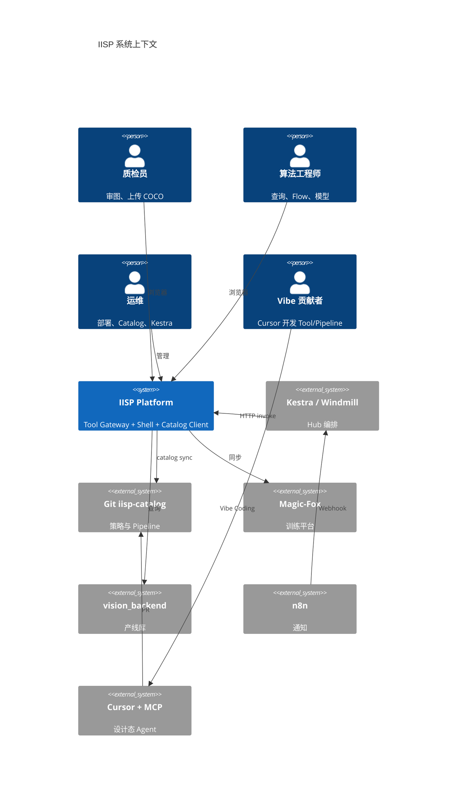
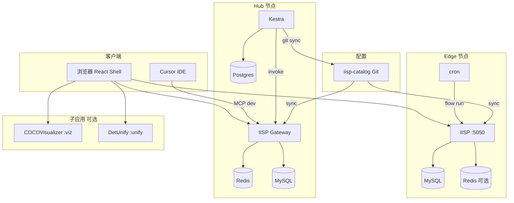
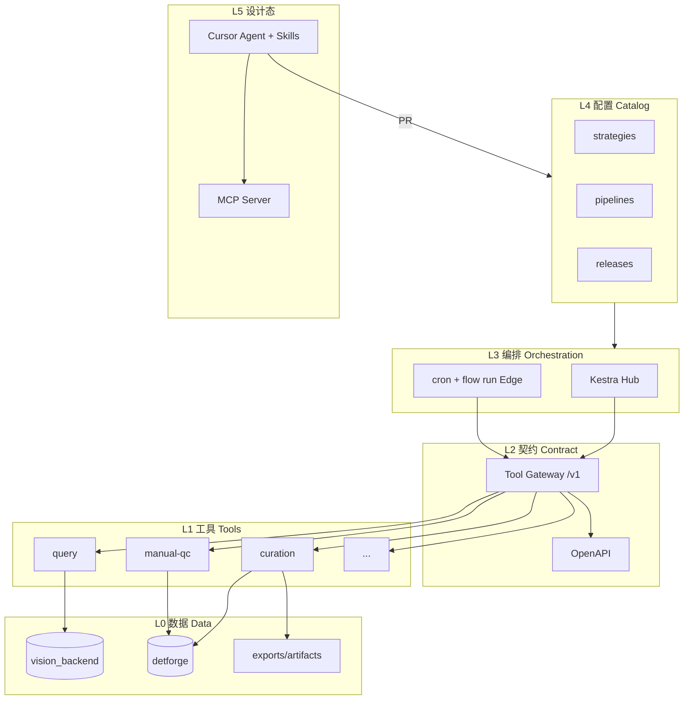
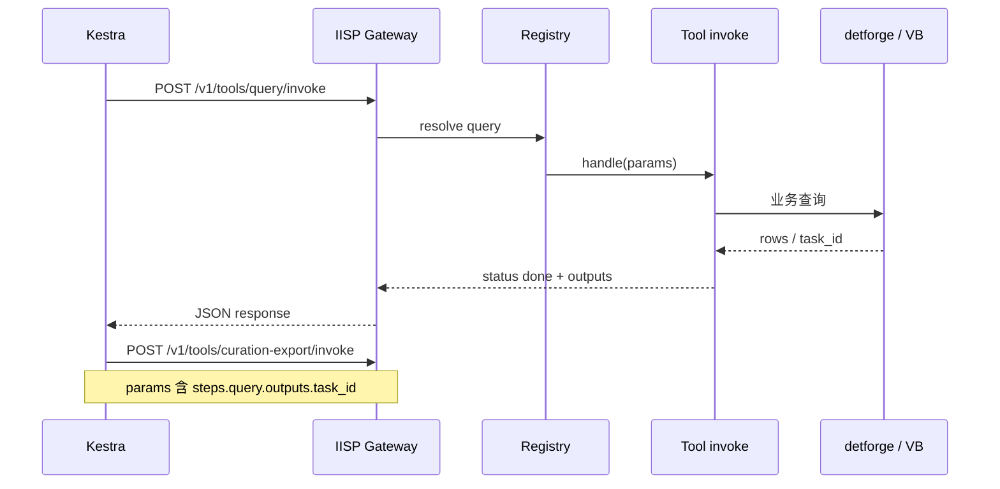
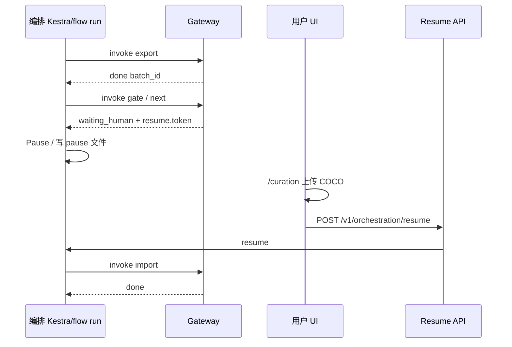
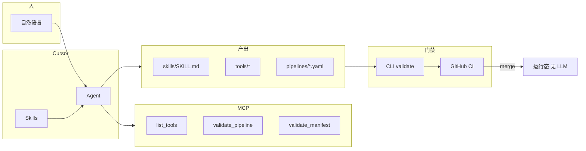
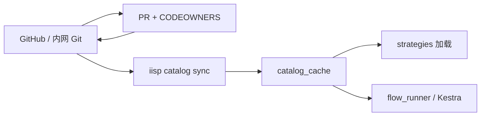
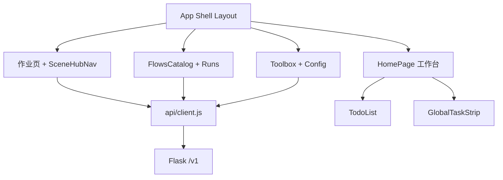
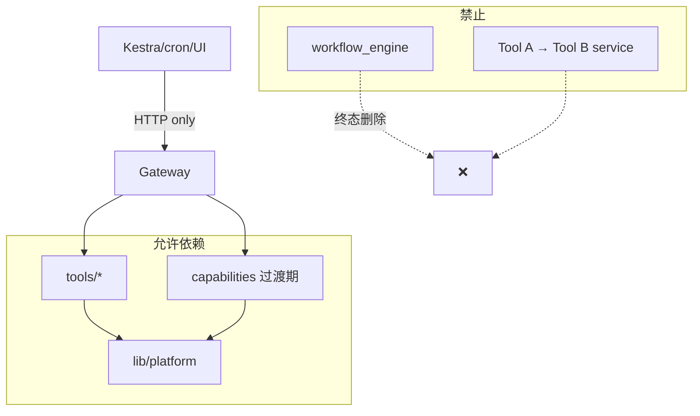
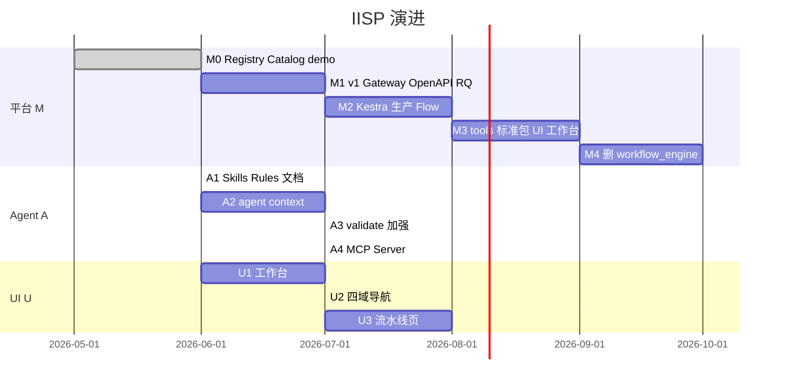

# IISP 技术架构图集

**版本**：v1.0  
**日期**：2026-06-09  
**关联**：[`IISP_DESIGN_FINAL.md`](./IISP_DESIGN_FINAL.md) · [`PRODUCT_DESIGN.md`](./PRODUCT_DESIGN.md) · [`CODING_STANDARDS.md`](./CODING_STANDARDS.md)

> 本文集中存放架构图，便于评审、 onboarding 与 Agent 引用。实现细节以设计定稿为准。

---

## 1. C4 上下文（系统与外部）

---

## 2. C4 容器（部署单元）

---

## 3. 逻辑分层

---

## 4. Tool 调用序列（Hub）

---

## 5. 人工卡点序列

---

## 6. Vibe Coding 设计态

---

## 7. Catalog 数据流

---

## 8. 前端组件关系（目标）

---

## 9. 仓库模块依赖（解耦）

---

## 10. 演进路线图

---

## 11. 修订记录

| 版本 | 日期 | 说明 |
|------|------|------|
| v1.0 | 2026-06-09 | C4、容器、序列、Vibe、路线图 |
