# IISP 技术架构图集

**版本**：v1.3  
**日期**：2026-06-09  
**标准**：[`IISP_DESIGN_FINAL.md`](./IISP_DESIGN_FINAL.md) **v2.2** · [`DOCS_INDEX.md`](./DOCS_INDEX.md)

> 实现细节以设计定稿为准。编排：**Kestra 唯一**（Edge + Hub）。

---

## 1. C4 上下文（系统与外部）

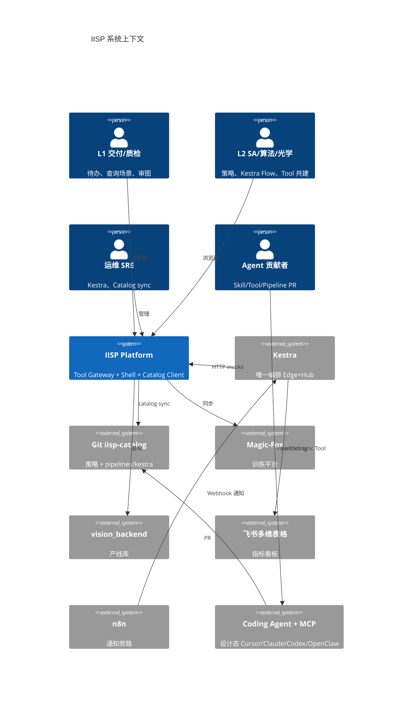

---

## 2. C4 容器（部署单元）

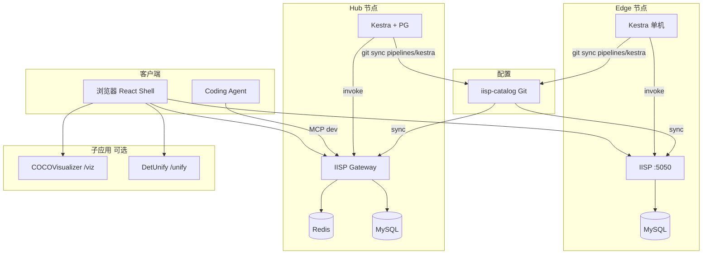

---

## 3. 逻辑分层

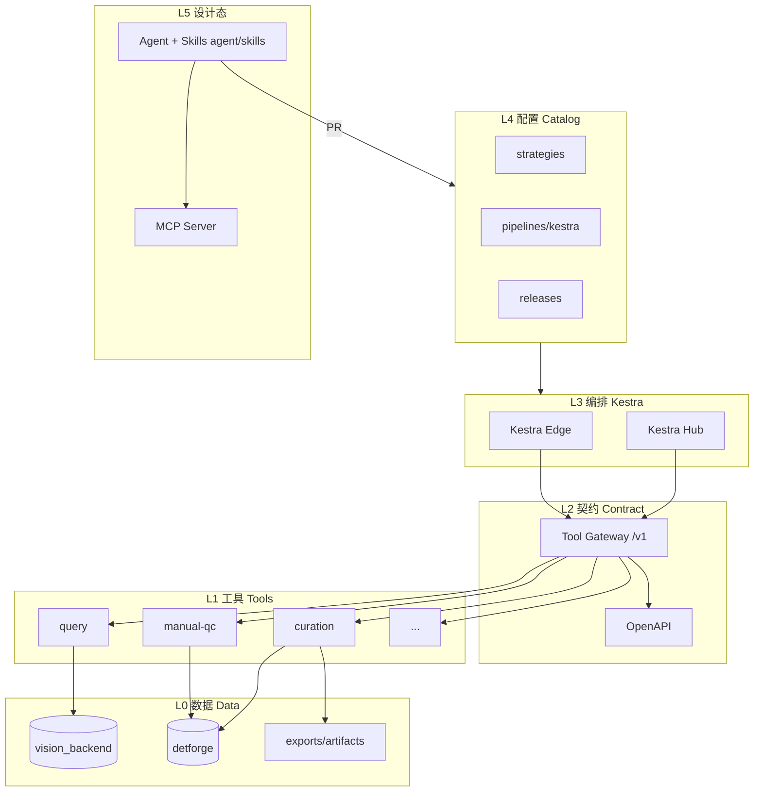

---

## 4. Tool 调用序列（Kestra）

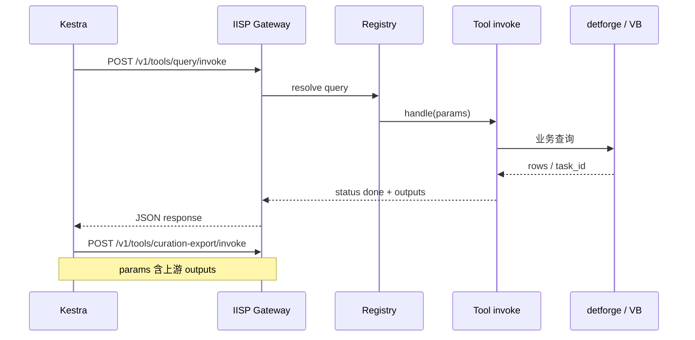

---

## 5. 人工卡点序列

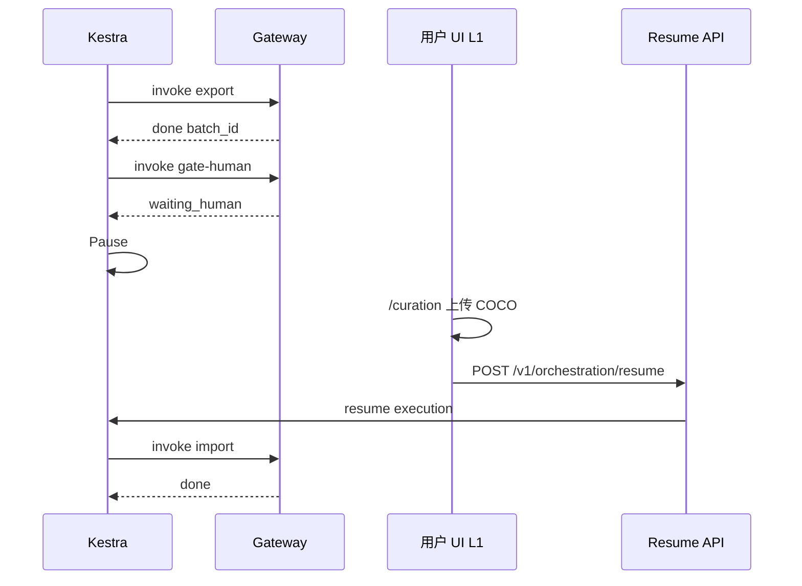

---

## 6. Vibe Coding 设计态

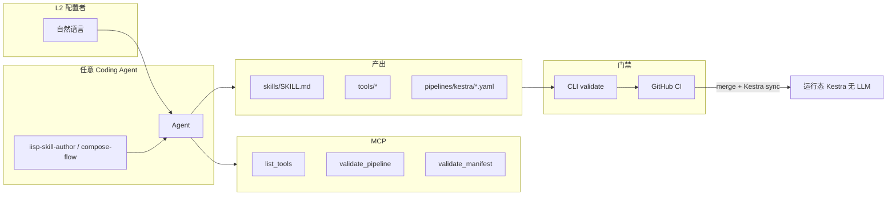

---

## 7. Catalog 数据流

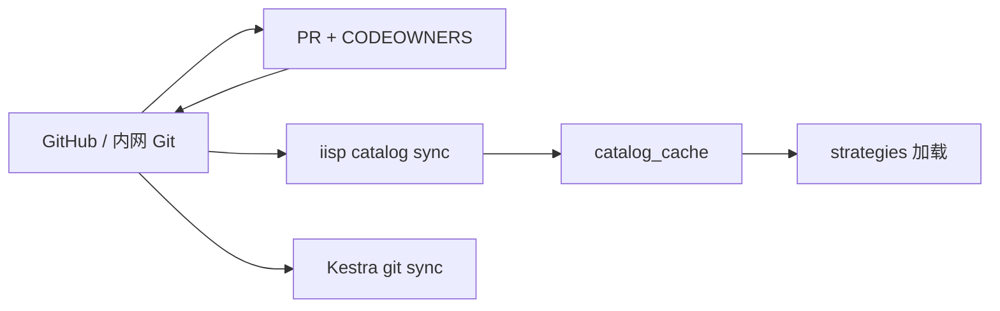

---

## 8. 前端与 L1/L2 导航（目标）

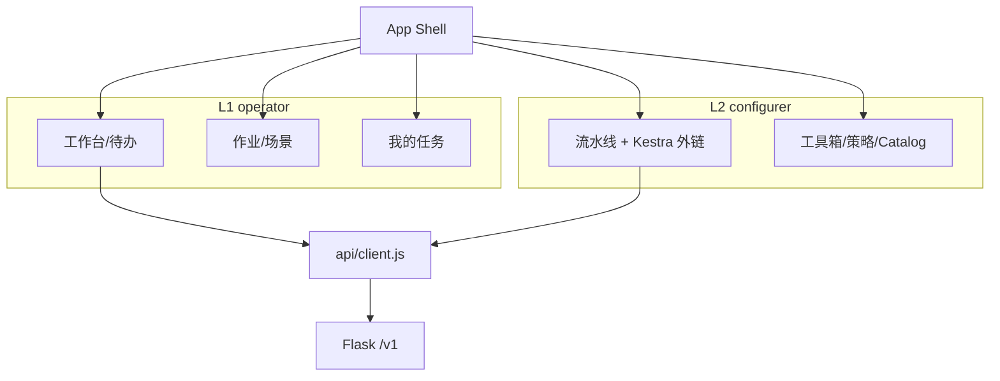

---

## 9. 仓库模块依赖（解耦）

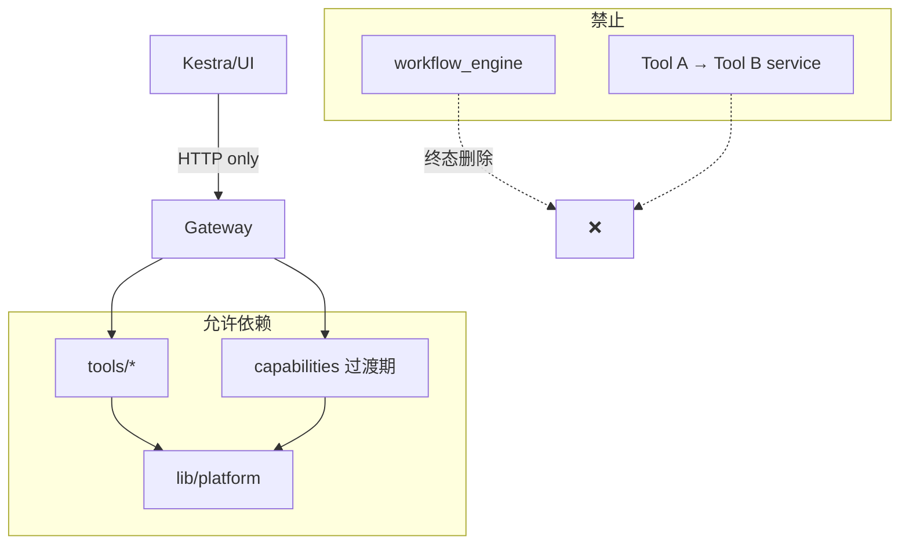

---

## 10. 演进路线图

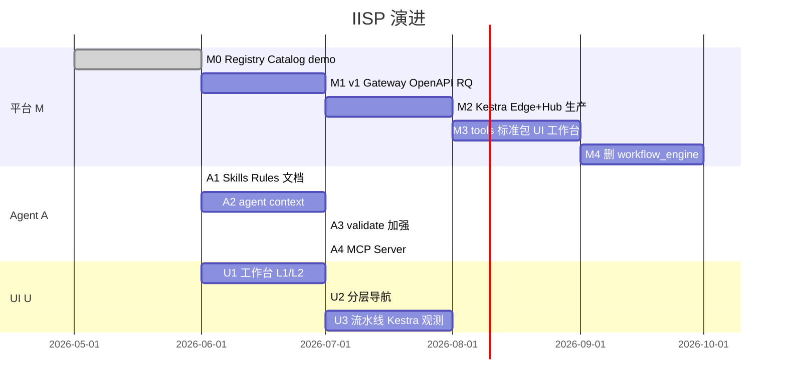

---

## 11. Deploy 模块依赖（原生一体包）

> 详述：[`deploy/README-native.md`](../deploy/README-native.md) · 实现：`orchestration/native/` · CLI：`cli/deploy_cmds.py`

### 11.1 分层与运行时

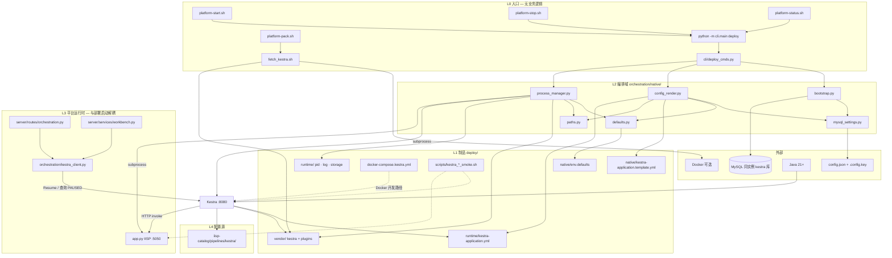

**依赖原则**：

| 规则 | 说明 |
|------|------|
| Shell 不堆业务 | `platform-*.sh` 仅转调 `iisp deploy` |
| 部署 ≠ 运行时客户端 | `process_manager` 管启停；`kestra_client` 管 API（Resume/待办） |
| MySQL 单一解析 | `mysql_settings.py` 读 `config.json`，bootstrap 与 render 共用 |
| 制品与代码分离 | 模板/env 在 `deploy/native/`；逻辑在 `orchestration/native/` |

### 11.2 `orchestration/native/` 模块内依赖

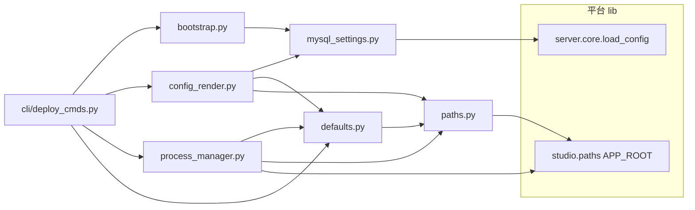

### 11.3 两条部署路径对比

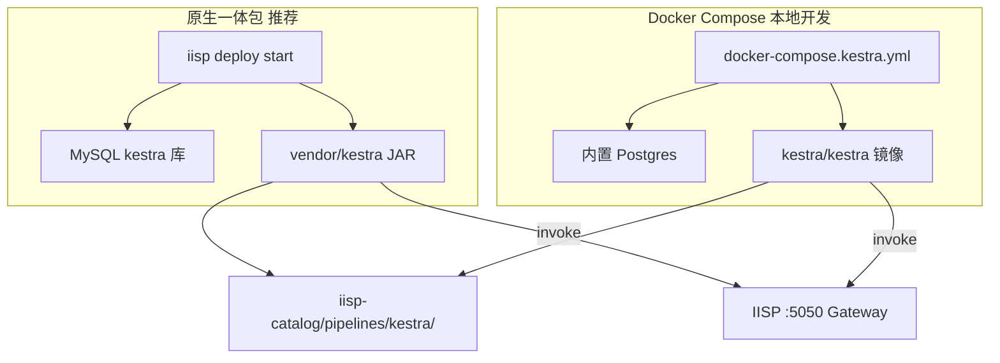

---

## 12. 修订记录

| 版本 | 日期 | 说明 |
|------|------|------|
| v1.2 | 2026-06-09 | §11 Deploy 模块分层与依赖图（原生 + Docker 双路径） |
| v1.3 | 2026-06-09 | 设计态 Agent 去 Cursor 化；C4/§6 改为任意 Coding Agent + `agent/` |
| v1.1 | 2026-06-09 | Kestra 唯一、L1/L2 角色、移除 cron/Windmill 图 |
| v1.0 | 2026-06-09 | 首版 |
