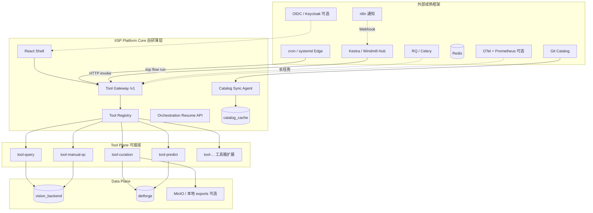

# IISP 最终架构设计

> ⚠️ **历史归档 v1.0** — 本文多处已过时。**唯一权威**：[`IISP_DESIGN_FINAL.md`](./IISP_DESIGN_FINAL.md) **Final v2.2** · 索引 [`DOCS_INDEX.md`](./DOCS_INDEX.md)  
> 现行标准：**Kestra 唯一编排** · **L1/L2 用户分层** · **Skill-first（L2）** · 废弃 Windmill / cron 生产 / `iisp flow run` 生产。

**版本**：Final v1.0（**已由 [`IISP_DESIGN_FINAL.md`](./IISP_DESIGN_FINAL.md) v2.2 取代**）  
**日期**：2026-06-09  
**状态**：归档 — 请阅读 **[`IISP_DESIGN_FINAL.md`](./IISP_DESIGN_FINAL.md)**

> 本文保留作 v1 历史参考。**编排已统一为 Kestra（v2.2）**；请以 **`docs/IISP_DESIGN_FINAL.md`** 为准。

---

## 0. 文档地位

本文是 IISP 的**最终架构定稿**，整合并 supersede 各专题文档中的冲突表述。专题文档仍保留细节，但以本文为准：

| 文档 | 关系 |
|------|------|
| **本文** | 总纲：边界、框架选型、解耦规则、平台核心范围 |
| [`IISP_PLATFORM.md`](./IISP_PLATFORM.md) | 运行部署与 API 速查 |
| [`CATALOG_CENTER.md`](./CATALOG_CENTER.md) | Catalog Provider 操作细节 |
| [`TOOLBOX_ORCHESTRATION.md`](./TOOLBOX_ORCHESTRATION.md) | Tool Contract 与 Kestra 集成细则 |
| [`ARCHITECTURE_GREENFIELD.md`](./ARCHITECTURE_GREENFIELD.md) | 绿场目录与轻量化补充 |
| [`UI_REDESIGN_CHECKLIST.md`](./UI_REDESIGN_CHECKLIST.md) | 前端实施清单 |
| [`SKILL_TO_TOOL.md`](./SKILL_TO_TOOL.md) | 共建流程 |
| [`AGENT_VIBE_CODING.md`](./AGENT_VIBE_CODING.md) | **Agent / Vibe Coding**（设计态 AI 生成 Tool 与 Pipeline） |
| [`ARCHITECTURE_DECOUPLED.md`](./ARCHITECTURE_DECOUPLED.md) | 历史迁移参考，只读 |

---

## 1. 设计命题

### 1.1 我们要建什么

**一个薄的工业检测数据闭环平台（Platform Core）**，只做：

1. **Tool Gateway** — 统一执行入口与契约校验  
2. **Catalog Client** — 拉取、缓存、展示配置（策略、Pipeline、releases）  
3. **Shell UI** — 工作台、领域页壳、工具箱浏览、流水线触发与观测  
4. **Platform 共享层** — DB 连接、路径解析、SN/时间等基础设施  

**不做**：自研 DAG、自研 Cron 引擎、在平台内硬编码业务组合逻辑。

### 1.2 扩展如何发生

| 扩展方式 | 谁做 | 载体 |
|----------|------|------|
| **新能力** | 算法/业务团队 | **工具箱**：`tool.manifest.json` + Tool 包（内置 / `.iisp-tool` / Blueprint HTTP） |
| **新组合** | 运维/算法/共建 | **工作流**：Catalog `pipelines/*.yaml` + Hub **Kestra/Windmill** 或 Edge **`iisp flow run`** |
| **新配置** | 全员 PR | **iisp-catalog** Git 仓：strategies、releases、environments |

平台发布后，**新增场景 = 新 Tool PR + 新 Pipeline PR**，无需改 Platform Core 调度代码。

### 1.4 Agent 与 Vibe Coding（设计态）

**运行态不用 LLM 编排**；AI 只参与 **设计态** 文件生成：

| 路径 | 人 + AI 产出 | 门禁 |
|------|--------------|------|
| 新 Tool | `SKILL.md` → `tools/<id>/` | `iisp tool validate` |
| 新 Pipeline | `iisp-catalog/pipelines/*.yaml` | `iisp workflow validate` |

**最简栈**：**Cursor Skills + IISP MCP Server**（list_tools / validate_pipeline）+ Git PR。  
可选：Shell Flow 助手或 Dify 生成 YAML 草稿，**产出格式与校验与 Cursor 相同**。

详见 [`AGENT_VIBE_CODING.md`](./AGENT_VIBE_CODING.md)。

### 1.5 两条铁律

1. **尽量用成熟框架** — 调度、队列、通知、鉴权、观测、Schema 表单、OpenAPI 不重复造轮。  
2. **彻底解耦** — 模块间只通过 **HTTP Tool Contract** 与 **可序列化 ID/URI** 通信；禁止编排层 Python import 业务。

---

## 2. 总体架构



**四平面 + 一配置源**：

| 平面 | 职责 | 实现 |
|------|------|------|
| **Control** | UI、Gateway、Catalog Agent、Resume | Platform Core（自研，保持薄） |
| **Orchestration** | 何时跑、顺序、重试、Pause | **成熟框架**（见 §4） |
| **Tool** | 每一步做什么 | 工具箱插件（自研业务，契约统一） |
| **Data** | 持久化与文件 | MySQL + 可选对象存储 |
| **Catalog** | 配置是什么 | **Git**（+ 可选 Nacos 热更新） |

---

## 3. 平台核心范围（Must Have）

平台**只允许**包含以下能力；其余一律以 Tool 或外部服务扩展。

### 3.1 Tool Gateway

| 项 | 说明 |
|----|------|
| 路由 | `POST /v1/tools/{tool_id}/invoke` |
| 校验 | Pydantic / JSON Schema（Manifest `params_schema`） |
| 幂等 | `X-Idempotency-Key`（编排侧重试用） |
| 路由策略 | `runtime: inprocess \| http`（见 Manifest） |
| 长任务 | 返回 `job_id`，异步状态查 `/v1/jobs/{id}`（队列见 §4.3） |
| 文档 | OpenAPI 3.1 自动生成，供 Kestra / 前端 / Agent 使用 |

**禁止**：Gateway 内写业务 if-else 组合（如「先 query 再 qc」）。

### 3.2 Tool Registry

| 项 | 说明 |
|----|------|
| 发现 | 扫描 `tools/*/tool.manifest.json` + 内置 + 已安装 `.iisp-tool` |
| 执行 | `registry.invoke(tool_id, ctx)` → 适配 inprocess / http / cli |
| 元数据 | `GET /v1/tools`、`GET /v1/tools/{id}` |

### 3.3 Catalog Client

| 项 | 说明 |
|----|------|
| Provider | `git` \| `local` \|（规划 `nacos` \| `bundle`） |
| 同步 | `strategies/`、`pipelines/` → `catalog_cache/` |
| 读取 | 策略加载、Flow 列表、releases 绑定 |
| API | `GET /v1/catalog/status`、`POST /v1/catalog/sync` |

**禁止**：在平台 DB 中维护「权威」Pipeline 定义（迁移期只读镜像除外）。

### 3.4 Orchestration 薄适配

| 项 | 说明 |
|----|------|
| Edge | **`iisp flow run`** — 无状态 YAML 解释器，**不是** DAG 引擎 |
| Resume | `POST /v1/orchestration/resume` — 人工完成后通知 Hub 编排器 |
| 运行记录 | Edge 可写本地 JSONL；Hub 以 Kestra 执行历史为准 |

**禁止**：扩展 `workflow_engine`、`workflow_scheduler`、workflow DB 状态机。

### 3.5 Shell UI（最小集）

| 页 | 归属 |
|----|------|
| 工作台 | 待办、进行中任务、快捷入口 |
| 作业 | 查询、质检、归档、预测等领域页（可调 Tool 或保留遗留 UI 直至 Tool 化） |
| 流水线 | Catalog Flow 列表、触发运行、步骤时间线、**只读** YAML |
| 平台 | 工具箱浏览、Catalog 同步、设置、手册 |
| 嵌入 | `/viz`、`/unify` 按需挂载，独立端口可选 |

**禁止**：自研 Flow DAG 编辑器、在 UI 内保存组合模板到 DB 作为权威源。

### 3.6 Platform 共享库（`lib/platform`）

仅含：**数据库连接、img_path、SN 查询、时区、ServiceLocator**。  
**禁止**：放入 query/curation 等业务规则。

---

## 4. 成熟框架选型（Must Use）

平台与周边**优先采用**下表方案；自研仅当无合适框架或框架过重（Edge flow runner 属例外）。

### 4.1 编排与调度

| 场景 | 框架 | 替代的自研模块 |
|------|------|----------------|
| **Hub** 多 Flow、DAG、Pause、历史 | **[Kestra](https://kestra.io)**（首选）或 **[Windmill](https://windmill.dev)** | `workflow_engine`、`WorkflowDagEditor` 主路径 |
| **Edge** 定时、线性 Flow | **cron / systemd** + `iisp flow run` | `workflow_scheduler` |
| 超长可靠事务（少数） | **Temporal** | 仅单条关键 Flow，非默认 |

Kestra Flow 存储：`iisp-catalog/pipelines/kestra/` 或由 Pipeline YAML **编译**生成；Hub 通过 Git 同步。

### 4.2 配置与版本

| 场景 | 框架 | 说明 |
|------|------|------|
| 策略 / Pipeline / releases | **Git**（GitHub / 内网 Gitea） | 权威源；PR + CODEOWNERS |
| 运行时参数热更新（可选） | **Nacos** | Catalog Provider 扩展，不替代 Git 审核 |
| 离线交付（可选） | **bundle** tar/zip | air-gap |

### 4.3 异步任务

| 场景 | 框架 | 说明 |
|------|------|------|
| 长查询、批量导出、预测 job | **RQ + Redis**（Edge）或 **Celery**（Hub） | 替代前端轮询 +  ad-hoc worker |
| 任务状态 API | 统一 `/v1/jobs/{id}` | Gateway 提交，Worker 消费 |

### 4.4 API 与契约

| 场景 | 框架 | 说明 |
|------|------|------|
| HTTP 层 + 校验 | **FastAPI**（Gateway 微服务）或 **Flask + Pydantic v2** | OpenAPI 一等公民 |
| 前端类型 | **openapi-typescript** | 从 `tools-v1.yaml` 生成 |
| 动态表单 | **RJSF**（React JSON Schema Form） | Manifest / Pipeline `params_schema` |

### 4.5 通知与集成

| 场景 | 框架 | 说明 |
|------|------|------|
| 飞书 / 邮件 / Webhook | **[n8n](https://n8n.io)** | 订阅 Kestra / Flow 完成事件 |
| 设计态 Flow 草稿（可选） | **Dify** 或 Shell 助手 | 产出 YAML → Catalog PR，非运行时 |
| **Vibe Coding 默认** | **Cursor + Skills + MCP** | 见 [`AGENT_VIBE_CODING.md`](./AGENT_VIBE_CODING.md) |

### 4.6 安全与观测（Hub / 多用户）

| 场景 | 框架 | 说明 |
|------|------|------|
| 登录与 SSO | **OIDC**（Keycloak / Authentik / 飞书） | Edge 可保留单 `api_token` |
| RBAC | **Casbin** 或 IdP 角色 | 配合 UI 角色视图 |
| 指标与追踪 | **OpenTelemetry** + **Prometheus/Grafana** | invoke 延迟、队列深度 |
| 异常 | **Sentry** | 前后端统一 |

### 4.7 存储与报表（规模化）

| 场景 | 框架 | 说明 |
|------|------|------|
| 大文件 / 多机 | **MinIO** 或云 COS | artifact URI 进 invoke 响应 |
| BI 看板 | **Metabase** / Superset | 只读 detforge，不进 React |

### 4.8 前端

| 场景 | 框架 | 说明 |
|------|------|------|
| 构建 | **Vite 6 + React 19** | 不迁 umi |
| 服务端状态 | **TanStack Query** | 任务、Flow、Catalog |
| 组件（渐进） | **shadcn/ui** 或 Ant Design 5 | 新页统一 |
| 命令面板 | **cmdk** | ⌘K 跳转 |
| 桌面壳 | **不做 Electron** | 浏览器 + kiosk |

---

## 5. 彻底解耦规则

### 5.1 依赖矩阵

| 调用方 | 允许 | 禁止 |
|--------|------|------|
| Kestra / Windmill / cron / UI | `POST /v1/tools/{id}/invoke` | import `studio.*` |
| Tool A | `lib/platform`、本包 `service.py` | import Tool B 的 `service.py` |
| Platform Gateway | Registry、Manifest、Pydantic | import Tool 业务实现（仅 `importlib` 延迟加载 invoke 入口） |
| Catalog | 文件系统 / Git | 调用 Tool 执行 |
| 编排 Flow | 传 `task_id` / `batch_id` / URI | 传 DataFrame、文件句柄 |

### 5.2 跨 Tool 数据流

```text
上游 Tool outputs（JSON）→ 编排引擎合并 → 下游 Tool params + inputs
```

大对象只传 **artifact URI**（`exports/...`、`s3://...`），不传内容。

### 5.3 状态归属

| 状态 | 存放 | 不在平台 DB 双写 |
|------|------|------------------|
| 编排执行、重试、Cron | Kestra / Windmill DB | — |
| Edge Flow 运行 | JSONL 或可选 detforge 审计表 | 不作执行引擎 |
| 业务实体 task/batch/qc | detforge | — |
| Pipeline / 策略定义 | Git Catalog → cache | **删除** workflow_template 权威写 |

### 5.4 删除清单（绿场终态）

| 模块 | 动作 |
|------|------|
| `studio/forge/workflow_engine.py` | **删除** |
| `studio/forge/workflow_scheduler.py` | **删除**（→ cron） |
| `workflow_*` DB 表 | 删除或**只读审计** |
| `capabilities/step_bridge` 双轨 | 删除，仅 Gateway |
| `WorkflowDagEditor` 作为主路径 | **deprecated** |
| `iisp-catalog/pipelines/legacy/` 作权威 | 迁移后归档 |

---

## 6. Tool Contract v1（唯一集成契约）

### 6.1 Invoke

```http
POST /v1/tools/{tool_id}/invoke
Content-Type: application/json
X-Idempotency-Key: {optional}
```

**Request**

```json
{
  "run_id": "kestra-exec-uuid",
  "step_id": "query",
  "params": { "strategy_id": "daily_trawl" },
  "inputs": { "upstream": { "prev": { "task_id": "abc" } } }
}
```

**Response**

```json
{
  "status": "done",
  "outputs": { "task_id": "abc", "row_count": 128 },
  "artifacts": [{ "kind": "csv", "uri": "exports/abc/result.csv" }],
  "resume": null,
  "error": null
}
```

**`status`**：`done` | `skipped` | `waiting_human` | `failed` | `accepted`（异步 job 已提交）

**`waiting_human`**

```json
{
  "status": "waiting_human",
  "outputs": { "batch_id": 42 },
  "resume": {
    "token": "pause-abc",
    "ui_url": "/curation?batch=42",
    "hint": "上传 COCO 后点击继续"
  }
}
```

Hub：Kestra `Pause` + `POST /v1/orchestration/resume`。  
Edge：`iisp flow run` 写 pause 文件，UI 完成后 CLI/API resume。

### 6.2 Manifest（每个 Tool）

```json
{
  "id": "query",
  "version": "2.0.0",
  "label": "数据查询",
  "contract_version": "v1",
  "runtime": "inprocess",
  "module": "tools.query.invoke:handle",
  "params_schema": { "$ref": "schemas/params.json" },
  "outputs": ["task_id", "row_count"],
  "artifacts": ["csv"],
  "tags": ["query", "data-collection"]
}
```

| `runtime` | 行为 |
|-----------|------|
| `inprocess` | Gateway `importlib` 调 `module` |
| `http` | Gateway 反向代理到 Blueprint URL |
| `cli` | 子进程 CLI（重活隔离） |

### 6.3 工具箱扩展路径

```text
skills/SKILL.md
    → iisp tool init-from-skill
    → tools/<id>/ + tool.manifest.json
    → 主仓 PR 或 打包 .iisp-tool
    → POST /v1/tools/install（规划）
    → Registry 热加载
```

**平台不内置**具体业务 Tool 的组合逻辑；内置 Tool 仅作**参考实现**与默认开箱能力。

---

## 7. Catalog 与工作流

### 7.1 目录规范（独立 Git 仓）

```text
iisp-catalog/
├── strategies/*.json
├── pipelines/
│   ├── *.yaml              # Pipeline DSL（Edge + 编译源）
│   └── kestra/*.yaml       # Hub 原生（可选）
├── releases.yaml
├── environments/*.yaml
├── tool-pins.yaml
└── skills-index.yaml
```

### 7.2 Pipeline YAML（编排权威配置）

```yaml
id: daily_ng_curation
label: 每日 NG 筛选
version: "2"
params_schema:
  time_window: { type: object }
nodes:
  - id: query
    tool: query
    params:
      strategy_id: daily_trawl
      time_window: "{{params.time_window}}"
  - id: export
    tool: curation-export
    params:
      task_id: "{{steps.query.outputs.task_id}}"
```

- **新增流水线** = Catalog PR，不是改 Platform 代码。  
- **Hub**：Kestra 从 Git 同步或 CI 编译 YAML → Kestra Flow。  
- **Edge**：`iisp flow run daily_ng_curation --param ...`

### 7.3 与 Windmill / Kestra 概念映射

| 概念 | IISP |
|------|------|
| Script | Tool + Manifest |
| Flow | Catalog Pipeline + 编排引擎 |
| App | Shell UI + 领域页 |
| Resource | environments + 设置页 + Nacos（可选） |

---

## 8. 目标代码结构（绿场终态）

```text
DetForge-Studio/
├── core/                           # Platform Core（从 server/ 演进）
│   ├── gateway/                    # FastAPI/Flask invoke、OpenAPI
│   ├── catalog/                    # sync agent、provider
│   ├── orchestration/              # flow_runner、resume（无 engine）
│   └── app.py
├── lib/platform/                   # DB、路径、SN（无业务）
├── tools/                          # 每个子目录 = 一个 Tool 包
│   ├── query/
│   │   ├── tool.manifest.json
│   │   ├── invoke.py
│   │   ├── service.py
│   │   └── ui/                     # 可选路由注册
│   ├── manual-qc/
│   └── ...
├── ui/                             # React Shell（现 frontend/）
├── packages/                       # submodule：viz、unify
├── deploy/
│   ├── docker-compose.edge.yml     # IISP + Redis + MySQL
│   └── docker-compose.hub.yml      # + Kestra + Postgres
├── iisp-catalog/                   # demo / 子树
└── docs/
```

**迁移期**：`studio/`、`capabilities/` 并存；Tool 逐步迁入 `tools/`，Registry 兼容两路径。

---

## 9. 部署模型

| 档位 | 组件 | 编排 | 队列 | 内存目标 |
|------|------|------|------|----------|
| **Edge** | IISP + MySQL + Redis(可选) | cron + flow run | RQ 可选 | &lt; 512 MB 常态 |
| **Hub** | IISP + Kestra + PG + Redis | Kestra | Celery/RQ | 1.5–4 GB+ |

Edge **不部署**：Kestra、n8n、Dify、Metabase。  
Hub **可选**：n8n、OIDC、OTel、MinIO。

---

## 10. 前端与平台边界

| 平台 UI 负责 | 工具 / 编排负责 |
|--------------|-----------------|
| 工作台、待办、Catalog 状态 | Tool 自有复杂 UI（可 iframe 或 `/tools/{id}/ui`） |
| Flow 列表、触发、时间线 | Kestra UI（Hub 外链） |
| 工具箱元数据、安装 | Tool Manifest 定义 |
| 设置、DB、路径 | — |

领域页（查询、质检）在完全 Tool 化之前可保留遗留 React 页，但**执行**须走 Gateway invoke，便于后续替换 UI 而不改编排。

---

## 11. 共建流程（L1–L4）

```text
L1  skills/<scene>/SKILL.md              Vibe：Cursor 写 SKILL
L2  iisp tool init-from-skill → tools/   Vibe：实现 invoke → validate → PR
L3  iisp-catalog pipelines/              Vibe：Agent 生成 YAML → validate → Catalog PR
L4  releases.yaml + environments/        运维发布
```

**Agent 细则**：[`AGENT_VIBE_CODING.md`](./AGENT_VIBE_CODING.md)

平台团队维护：**Gateway、Registry、Catalog Agent、Shell 壳、OpenAPI、CI 校验**。  
业务团队维护：**Tool 包 + Pipeline YAML**。

---

## 12. CI / 质量门禁

| 检查 | 工具 |
|------|------|
| Manifest 校验 | `iisp tool validate` |
| Pipeline 校验 | `iisp workflow validate` |
| OpenAPI 生成 | CI 从 Manifest 聚合 |
| Catalog PR | CODEOWNERS + YAML lint |
| 禁止 import 违规 | 自定义 lint / import-linter |

---

## 13. 从现状到终态（迁移）

| 阶段 | 交付 | 自研下线 |
|------|------|----------|
| **M0**（当前） | Registry、Catalog sync、flow run demo | — |
| **M1** | `/v1` Gateway + Pydantic + OpenAPI；RQ 接 query | 减少前端轮询 |
| **M2** | 首条生产 Flow 上 Kestra；Resume API | scheduler 只读 |
| **M3** | `tools/query` 等迁入标准包；UI 工作台 | engine 只读 |
| **M4** | 删 workflow_engine/scheduler/模板 DB 写 | 全部下线 |
| **M5** | `.iisp-tool` 安装、Metabase、OIDC（按需） | — |

---

## 14. 非目标（明确不做）

- Electron / Tauri 桌面壳  
- umi 迁移  
- 平台内自研 DAG / BPMN 设计器（主路径）  
- 在 Platform Core 硬编码新产品流水线  
- 编排层 Python import 链  
- Edge 部署 Kestra / n8n / Dify  

---

## 15. 成功标准

1. **新业务场景**：0 行 Platform Core 调度代码，仅 Tool + Pipeline PR。  
2. **编排变更**：Git Catalog PR，无需发版 IISP（sync 即可）。  
3. **Hub 编排器**可替换（Kestra ↔ Windmill），Tool Contract 不变。  
4. **Edge** 无 JVM 可跑通 Catalog 中线性 Flow。  
5. **OpenAPI** 为 Kestra、前端、Agent 单一事实来源。

---

## 16. 修订记录

| 版本 | 日期 | 说明 |
|------|------|------|
| Final v1.0 | 2026-06-09 | 定稿：成熟框架优先、平台薄核、工具箱+Catalog 扩展、解耦规则、删除清单 |

---

**批准后的下一步**：按 §13 M1 启动 Gateway `/v1` + OpenAPI + RQ；并行 UI [`UI_REDESIGN_CHECKLIST.md`](./UI_REDESIGN_CHECKLIST.md) U1 工作台。
