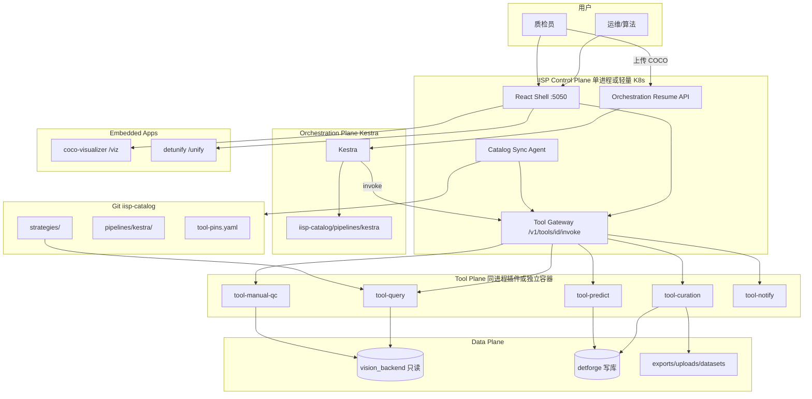
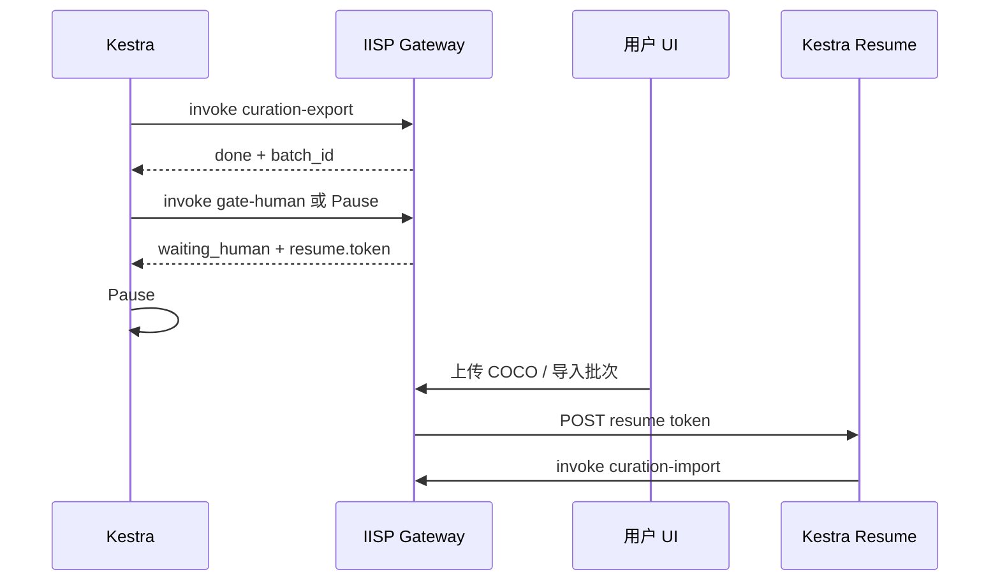
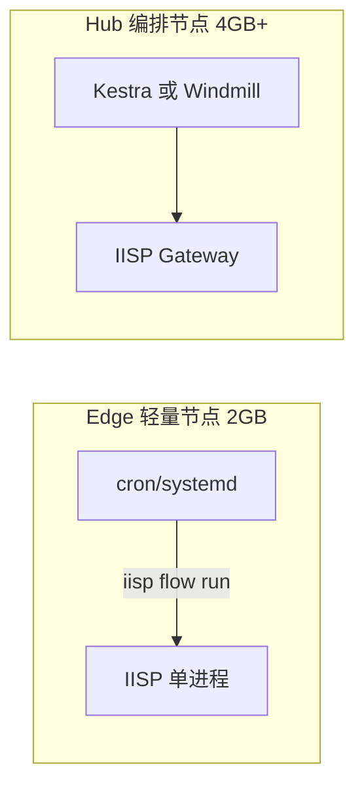

# IISP 绿场架构（Greenfield）

**版本**：v1.2  
**状态**：绿场目标架构；**定稿以 [IISP_DESIGN_FINAL.md](./IISP_DESIGN_FINAL.md) 为准**  
**关联**：[**最终架构定稿**](./ARCHITECTURE_FINAL.md) · [平台完整说明](./IISP_PLATFORM.md) · [可拆解架构](./ARCHITECTURE_DECOUPLED.md) · [工具箱与编排 v2](./TOOLBOX_ORCHESTRATION.md)

---

## 1. 一句话

**IISP = 工具运行时 + 领域 UI + Catalog 客户端；Edge 用 `iisp flow run` + cron，Hub 可选 Kestra/Windmill；模块之间只通过 Tool Contract v1 说话。**

删掉自研 DAG、删掉 `STEP_HANDLERS`、删掉工作流 DB 状态机。保留工业检测领域能力与 Git 共建模型。**前端保持 React + Vite，本期不做 Electron 桌面壳。**

---

## 2. 设计原则

| # | 原则 |
|---|------|
| 1 | **编排零自研 DAG** — Edge：`cron` + `iisp flow run`；Hub：Kestra/Windmill 负责调度、重试、Cron、Pause |
| 2 | **工具一等公民** — 每个能力 = 独立包 + `tool.manifest.json` + 同一 `invoke` 契约 |
| 3 | **编排只认 HTTP** — 步骤永远是 `POST /v1/tools/{id}/invoke`，不认 Python import |
| 4 | **配置进 Catalog Git** — 策略、Pipeline、releases 在 `iisp-catalog`；Provider 可迁 local/Nacos |
| 5 | **UI 与执行分离** — 页面给人操作；Flow 给机器调度；共用同一批 tool |
| 6 | **共享库不共享业务** — `platform` 只管 DB/路径/SN；业务在各 tool 包内 |
| 7 | **前端务实** — React + Vite；不迁 umi；**暂不做 Electron** |

---

## 3. 总体架构



---

## 4. 仓库与目录（推荐）

```text
iisp/                              # 主仓库（现 DetForge-Studio 演进）
├── core/                          # Control Plane（新建，替代 server+forge 编排职责）
│   ├── gateway/                   # invoke 路由、鉴权、契约校验
│   ├── catalog/                   # git pull、策略缓存、webhook
│   ├── orchestration/             # Kestra resume 回调（薄）
│   └── app.py                     # Flask 入口
├── lib/
│   └── platform/                  # 共享：db、img_path、sn_query（无业务）
├── tools/                         # 每个子目录 = 一个 tool（不再是 studio/ 大杂烩）
│   ├── query/
│   │   ├── tool.manifest.json
│   │   ├── service.py
│   │   ├── invoke.py
│   │   └── ui/                    # 可选：查询页组件或路由注册
│   ├── manual-qc/
│   ├── curation/
│   ├── predict/
│   └── notify/
├── ui/                            # React Shell（现 frontend/）
├── packages/                      # submodule：coco-visualizer、detunify
├── deploy/
│   ├── docker-compose.yml         # iisp + kestra + mysql + postgres(kestra)
│   └── kestra/                    # 环境变量、Git 同步配置
└── docs/

iisp-catalog/                      # 独立 Git 仓（或主仓子目录 + subtree）
├── strategies/
├── pipelines/kestra/
├── tool-pins.yaml
└── skills-index.yaml
```

**删除（绿场不保留）**：

- `studio/forge/workflow_*.py` 全套
- `workflow_*` 数据库表（或仅保留审计只读镜像，不参与执行）
- `capabilities/step_bridge`、`IISP_USE_REGISTRY` 双轨
- `iisp-catalog/pipelines/legacy/`
- `workflow_templates.py` 内置种子

---

## 5. Tool Contract v1（唯一集成面）

### 5.1 Invoke

```http
POST /v1/tools/{tool_id}/invoke
X-Idempotency-Key: {kestra_task_run_id}   # 可选，防 Kestra 重试重复写
```

**Request**

```json
{
  "run_id": "kestra-execution-uuid",
  "step_id": "query",
  "params": { "strategy_id": "daily_trawl", "time_window": { "preset": "yesterday" } },
  "inputs": { "upstream": {} }
}
```

**Response**

```json
{
  "status": "done",
  "outputs": { "task_id": "…", "row_count": 128 },
  "artifacts": [{ "kind": "csv", "uri": "exports/…/result.csv" }],
  "resume": null,
  "error": null
}
```

**`status` 枚举**：`done` | `skipped` | `waiting_human` | `failed`

**`waiting_human` 时额外字段**：

```json
{
  "status": "waiting_human",
  "outputs": { "batch_id": 42, "export_dir": "…" },
  "resume": {
    "token": "pause-abc123",
    "hint": "请在筛选归档页上传 COCO 后点击继续",
    "ui_url": "/curation?batch=42"
  }
}
```

Kestra 侧：`Pause` 的 `onResume` 与 `resume.token` 关联；IISP 在导入完成后 `POST /v1/orchestration/resume`。

### 5.2 Manifest（每个 tool 包根目录）

```json
{
  "id": "query",
  "version": "2.0.0",
  "label": "数据查询",
  "contract_version": "v1",
  "params_schema": { "$ref": "schemas/query-params.json" },
  "inputs": [],
  "outputs": ["task_id", "row_count"],
  "artifacts": ["csv"],
  "runtime": "inprocess",
  "module": "tools.query.invoke:handle"
}
```

| 字段 | 说明 |
|------|------|
| `runtime` | `inprocess`（Gateway 调 Python）或 `http`（独立容器 URL） |
| `module` | 仅 `inprocess`；绿场初期全部 inprocess，后期热拆容器 |

**OpenAPI**：CI 从所有 Manifest 生成 `docs/openapi/tools-v1.yaml`，Kestra/前端/Agent 共用。

---

## 6. 编排：Edge CLI + Hub Kestra

### 6.0 两档模型（默认）

| 档位 | 编排 | Pipeline 来源 |
|------|------|---------------|
| **Edge** | `cron` + **`iisp flow run`**（`orchestration/flow_runner.py`） | `catalog_cache/pipelines/` YAML |
| **Hub** | Kestra 或 Windmill | 同上 YAML **编译**为 Kestra Flow，或维护 `pipelines/kestra/` |

Edge **不部署 JVM**；Hub 内存 ≥4GB 时再上 Kestra。详见 §16。

### 6.1 Flow 即产品

每个组合产品 = Catalog 里一个 Flow id：

| Flow id | 步骤 |
|---------|------|
| `daily_ng_curation` | query → curation-create → export → pause → import → archive → notify |
| `weekly_predict_eval` | query → predict → query → curation → … |
| `benchmark_eval` | …（后续） |

定时、互斥、告警：Kestra triggers + labels，不在 IISP 写 Cron。

### 6.2 步骤模板（DRY）

Catalog 内可抽 `templates/kestra/tool-invoke.yaml` 片段，避免每步重复 HTTP 配置：

```yaml
# 伪代码：Kestra subflow 或 Plugin 封装
- id: "{{ step_id }}"
  type: iisp.toolInvoke          # 自定义 Kestra Plugin（可选优化）
  tool_id: query
  params: { ... }
```

绿场 **MVP 用原生 HTTP Request 即可**；步骤多了再写薄 Plugin。

### 6.3 人工卡点（推荐模式）



**不再**在 IISP 内维护 `workflow_run.status = waiting_human` 轮询。

---

## 7. IISP Control Plane 职责（瘦身）

| 组件 | 职责 | 不做 |
|------|------|------|
| **Tool Gateway** | 路由 invoke、校验 schema、调 tool、幂等 | DAG 调度 |
| **Catalog Agent** | pull catalog、更新策略缓存、可选触发 Kestra Git sync | 编辑策略 UI 可保留 |
| **Resume API** | 人工完成后通知 Kestra | 步骤状态机 |
| **React Shell** | 查询/质检/归档/工具箱/设置 | 流程设计器（交给 Kestra UI 或 Dify 草稿） |
| **挂载** | `/viz`、`/unify` | — |

---

## 8. Tool 包内部标准（统一模板）

```text
tools/query/
  tool.manifest.json
  service.py          # 纯业务，可单测，无 Flask
  invoke.py           # handle(body) -> ToolResult；只做参数映射
  schemas/            # JSON Schema
  tests/
  ui_routes.py        # 注册到 Shell 的路由（可选）
```

**依赖规则**：

- `tools/*` 可依赖 `lib/platform`
- `tools/*` **禁止**互相 import `service.py`
- 跨 tool 传参只通过 Kestra Flow 的 `outputs → params`

---

## 9. 数据与状态

| 状态 | 存放 |
|------|------|
| 执行历史、重试、Cron | Kestra DB |
| 业务实体 task/batch/job/manual_qc | detforge（现有表保留） |
| 策略 JSON | catalog sync → 本地 cache |
| 文件 artifact | exports/uploads（URI 进 invoke 响应） |

**不再**双写 `workflow_run` / `workflow_step_run`，除非做只读审计同步（可选）。

---

## 10. 共建与 Skills

流程不变，路径更清晰：

```text
L1  skills/<scene>/SKILL.md           → Cursor 日常使用
L2  iisp tools scaffold → tools/<id>/  → 主仓 PR
L3  iisp-catalog pipelines/kestra/     → Flow PR
L4  tool-pins.yaml + 部署 env          → 运维
```

`iisp tool init-from-skill` 生成 `tools/<id>/` 标准骨架（非 packages 随意命名）。

---

## 11. 可选增强（非 MVP）

| 能力 | 方案 |
|------|------|
| Agent 配 Flow | Dify / 内置 LLM → 只产出 Kestra YAML → Catalog PR |
| 外部通知 | n8n 订阅 Kestra webhook → 飞书 |
| Cursor 调工具 | 每 tool 可选 MCP Server，与 invoke 共用 `service.py` |
| 工具拆容器 | Manifest `runtime: http`，Gateway 变纯反向代理 |
| 超长可靠流程 | 单条关键 Flow 迁 Temporal（少数） |

---

## 12. 与「迁移版 v2」差异

| 项 | v2（兼容迁移） | 绿场 v1（本文） |
|----|----------------|-----------------|
| workflow_engine | 过渡期保留 | **删除** |
| Registry 双轨 | inprocess + HTTP | **仅 Gateway → tool.invoke** |
| forge workflow 表 | 读写 | **删除或只读审计** |
| studio/ 大目录 | 逐步拆 | **直接 tools/** |
| legacy pipeline DSL | 保留 | **删除** |
| 人工卡点 | 引擎 + Kestra | **仅 Kestra Pause + Resume API** |

---

## 13. 实施顺序（绿场）

| 阶段 | 交付 | 周期（估） |
|------|------|------------|
| **G0** | `core/gateway` + Tool Contract + OpenAPI；`tools/query` 一个包跑通 invoke | 1–2 周 |
| **G1** | 其余 tool 从 studio 迁入；删 workflow_* | 2–3 周 |
| **G2** | Kestra + `daily_ng_curation` 生产；Resume API | 1–2 周 |
| **G3** | Catalog 独立仓、CI 校验 Manifest + Flow | 1 周 |
| **G4** | UI Shell 收口；工具箱页调 invoke | 1 周 |

---

## 14. 为何这是「最好」的设计（针对你们）

1. **边界清晰** — 三件事：Kestra 管「什么时候跑」、Tool 管「跑什么」、Catalog 管「配置是什么」。  
2. **共建成本低** — 新人只需会写 `service.py` + Manifest + Flow 里加一行 HTTP。  
3. **与工业场景匹配** — 人工质检、长等待、定时捞图是 Kestra Pause/Cron 的强项，不是自研 DAG 的强项。  
4. **演进路径** — 初期 inprocess 单进程部署简单；Manifest 改 `runtime: http` 即可拆服务。  
5. **AI 友好** — 固定 JSON 契约 + OpenAPI + 可选 MCP，比 import 链更适合 Agent 和外部编排。

---

## 16. 轻量化与性能（内存优先）

工业现场常见 **2–4 GB 单机部署**，编排 + IISP + MySQL 不能占满内存。绿场架构在「Kestra + 单进程 Gateway」之上，按档位选型。

### 16.1 内存大致预算（经验值）

| 组件 | 典型占用 | 说明 |
|------|----------|------|
| IISP 主进程（空载） | 80–150 MB | Flask/FastAPI + React 静态；**未 import pandas** |
| 单次 query invoke | +50–200 MB | pandas 峰值；步骤结束应 `gc` / 不缓存 DataFrame |
| worker / 预测子进程 | 200 MB–数 GB | **GPU/模型另进程**；勿与 Gateway 同进程加载 torch |
| COCOVisualizer 挂载 | +100–300 MB | 建议**按需独立端口**，默认不挂进 5050 |
| DetUnify 挂载 | +200 MB+ | 同上 |
| Kestra + Postgres | **800 MB–1.5 GB+** | JVM + DB；**最重的一环** |
| Windmill（备选编排） | 300–600 MB | Rust 引擎，同档通常比 Kestra 省 |
| n8n / Dify | 各 500 MB+ | 边缘节点**不要装** |

结论：**要足够轻，首先控制「编排器选型」和「是否同进程挂载 viz/unify/模型」。**

### 16.2 两档部署模型（推荐）



| 档位 | 场景 | 编排 | IISP | 目标内存 |
|------|------|------|------|----------|
| **Edge** | 产线旁、单项目、流程固定 | **无 JVM**：`cron` + `iisp flow run` CLI | 单 worker，viz/unify **不挂载** | **&lt; 512 MB** 常态 |
| **Hub** | 多项目、多 Flow、共建 PR | **Windmill**（轻）或 **Kestra**（全功能） | Gateway + 按需子服务 | **&lt; 1.5 GB** 常态 |

**Edge 不是自研 DAG 引擎**：CLI 只做「读 Catalog Flow → 顺序 HTTP invoke → 写 pause 文件」的**无状态解释器**，逻辑 200 行级，调度交给 cron。复杂 DAG、并行、重试仍用 Hub 上的 Kestra/Windmill。

### 16.3 IISP 进程模型（必做）

| 规则 | 做法 |
|------|------|
| **单进程单 worker** | 生产 `gunicorn -w 1` 或内置 server；`PC_NO_WORKER=1` 时预测走**独立** `worker.py` 子进程 |
| **工具懒加载** | Gateway 启动只读 Manifest 元数据；**首次 invoke 才** `importlib` 对应 `tools.*` |
| **重库延迟 import** | `pandas`、`PIL` 只在 `tools/query` 内 import；主进程不 import `studio.query` |
| **invoke 无状态** | 请求内完成业务即返回；**禁止**跨请求缓存 DataFrame |
| **子进程隔离重活** | 批量预测、大导出用 `subprocess` / 独立 worker，结束即释放 |
| **静态前端** | 只 serve `frontend/dist`；生产不跑 Vite dev |
| **viz/unify 按需** | 环境变量 `IISP_MOUNT_VIZ=0` / `IISP_MOUNT_UNIFY=0`；要看图时再开 `:6010`/`:6006` |

### 16.4 编排器选型（性能视角）

| 选项 | 内存 | 能力 | 建议 |
|------|------|------|------|
| **cron + `iisp flow run`** | 几乎为 0 | 线性 Flow、Pause 文件 | Edge 默认 |
| **Windmill** | 中 | DAG、Cron、Git、UI | Hub **轻量首选** |
| **Kestra** | 高 | 插件生态、Pause/Webhook 成熟 | Hub 内存 ≥4GB 或独立机器 |
| Temporal | 高 | 最强可靠 | 除非单 Flow 极长，否则过重 |

绿场文档原默认 Kestra；**若内存是第一优先级，Hub 编排改为 Windmill，Edge 用 CLI runner。**

Flow YAML 保持「每步 HTTP invoke」不变，Windmill/Kestra/CLI 只是**调度壳**，工具契约不变。

### 16.5 Tool 设计约束（为内存服务）

1. **输出只传 ID，不传大对象**：Flow 里传 `task_id` / `batch_id`，不传 CSV 内容。  
2. **artifacts 用 URI**：大文件落盘，响应里只带 `exports/...` 路径。  
3. **streaming 导出**：curation-export 流式写盘，不在内存拼全量 COCO。  
4. **query 限量**：策略层 `MAX_RAWS` 硬顶；invoke 校验 `row_count` 上限。  
5. **Manifest 禁止** `kind: hybrid` 在同一步里又起 CLI 又起 capability 双份加载。

### 16.6 Catalog 与缓存

- 策略 JSON：**mmap 或按需读单文件**，启动不加载全部进 dict（可按 id lazy load）。  
- Catalog sync：**rsync 式覆盖**即可，不必常驻 `git clone` 对象库。  
- OpenAPI/Manifest：启动扫描一次写内存索引（&lt;1 MB），不 watch 文件系统。

### 16.7 可观测与限流

- 每 tool 配置 `max_concurrent`（Gateway 信号量），防止并行 query 打爆内存。  
- invoke 超时 + 内存告警（`resource.getrusage` 打点）。  
- Kestra/Windmill 侧限制 Flow 并行度为 1（Edge 场景）。

### 16.8 轻量部署清单（Checklist）

- [ ] 生产 `IISP_MOUNT_VIZ=0`、`IISP_MOUNT_UNIFY=0`  
- [ ] `gunicorn -w 1 --threads 4` 或单线程 + 异步 IO  
- [ ] 预测 `worker.py` 独立进程，模型不加载进 Gateway  
- [ ] Edge 用 `cron` + `iisp flow run`，不部署 Kestra  
- [ ] Hub 优先 Windmill；Kestra 单独 VM  
- [ ] 不部署 n8n/Dify 于同一台  
- [ ] MySQL 连接池 `max_connections` 与 worker 数匹配  

---

## 17. 文档修订（续）

| 版本 | 日期 | 说明 |
|------|------|------|
| v1.2 | 2026-06-09 | Edge 默认 flow run；Catalog Provider；无 Electron；链 IISP_PLATFORM |
| v1.1 | 2026-06-09 | §16 轻量化：Edge/Hub 两档、编排选型、进程模型 |
| v1.0 | — | 首版绿场 |

