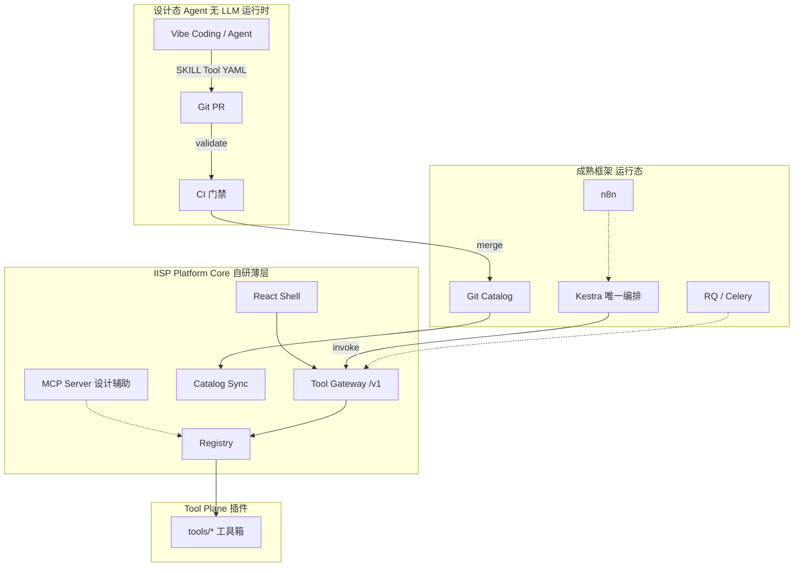

# IISP 平台最终设计（全文定稿）

**版本**：Final v2.2  
**日期**：2026-06-09  
**状态**：**唯一权威定稿** — 平台实现、共建、Agent、PR 评审均以本文为准  
**v2.2 变更**：**编排统一 [Kestra](https://kestra.io)**（Edge + Hub）；移除 Windmill、cron/`iisp flow run` 生产路径。  
**文档索引**：[`DOCS_INDEX.md`](./DOCS_INDEX.md)  
**仓库**：`DetForge-Studio` · **产品**：IISP（Industrial Inspection Solutions Platform）

---

## 如何使用本文

| 读者 | 阅读章节 |
|------|----------|
| 架构 / 评审 | §1–§5 全文 |
| 后端 / 平台组 | §3、§6、§7、§14 |
| 业务 / Vibe 贡献者 | §8、§9、§10、[`AGENTS.md`](../AGENTS.md) |
| 运维 / 部署 | §12、§7、[`IISP_PLATFORM.md`](./IISP_PLATFORM.md) |
| 前端 | §11、[`UI_REDESIGN_CHECKLIST.md`](./UI_REDESIGN_CHECKLIST.md) |

**专题附录**（细节不重复，冲突以本文为准）：

| 文档 | 内容 |
|------|------|
| [`CODING_STANDARDS.md`](./CODING_STANDARDS.md) | **编码规范、技术选型、PR** |
| [`PRODUCT_DESIGN.md`](./PRODUCT_DESIGN.md) | **产品设计、角色、IA、旅程** |
| [`TOOL_PLUGIN_MODEL.md`](./TOOL_PLUGIN_MODEL.md) | **工具插件终态：CLI+Skill+UI+lib** |
| [`SECURITY.md`](./SECURITY.md) | **Token 与安全、S1–S5** |
| [`PLATFORM_RISK_REGISTER.md`](./PLATFORM_RISK_REGISTER.md) | **平台遗漏与风险登记** |
| [`IISP_PLATFORM.md`](./IISP_PLATFORM.md) | 运行部署与 API 速查 |
| [`CATALOG_CENTER.md`](./CATALOG_CENTER.md) | Catalog Provider |
| [`TOOLBOX_ORCHESTRATION.md`](./TOOLBOX_ORCHESTRATION.md) | Tool Contract 细则 |
| [`PLATFORM_CHANGELOG.md`](./PLATFORM_CHANGELOG.md) | **平台功能变更记录** |
| [`DOCS_INDEX.md`](./DOCS_INDEX.md) | **文档索引与现行标准** |
| [`ARCHITECTURE_DIAGRAMS.md`](./ARCHITECTURE_DIAGRAMS.md) | **架构图集** |
| [`SKILL_PLATFORM.md`](./SKILL_PLATFORM.md) | **Skill-first（L2 主路径）** |
| [`SKILL_TO_TOOL.md`](./SKILL_TO_TOOL.md) | Skill → Tool 命令与 L1–L4 |
| [`UI_REDESIGN_CHECKLIST.md`](./UI_REDESIGN_CHECKLIST.md) | 前端实施 |
| [`AGENTS.md`](../AGENTS.md) | Agent 入口（IDE 无关） |
| [`agent/`](../agent/README.md) | **项目级 Skills + Rules 权威目录** |
| [`.cursor/skills/`](../.cursor/skills/README.md) | Cursor 适配层（符号链接） |

历史只读：[`ARCHITECTURE_DECOUPLED.md`](./ARCHITECTURE_DECOUPLED.md) · [`ARCHITECTURE_FINAL.md`](./ARCHITECTURE_FINAL.md) · [`ARCHITECTURE_GREENFIELD.md`](./ARCHITECTURE_GREENFIELD.md) · [`AGENT_VIBE_CODING.md`](./AGENT_VIBE_CODING.md)

---

# Part I — 愿景与原则

## 1. 一句话

**IISP = 薄的 Tool 运行时 + Catalog 客户端 + Shell UI；编排与调度交给成熟框架；新能力与组合通过 Vibe Coding 产出 Tool 与 Pipeline 文件，经校验后进 Git，平台内核零改动。**

## 2. 设计目标

| 目标 | 实现 |
|------|------|
| 平台只做核心 | Gateway、Registry、Catalog Sync、Shell 壳、`lib/platform` |
| 尽量成熟框架 | **Kestra**、Git、RQ/Celery、OpenAPI、n8n、OIDC、**Agent + MCP** |
| 彻底解耦 | 仅 `POST /v1/tools/{id}/invoke` + JSON/URI |
| 扩展靠工具箱 | `tool.manifest.json` + Tool 包 / `.iisp-tool` |
| 扩展靠工作流 | Catalog `pipelines/kestra/*.yaml` + Kestra Git sync |
| 扩展靠 Agent | **设计态** Vibe → SKILL/Tool/YAML → validate → PR |
| 运行态无 LLM | 生产调度不调用大模型 |

## 3. 三条铁律

1. **编排零自研 DAG** — **唯一编排器：Kestra**（Edge 单机 + Hub 集群）；IISP 不维护第二套调度。  
2. **契约唯一** — Kestra / UI / Agent 测试只认 Tool Contract v1 + Kestra Flow YAML（或 Pipeline DSL **编译为** Kestra）。  
3. **AI 只写文件** — 允许 `skills/`、`tools/`、`iisp-catalog/`；禁止改 Gateway、engine、scheduler。

---

# Part II — 总体架构



**五层职责**：

| 层 | 职责 | 谁维护 |
|----|------|--------|
| **Catalog** | 策略、Pipeline、releases | Git PR（+ 可选 Nacos 热更新） |
| **Orchestration** | 调度、Pause、重试、Cron | **Kestra**（**非 IISP**） |
| **Tool** | 单步业务 | 工具箱贡献者 |
| **Control** | Gateway、UI、Sync、MCP | 平台组 |
| **Agent** | 生成 Tool/YAML 草稿 | **Agent + Skills**（**非运行时**；IDE 无关） |

---

# Part III — 平台核心范围

平台 **Must Have** 且 **仅限** 下表；其余 = Tool 或外部服务。

| 组件 | 能力 | 禁止 |
|------|------|------|
| **Tool Gateway** | `/v1/tools/{id}/invoke`、Pydantic 校验、OpenAPI | 业务组合 if-else |
| **Registry** | 扫描 Manifest、inprocess/http/cli 路由 | 编排逻辑 |
| **Catalog Client** | Provider git/local、sync、releases | DB 存权威 Pipeline |
| **flow_runner** | **仅**本地 dev/CI dry-run（非生产调度） | DAG、DB 状态机、Cron |
| **Resume API** | `POST /v1/orchestration/resume` | 自研 waiting 轮询 |
| **Shell UI** | 工作台、作业壳、流水线观测、工具箱 | DAG 编辑器主路径 |
| **MCP Server** | list/validate 工具与 Pipeline（设计态） | 生产 invoke 写库 |
| **lib/platform** | DB、路径、SN、时区 | 业务规则 |

---

# Part IV — 成熟框架选型

| 领域 | 选用 | 替代自研 |
|------|------|----------|
| **编排（Edge + Hub）** | **[Kestra](https://kestra.io)** | workflow_engine、Windmill、cron 主编排、DAG UI |
| 配置 | **Git** Catalog `pipelines/kestra/` | DB workflow 模板 |
| 队列 | **RQ** / Celery | 前端轮询、ad-hoc worker |
| API | **FastAPI** 或 Flask+Pydantic | 手写校验 |
| 通知 | **n8n** | 自研通知 |
| 鉴权 Hub | **OIDC** | 复杂自研 RBAC |
| 观测 | **OTel** + Prometheus | — |
| 表单 UI | **RJSF** | 手写 params 表单 |
| 前端 | **Vite+React**、TanStack Query、cmdk | umi、Electron |
| **Vibe 默认** | **Agent + Skills + MCP** | 自研运行时 Agent |
| Flow 草稿（可选） | Dify / Shell 助手 | 与 Agent 同 schema |

---

# Part V — 解耦规则

## 5.1 依赖矩阵

| 调用方 | 允许 | 禁止 |
|--------|------|------|
| Kestra / UI / Agent 测试 | HTTP invoke | import studio / Tool 互引 |
| Tool | lib/platform、本包 service | 其他 Tool 的 service |
| Gateway | Registry + importlib invoke 入口 | 业务逻辑 |
| Agent | 写 skills/tools/catalog 文件 | 改 core/、server 编排 |

## 5.2 数据流

- 跨步只传 **JSON outputs** 与 **artifact URI**。  
- 编排状态在 **Kestra**；业务实体在 **detforge**；Pipeline 在 **Git**。

## 5.3 终态删除

`workflow_engine`、`workflow_scheduler`、`workflow_*` 权威写、`step_bridge` 双轨、WorkflowDagEditor 主路径。

---

# Part VI — Tool Contract v1

```http
POST /v1/tools/{tool_id}/invoke
```

**Response status**：`done` | `skipped` | `waiting_human` | `failed` | `accepted`（异步）

**Manifest 要点**：`id`、`contract_version: v1`、`runtime`、`params_schema`、`outputs`、`module`（inprocess）

详见 [`TOOLBOX_ORCHESTRATION.md`](./TOOLBOX_ORCHESTRATION.md) §3。

---

# Part VII — Catalog 与 Pipeline

## 7.1 目录

```text
iisp-catalog/
├── strategies/
├── pipelines/
│   ├── kestra/              # **运行时权威**：Kestra Flow YAML
│   └── legacy/              # 设计态 Pipeline DSL（编译 → kestra/）
├── releases.yaml
├── environments/
├── tool-pins.yaml
└── skills-index.yaml
```

## 7.2 Pipeline YAML Schema（Agent 与人工共用）

```yaml
id: snake_case_unique
label: 显示名
version: "1"
description: |
  可选：用户意图摘要
params_schema:
  type: object
  properties: {}
  required: []
nodes:
  - id: step_id
    tool: registered_tool_id
    params:
      key: "{{params.key}}"
      upstream: "{{steps.prev.outputs.field}}"
notes:
  - 人工步骤说明与 ui_url
```

**校验**（`iisp workflow validate`）：

1. YAML 结构合法  
2. 每个 `nodes[].tool` ∈ Registry  
3. `id` / `nodes[].id` 命名合法、无重复  
4. 模板引用语法合法（静态检查 steps 引用）  

## 7.3 运行

- **生产（Edge + Hub）**：Kestra Git sync `pipelines/kestra/` → 每步 `POST /v1/tools/{id}/invoke`  
- **开发/CI**：`iisp workflow validate`；可选 `iisp flow run` **dry-run**（不替代 Kestra 定时与历史）

---

# Part VIII — Agent 与 Vibe Coding

## 8.1 核心公式

```text
自然语言 → Cursor Agent → 可校验文件 → iisp validate → Git PR → merge → catalog sync → 运行态（无 LLM）
```

| 态 | LLM | 职责 |
|----|-----|------|
| **设计态** | ✅ Cursor / 可选 Dify | 生成 SKILL、Tool、Pipeline YAML |
| **运行态** | ❌ | **Kestra** + HTTP invoke |

## 8.2 路径 A：Vibe 新 Tool（默认 Skill-first）

**L2 配置者（推荐）**

```text
用户描述 → iisp-skill-author
  → skills/<id>/SKILL.md (+ 可选 scripts/*.py)
  → iisp-skill-pack / iisp skill pack
  → tools/<id>/（Manifest + CLI + 默认 schema UI）
  → iisp tool validate → 主仓 PR → Registry
```

**工程兜底**

```text
用户描述 → iisp-create-tool / iisp-tool-package
  → tools/<id>/（service + 可选 custom ui/）
  → iisp tool validate → PR
```

## 8.3 路径 B：Vibe 新 Pipeline

```text
用户描述 → Skill iisp-compose-flow
  → MCP iisp_list_tools（只用已有 tool_id）
  → 写 iisp-catalog/pipelines/<scene>/<id>.yaml
  → iisp workflow validate
  → Catalog PR → sync → **Kestra** 拉取 Flow
```

## 8.4 Agent 上下文包（固定、可缓存）

| 资源 | 来源 |
|------|------|
| 工具列表 | `iisp agent context --json` 或 MCP `iisp_list_tools` |
| 契约 | `docs/openapi/tools-v1.yaml` |
| Pipeline 范例 | `pipelines/demo/welcome_flow.yaml` |
| 技能索引 | `iisp-catalog/skills-index.yaml` |
| 红线 | `AGENTS.md`、本文 §5 |

**禁止**向 Agent 投喂整仓 `studio/` 源码。

## 8.5 Agent 允许改动的路径

```text
skills/**/*
tools/**/*
iisp-catalog/pipelines/**/*
iisp-catalog/skills-index.yaml   # 随 Tool PR 更新
```

**禁止改动**（PR 应被 CODEOWNERS / lint 拒绝）：

```text
core/  server/  orchestration/flow_runner.py（除非平台组）
studio/forge/workflow_*.py
frontend/ 除约定 Shell 页外
config.json
```

## 8.6 可选：非 Cursor 用户

| 方式 | 产出 | 门禁 |
|------|------|------|
| Shell `/flows/assistant` | YAML 草稿 | 同 validate |
| Dify 工作流 | YAML → Webhook PR | 同 validate |

与 Cursor **共用 schema**，不维护第二套编排语义。

---

# Part IX — MCP Server 规范

## 9.1 部署

- 实现：`mcp/iisp_server.py`（stdio 或 HTTP）  
- 配置：`.cursor/mcp.json`（见 [`mcp/mcp.json.example`](../mcp/mcp.json.example)）  
- 与 IISP 同仓、读 Registry 与 catalog_cache  

## 9.2 MCP Tools 定稿

| 名称 | 输入 | 输出 | 说明 |
|------|------|------|------|
| `iisp_list_tools` | `{ "tag": "optional" }` | `{ tools: [{id, label, outputs, params_schema}] }` | 编排前必调 |
| `iisp_get_tool` | `{ "tool_id" }` | Manifest JSON | |
| `iisp_validate_manifest` | `{ "path" }` 或 `{ "json" }` | `{ valid, errors[] }` | |
| `iisp_validate_pipeline` | `{ "path" }` 或 `{ "yaml" }` | `{ valid, errors[] }` | |
| `iisp_list_pipelines` | `{ "catalog": "cache\|repo" }` | `{ pipelines: [{id, path, label}] }` | |
| `iisp_init_tool_from_skill` | `{ "skill_path", "out_dir" }` | `{ files_created[] }` | 包装 CLI |
| `iisp_agent_context` | `{}` | 工具列表+范例路径+schema 链接 | 等价 CLI |

**不提供**：`iisp_invoke`（生产写）除非 `IISP_AGENT_ALLOW_INVOKE=1` 且 `IISP_ENV=dev`。

## 9.3 MCP Resources（可选）

| URI | 内容 |
|-----|------|
| `iisp://openapi/tools-v1` | OpenAPI 片段 |
| `iisp://examples/pipeline/welcome_demo` | 范例 YAML |
| `iisp://catalog/skills-index` | skills-index.yaml |

---

# Part X — Agent Skills 定稿（IDE 无关）

**权威目录**：[`agent/skills/`](../agent/skills/README.md) · 机器索引：`./scripts/iisp agent context --json`  
Cursor 通过 [`.cursor/skills/`](../.cursor/skills/README.md) 符号链接加载，**不重复维护**。

| Skill | 文件 | 触发 |
|-------|------|------|
| **iisp-skill-author** | [`agent/skills/iisp-skill-author/SKILL.md`](../agent/skills/iisp-skill-author/SKILL.md) | **L2**：只写 Platform Skill |
| **iisp-skill-pack** | [`agent/skills/iisp-skill-pack/SKILL.md`](../agent/skills/iisp-skill-pack/SKILL.md) | Skill 封装为可加载 Tool |
| **iisp-compose-flow** | [`agent/skills/iisp-compose-flow/SKILL.md`](../agent/skills/iisp-compose-flow/SKILL.md) | 编排、定时、组合流程 |
| **iisp-create-tool** | [`agent/skills/iisp-create-tool/SKILL.md`](../agent/skills/iisp-create-tool/SKILL.md) | 工程兜底、复杂 Tool |
| **iisp-review-pr** | [`agent/skills/iisp-review-pr/SKILL.md`](../agent/skills/iisp-review-pr/SKILL.md) | PR 前解耦审查 |

贡献者入口：[`AGENTS.md`](../AGENTS.md) · 接入说明：[`agent/README.md`](../agent/README.md)

---

# Part XI — 前端

- **栈**：React 19 + Vite 6 + TanStack Query + RJSF + tokens.css  
- **IA**：工作台 · 作业 · 流水线 · 平台（见 UI 清单）  
- **流水线页**：Catalog 只读 + 运行时间线 + 可选 Flow 助手（设计态）  
- **不做**：Electron、umi、DAG 编辑器主路径  

详见 [`UI_REDESIGN_CHECKLIST.md`](./UI_REDESIGN_CHECKLIST.md)。

---

# Part XII — 部署

| 档位 | 编排 | 组件 | Agent/MCP |
|------|------|------|-----------|
| **Edge** | **Kestra**（单机） | IISP、Kestra、MySQL、可选 Redis | 开发机 Agent |
| **Hub** | **Kestra**（PG、可选 HA） | + n8n/OIDC、Metabase | MCP 连 Hub dev 实例 |

---

# Part XIII — 共建 L1–L4

```text
L1  skills/<scene>/SKILL.md           Vibe / Agent
L2  tools/<id>/ + validate            Vibe → 主仓 PR
L3  iisp-catalog/pipelines/*.yaml     Vibe → Catalog PR
L4  releases.yaml + environments/     运维发布
```

更新 `skills-index.yaml` 与 L2 同步。

---

# Part XIV — CI 质量门禁

| PR 类型 | 必过检查 |
|---------|----------|
| Tool | `iisp tool validate`、单测、import-linter（不引其他 Tool） |
| Pipeline | `iisp workflow validate`、YAML lint、**PLATFORM_CHANGELOG**（用户可见 Flow） |
| Catalog | CODEOWNERS |
| Platform Core | 禁止改动或平台组 approve |
| Agent 生成 | 同上述；**无 validate 通过不得 merge** |

GitHub Actions 示例步骤：

```yaml
- run: ./scripts/iisp tool validate tools/**/tool.manifest.json
- run: ./scripts/iisp workflow validate iisp-catalog/pipelines/**/*.yaml
```

---

# Part XV — 实施路线图

## 平台迁移 M0–M5

| 阶段 | 交付 |
|------|------|
| **M0** ✅ | Registry、Catalog sync、flow run demo |
| **M1** | `/v1` Gateway、OpenAPI、RQ |
| **M2** | Kestra 生产 Flow、Resume API |
| **M3** | tools/ 标准包、UI 工作台 |
| **M4** | 删 workflow_engine/scheduler |
| **M5** | .iisp-tool、OIDC、Metabase、**S5 登录** |

## 安全 S1–S5

| 阶段 | 交付 |
|------|------|
| **S1** | Token 设置页/401 引导、生产检查清单、gitleaks |
| **S2** | 双 Token 轮换、禁新 API query token、日志脱敏 |
| **S3** | Scoped token（invoke vs admin） |
| **S4** | 审计日志 |
| **S5** | OIDC + HttpOnly 会话 + RBAC |

详见 [`SECURITY.md`](./SECURITY.md)。

## Agent MVP A1–A6

| 阶段 | 交付 |
|------|------|
| **A1** ✅ | `AGENTS.md`、Cursor Skills、本文 |
| **A2** | `iisp agent context --json` |
| **A3** | workflow validate 检查 tool_id |
| **A4** | MCP Server §9.2 全量 |
| **A5** | Vibe walkthrough 文档 + 样例 PR |
| **A6**（可选） | Shell Flow 助手 / Dify |

**并行建议**：M1 与 A2–A4 可同时进行。

---

# Part XVI — 非目标与成功标准

## 16.1 非目标

- 运行时 LLM 编排、Electron、umi、平台内 DAG 设计器（主路径）  
- Agent 绕过 PR 改生产  
- **Windmill / cron 主编排 / 双编排路径**  
- n8n、Dify **承担主编排**（仅旁路通知/设计态）

## 16.2 成功标准

| # | 标准 |
|---|------|
| 1 | 新业务 = Tool PR + Pipeline PR，Platform Core 零调度代码 |
| 2 | Vibe 新人仅用 Cursor 完成 1 Tool + 1 Flow，validate 全过 |
| 3 | 幻觉 tool_id / 非法 YAML 无法 merge |
| 4 | 生产运行时零 LLM；与手写 YAML 行为一致 |
| 5 | **唯一 Kestra** 编排（Edge+Hub），Tool Contract 不变 |
| 6 | OpenAPI + MCP 为 Agent 与人类单一契约来源 |

---

# Part XVII — 目标仓库布局（终态）

```text
DetForge-Studio/
├── AGENTS.md
├── .cursor/skills/iisp-create-tool/
├── .cursor/skills/iisp-compose-flow/
├── mcp/iisp_server.py
├── mcp/mcp.json.example
├── core/                    # gateway, catalog, orchestration
├── lib/platform/
├── tools/                   # Vibe 产出
├── skills/                  # 业务 SKILL
├── iisp-catalog/
├── ui/                      # frontend
├── packages/
└── docs/
    ├── IISP_DESIGN_FINAL.md # 本文
    └── openapi/tools-v1.yaml
```

---

# Part XVIII — 修订记录

| 版本 | 日期 | 说明 |
|------|------|------|
| **Final v2.2** | 2026-06-09 | **编排统一 Kestra**（Edge+Hub）；废弃 Windmill、cron 生产路径 |
| **Final v2.1** | 2026-06-09 | 链入编码规范、产品设计、架构图、项目 Skills/Rules |
| Final v2.0 | 2026-06-09 | 合并架构 + Agent/Vibe + MCP |
| Final v1.0 | 2026-06-09 | ARCHITECTURE_FINAL（已取代） |

---

# Part XIX — Vibe Coding 约束体系（总览）

```text
alwaysApply  .cursor/rules/iisp-core.mdc
     │
     ├── iisp-vibe-guardrails   （任何改动）
     ├── iisp-create-tool       （新 Tool）
     ├── iisp-compose-flow      （新 Pipeline）
     ├── iisp-review-pr         （PR 前）
     └── iisp-platform-core     （仅 Core）

globs Rules:
  iisp-tools.mdc      → tools/** capabilities/**
  iisp-pipelines.mdc  → iisp-catalog/pipelines/**
  iisp-frontend.mdc   → frontend/**

Human docs:
  CODING_STANDARDS · PRODUCT_DESIGN · ARCHITECTURE_DIAGRAMS
```

**下一步执行**：**M1**（Gateway `/v1`）与 **A2–A4**（agent context、validate、MCP）并行；Vibe 贡献者开箱即用 Skills + Rules。
