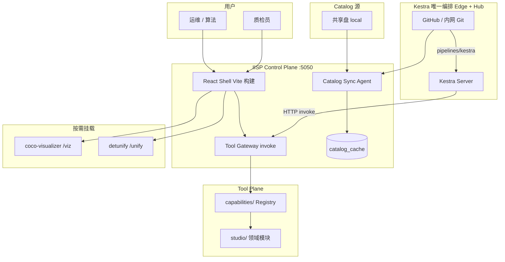

# IISP 平台完整说明

**版本**：v1.1  
**日期**：2026-06-09  
**索引**：[`DOCS_INDEX.md`](./DOCS_INDEX.md) · [`IISP_DESIGN_FINAL.md`](./IISP_DESIGN_FINAL.md) v2.2

> **IISP**（Industrial Inspection Solutions Platform）— 工业检测解决方案平台：数据查询、训练平台同步、预测、人工质检、筛选归档、评测流水线与 COCO/CSV 导出。  
> 代码仓库目录名仍为 `DetForge-Studio`，与产品名 IISP 并存。

---

## 文档索引

| 文档 | 用途 |
|------|------|
| **[`DOCS_INDEX.md`](./DOCS_INDEX.md)** | **文档索引与现行标准 v2.2** |
| **[`IISP_DESIGN_FINAL.md`](./IISP_DESIGN_FINAL.md)** | **架构定稿** |
| [`CODING_STANDARDS.md`](./CODING_STANDARDS.md) | 编码规范与技术选型 |
| [`PRODUCT_DESIGN.md`](./PRODUCT_DESIGN.md) | 产品设计 |
| [`ARCHITECTURE_DIAGRAMS.md`](./ARCHITECTURE_DIAGRAMS.md) | 架构图集 |
| **本文** | 运行部署与 API 速查 |
| [`UI_REDESIGN_CHECKLIST.md`](./UI_REDESIGN_CHECKLIST.md) | UI 改造实施清单（U1–U5） |
| [`ARCHITECTURE_GREENFIELD.md`](./ARCHITECTURE_GREENFIELD.md) | 绿场目标架构、Tool Contract、轻量化 Edge/Hub |
| [`TOOLBOX_ORCHESTRATION.md`](./TOOLBOX_ORCHESTRATION.md) | 工具箱 + 编排 v2、Kestra 集成细节 |
| [`CATALOG_CENTER.md`](./CATALOG_CENTER.md) | Catalog Provider、GitHub、迁移至内网/Nacos |
| [`SKILL_TO_TOOL.md`](./SKILL_TO_TOOL.md) | Skills → Tool 共建流程 |
| [`ARCHITECTURE_DECOUPLED.md`](./ARCHITECTURE_DECOUPLED.md) | 历史可拆解架构（迁移参考） |
| [`USER_GUIDE.md`](./USER_GUIDE.md) | 终端用户操作手册 |

---

## 1. 设计目标

| 目标 | 做法 |
|------|------|
| **编排即配置** | Kestra Flow 在 `pipelines/kestra/`；Git 版本、PR 审核、Kestra sync |
| **Edge / Hub 统一** | **均部署 Kestra**；Edge 单机，Hub 可 HA |
| **用户零安装** | Tool 经 `POST /v1/tools/{id}/invoke` |
| **配置可迁移** | Catalog 先用 GitHub；Provider 抽象支持 local / 未来 Nacos / bundle |
| **前端务实演进** | 保留 **React 19 + Vite 6**；不迁 umi、**不做 Electron 桌面壳** |

---

## 2. 总体架构



**三件事分离**：

1. **Catalog** — 「配置是什么」（策略 JSON、Pipeline YAML、releases、环境绑定）  
2. **编排** — 「什么时候、按什么顺序跑」（**Kestra**，Edge + Hub）  
3. **Tool** — 「每一步做什么」（Gateway + capabilities）

---

## 3. 两档部署：Edge 与 Hub

| 档位 | 典型场景 | 编排 | IISP |
|------|----------|------|------|
| **Edge** | 单项目产线旁 | **Kestra 单机**（H2 或轻量 PG） | 单 worker |
| **Hub** | 多 Flow、共建 PR | **Kestra**（PG、可选 HA） | Gateway + 子服务 |

`iisp flow run` **仅**本地 dev/CI dry-run，不承担生产 Cron。

详见 [`ARCHITECTURE_GREENFIELD.md` §16](./ARCHITECTURE_GREENFIELD.md#16-轻量化与性能内存优先)。

---

## 4. Catalog 配置中心

### 4.1 权威来源

独立 Git 仓（或主仓内置 `iisp-catalog/` 演示）：

```text
iisp-catalog/
├── strategies/              # 数据收集策略 JSON
├── pipelines/
│   ├── demo/                # 演示 Flow（如 welcome_demo）
│   └── legacy/              # 生产向 Pipeline DSL（可编译为 Kestra）
├── environments/            # 环境 → release 绑定
├── releases.yaml            # 发布清单（哪些 Flow 已上线）
├── tool-pins.yaml           # 工具版本 pin
└── skills-index.yaml        # Skills 元数据索引
```

**工作流与策略放在 Catalog 仓**，平台代码仓可公开；敏感业务参数不进主仓。

### 4.2 Provider 模型

通过环境变量 `IISP_CATALOG_PROVIDER` 选择后端（实现位于 `orchestration/catalog_providers/`）：

| Provider | 环境变量 | 状态 | 适用 |
|----------|----------|------|------|
| **git**（默认） | `IISP_CATALOG_REPO`、`IISP_CATALOG_REF` | ✅ 已实现 | GitHub / GitLab / Gitea / 内网 bare repo |
| **local** | `IISP_CATALOG_LOCAL` | ✅ 已实现 | NAS、运维拷贝目录 |
| **nacos** | — | 🔜 规划 | 配置下发、热更新（非版本审核首选） |
| **bundle** | — | 🔜 规划 | 离线 tar/zip 导入导出 |

同步命令：

```bash
./scripts/iisp catalog sync          # CLI
curl -X POST http://127.0.0.1:5050/api/catalog/sync
curl http://127.0.0.1:5050/api/catalog/status
```

本地缓存：`catalog_cache/strategies/`、`catalog_cache/pipelines/`。

详见 [`CATALOG_CENTER.md`](./CATALOG_CENTER.md)。

### 4.3 为何先用 GitHub

- Pipeline / 策略需要 **版本、Diff、PR、CODEOWNERS**，Git 模型最自然  
- GitHub 只是托管之一；迁移时改 `IISP_CATALOG_REPO` 指向内网 Git 即可  
- Nacos 适合**运行时下发**与热更新，不适合替代 Flow 的审核流；未来可作为第二 Provider

---

## 5. 编排体系

### 5.1 Pipeline YAML（配置格式）

编排的**权威配置**是 Catalog 中的 YAML，而非数据库里的 workflow 模板。

示例（`iisp-catalog/pipelines/demo/welcome_flow.yaml`）：

```yaml
id: welcome_demo
label: 欢迎演示 Flow
version: "1"
nodes:
  - id: greet
    tool: demo.echo
    params:
      message: "你好，{{params.reviewer}}！"
params_schema:
  reviewer:
    type: string
    default: 访客
```

- 节点引用 **tool id**（capabilities Registry）  
- `params` / `{{steps.xxx.outputs}}` 模板由 flow runner 渲染  
- `requires` 可声明上游输出字段

### 5.2 生产：Kestra（Edge + Hub）

- Flow 权威路径：`iisp-catalog/pipelines/kestra/`  
- Kestra [Git 同步](https://kestra.io/docs/developer-guide/git) 加载 Flow  
- 每步 `io.kestra.plugin.core.http.Request` → `POST /v1/tools/{id}/invoke`  
- Cron、Pause、重试、执行历史 **均在 Kestra**

详见 [`TOOLBOX_ORCHESTRATION.md`](./TOOLBOX_ORCHESTRATION.md)。

### 5.3 本地 dev：`iisp flow run`（dry-run）

```bash
./scripts/iisp flow list
./scripts/iisp flow run welcome_demo --reviewer 张三 --auto-resume
```

- 实现：`orchestration/flow_runner.py` — **非生产调度**  
- Web 演示：`/demo`  
- **禁止**用 cron + flow run 替代 Kestra 生产定时

### 5.4 遗留 workflow_engine

`studio/forge/workflow_engine.py` 处于**迁移期**，默认 `IISP_USE_REGISTRY=1` 走 capabilities。  
绿场目标：**删除**自研 DAG；新流程只写 Catalog Pipeline。

---

## 6. 工具箱（Toolbox）

### 6.1 Tool Contract v1

所有编排与消费者**只**通过 HTTP 调用工具：

```http
POST /v1/tools/{tool_id}/invoke
Content-Type: application/json
```

```json
{
  "run_id": "flow-001",
  "step_id": "query",
  "params": { "strategy_id": "daily_trawl" },
  "inputs": { "upstream": {} }
}
```

响应 `status`：`done` | `skipped` | `waiting_human` | `failed`。

过渡期 Gateway 路径：`POST /api/tools/<tool_id>/execute`（与 v1 语义对齐，后续统一到 `/v1`）。

### 6.2 工具来源

| 来源 | 说明 |
|------|------|
| **内置 capabilities** | `capabilities/builtins/`、`capabilities/demo_tools/` |
| **Manifest** | 各工具 `tool.manifest.json`，Registry 启动扫描 |
| **管理员上传**（规划） | `.iisp-tool` 包 + blueprint 远程 URL |
| **Catalog 从中心加载**（规划） | 工具箱 UI「从 Catalog 安装」 |

CLI：

```bash
./scripts/iisp tool list
./scripts/iisp tool validate path/to/tool.manifest.json
./scripts/iisp tool init-from-skill skills/xxx/SKILL.md
```

UI：侧栏 **工具箱**、**编排演示**。

---

## 7. 前端技术栈

### 7.1 当前栈（保持）

| 项 | 选型 |
|----|------|
| 框架 | React 19 |
| 构建 | Vite 6 |
| 样式 | CSS Modules / 全局 CSS（`tokens.css` 设计令牌） |
| 数据请求 | `fetch`（`frontend/src/api/client.js`） |
| 路由 | React Router |
| 后端 | Flask :5050，开发时代理 `/api` → 5050 |

### 7.2 明确不做（本期）

| 项 | 决策 |
|----|------|
| **Electron** | 暂不考虑；工业现场用浏览器 + 固定 URL / kiosk 即可 |
| **umi** | 不迁移；Vite 冷启动与 HMR 更适合当前体量 |
| **全面换 axios/less/dva** | 非必须；若新页面需要可**渐进**引入 |

### 7.3 子应用挂载

| 路径 | 包 | 说明 |
|------|-----|------|
| `/viz` | `packages/coco-visualizer` | 样本图库 |
| `/unify` | `packages/detunify` | 在线预测 |

生产建议 `IISP_MOUNT_VIZ=0`、`IISP_MOUNT_UNIFY=0`，按需独立端口以省内存。

---

## 8. 快速体验

### 8.1 安装

```bash
cd tools/DetForge-Studio
git submodule update --init --recursive
pip install -r requirements.txt
cd frontend && npm install && cd ..
```

### 8.2 开发模式

```bash
# 终端 1
python app.py                    # http://127.0.0.1:5050

# 终端 2
cd frontend && npm run dev       # http://127.0.0.1:5173 ，/api 代理到 5050
```

### 8.3 演示 Flow

```bash
./scripts/iisp flow run welcome_demo --reviewer 用户 --auto-resume
# 浏览器：http://127.0.0.1:5173/demo
```

### 8.4 Catalog 同步

```bash
# 使用内置 iisp-catalog/（未设 IISP_CATALOG_REPO 时）
./scripts/iisp catalog sync

# 指向 GitHub 私有仓
export IISP_CATALOG_REPO=https://github.com/your-org/iisp-catalog.git
export IISP_CATALOG_REF=main
./scripts/iisp catalog sync
```

---

## 9. 目录结构（当前仓库）

```text
DetForge-Studio/
├── app.py                       # Flask 入口
├── capabilities/                # Tool Registry、Manifest、builtins
├── orchestration/
│   ├── flow_runner.py           # Edge Flow 解释器
│   ├── catalog_sync.py          # sync → catalog_cache
│   ├── catalog_providers/       # git | local | (nacos | bundle)
│   └── loader.py                # 读 Pipeline YAML
├── iisp-catalog/                # 演示 / 默认 Catalog 树
├── studio/                      # 领域能力（查询、质检、forge…）
├── server/                      # API 路由（tools、flows、catalog）
├── frontend/                    # React + Vite
├── packages/                    # submodule：coco-visualizer、detunify
├── scripts/iisp                 # CLI 入口
└── docs/                        # 架构与用户文档
```

---

## 10. 环境变量速查

### Catalog

| 变量 | 默认 | 说明 |
|------|------|------|
| `IISP_CATALOG_PROVIDER` | `git` | `git` \| `local` |
| `IISP_CATALOG_REPO` | 空 | Git URL；空则用内置 `iisp-catalog/` |
| `IISP_CATALOG_REF` | `main` | 分支或 tag |
| `IISP_CATALOG_LOCAL` | `catalog_cache/repo` | `local` Provider 路径 |
| `IISP_CATALOG_SYNC_ON_START` | `0` | `1` 启动时自动 sync |

### 运行时

| 变量 | 说明 |
|------|------|
| `IISP_USE_REGISTRY` | `1` 使用 capabilities Registry（推荐） |
| `IISP_MOUNT_VIZ` / `IISP_MOUNT_UNIFY` | `0` 关闭子应用挂载 |

完整配置见 [`CONFIG_README.md`](../CONFIG_README.md)。

---

## 11. API 摘要

| 方法 | 路径 | 说明 |
|------|------|------|
| GET | `/api/tools` | 工具列表 |
| POST | `/api/tools/{id}/execute` | 执行工具（→ v1 invoke） |
| POST | `/api/flows/run` | 运行 Pipeline Flow |
| GET | `/api/catalog/status` | Catalog Provider 与缓存状态 |
| POST | `/api/catalog/sync` | 触发 Catalog 同步 |

目标统一前缀：`/v1/tools/{id}/invoke`、`/v1/orchestration/resume`。

---

## 12. 实施路线

| 阶段 | 内容 | 状态 |
|------|------|------|
| **P0** | capabilities Registry + platform 共享层 | ✅ |
| **P1** | Tool Manifest、工具箱 UI、`iisp tool` | ✅ |
| **P2** | iisp-catalog、`catalog sync`、strategy 读缓存 | ✅ |
| **P3** | skill → tool、`init-from-skill` | ✅ |
| **P4** | Pipeline loader、`flow run`、demo Web | ✅ |
| **P5** | Catalog Provider 抽象、文档、releases.yaml | ✅ 本文档 |
| **下一步** | `/v1` invoke 统一、Kestra 编译器、`.iisp-tool` 上传 | 🔜 |
| **可选** | Nacos Provider、bundle import/export、Dify 草稿 → PR | 🔜 |

---

## 13. 与低代码平台的差异（参考）

| 概念 | IISP |
|------|------|
| 单步能力 | Tool（`invoke` + Manifest） |
| 组合流程 | **`pipelines/kestra/` + Kestra**（Edge + Hub 统一） |
| 界面 | IISP React Shell + 领域页 |
| 配置 | `environments/`、`releases.yaml`、Git Catalog |

IISP 选择 **Git Catalog + Kestra + Tool 契约**，不用 Windmill 等一体化低代码作为主路径。

---

## 14. 安全与共建

- 敏感配置：`config.json`、`.config.key` **勿提交**  
- Catalog 仓：私有 GitHub 或内网 Git；`CODEOWNERS` 审核 Flow/策略  
- 子模块：`packages/coco-visualizer`、`packages/detunify` 独立 git  

贡献路径：`skills/` → `iisp tool init-from-skill` → 主仓 PR → `iisp-catalog` Flow PR。

---

## 15. 修订记录

| 版本 | 日期 | 说明 |
|------|------|------|
| v1.0 | 2026-06-09 | 首版：Edge/Hub、Catalog Provider、前端无 Electron、完整索引 |
