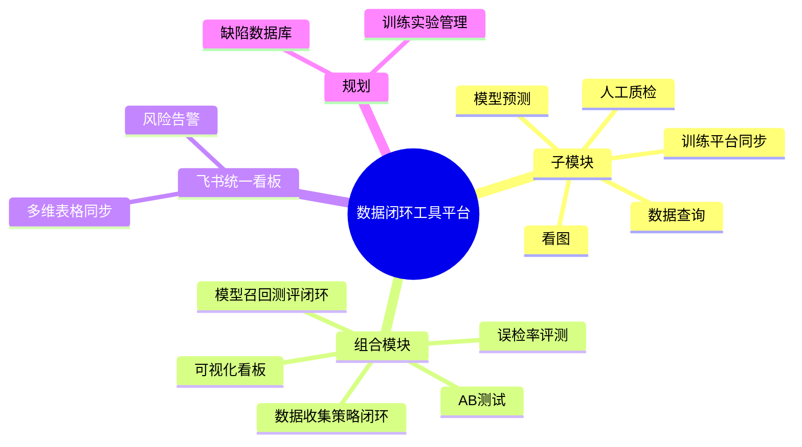
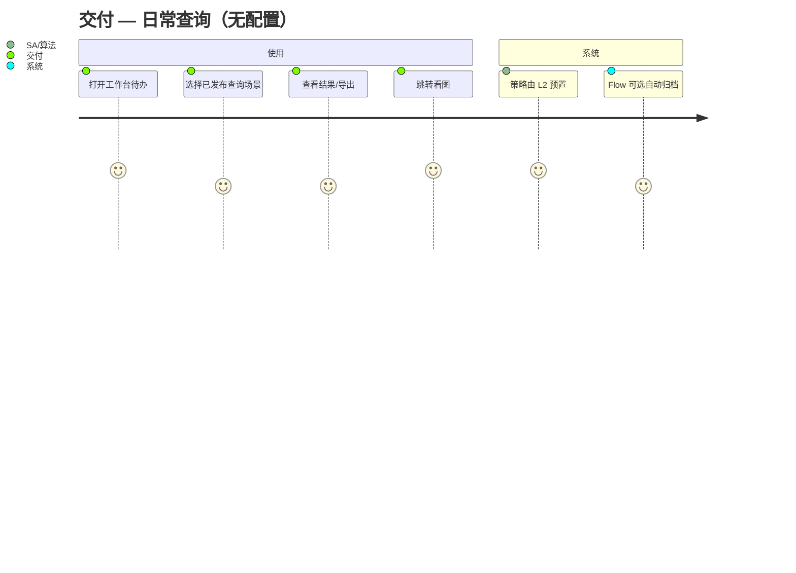
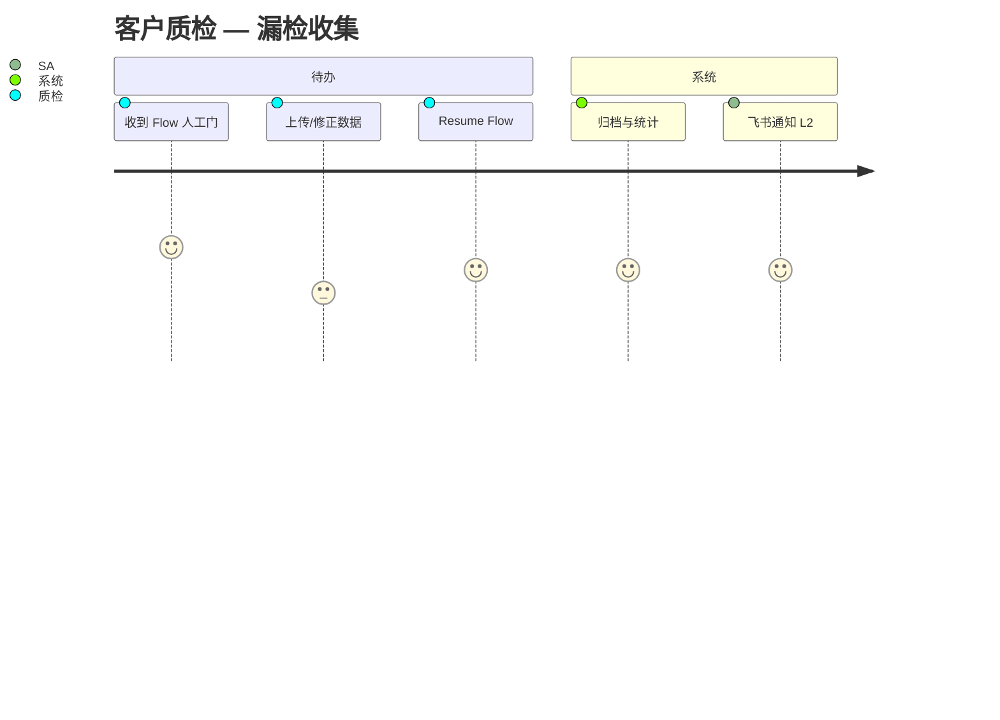
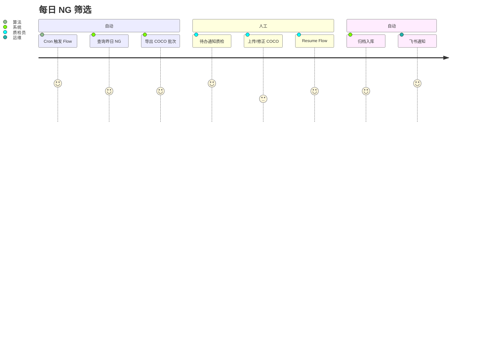
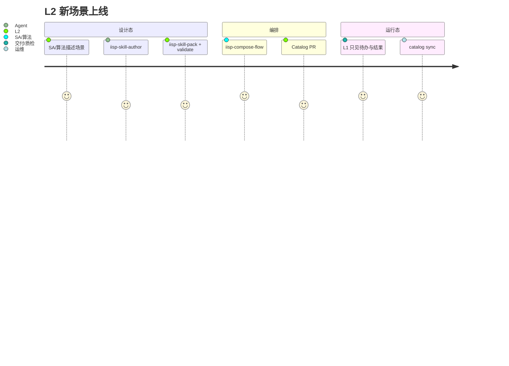

# IISP 产品设计

**版本**：v1.2  
**状态**：产品定稿  
**索引**：[`DOCS_INDEX.md`](./DOCS_INDEX.md) · [`IISP_DESIGN_FINAL.md`](./IISP_DESIGN_FINAL.md) v2.2  
**业务来源**：[飞书 · 数据闭环建设方案评审](https://zcnce50wan15.feishu.cn/wiki/H7RQwspDKiqDsPkFJu0cgIaFnuB)

---

## 1. 产品定义

**IISP** — **数据闭环工具平台**，支撑工业缺陷检测从产线状态到持续迭代的闭环：

```text
标准定目标 → 状态明现实 → 迭代缩差距
```

对应平台能力（见 [§3](#3-系统生态与能力地图)）：

```text
子模块（原子 Tool）→ 组合模块（Pipeline）→ 飞书统一看板（指标与告警）
```

**产品边界**：

- **是**：数据闭环工作台、Tool 运行时、Catalog 配置客户端、工具箱与流水线观测、飞书指标同步  
- **不是**：通用 BPM、低代码全栈平台、桌面客户端、训练框架本身（训练在 Magic-Fox / HQ）

**代码仓名**：`DetForge-Studio`（历史名，对外品牌 **IISP**）

---

## 2. 用户分层（两层模型）

全系统只分 **两层**；权限、导航、可配置范围均按此划分。

### 2.1 L1 · 作业层（Operator）— 只使用，不配置流程

| 角色 | 典型工作 | 可见能力 | 明确禁止 |
|------|----------|----------|----------|
| **交付工程师** | 日常捞数、历史 OK 复跑、看查询/导出结果、处理待办卡点 | 工作台待办、**已发布**查询入口（无代码/常用场景）、看图、人工质检上传、Resume 人工门 | 改查询策略、编 Pipeline、Catalog sync、工具箱开发、Skill 封装 |
| **客户质检人员** | 漏检收集、核对上传、按批次审图 | 工作台待办、人工质检、看图、指定 Flow 的 Resume | 同上 |

**L1 产品原则**：

- 复杂逻辑（SQL+Python、策略 JSON、定时任务）由 **L2 预先封装** 为 Tool / Kestra Flow  
- 导航 **不出现**「流水线配置」「策略编辑」「工具箱开发者」「Catalog 管理」。  
- 首页 = **待办 + 进行中任务 + 最近作业**（≤ 2 次点击进业务页）。

### 2.2 L2 · 配置层（Configurer）— 使用 + 流程与策略管理

| 角色 | 典型工作 | 在 L1 基础上增加 |
|------|----------|------------------|
| **SA 解决方案工程师** | 项目闭环方案、组合模块上线、客户指标看板、验收口径落地 | 组合 Pipeline 配置（Catalog）、飞书看板绑定、标准/验收指标封装进 Flow、Skill→Tool 共建（业务语言） |
| **算法工程师** | 评测集、A/B、召回/误检评测、模型预测与训练同步 | 查询策略（SQL+Python 或 Skill 封装）、模型源配置、Benchmark Flow、实验记录 |
| **光学工程师** | 设备/光源/相机状态与问题归因 | 状态类 Tool 参数、与图像溯源相关的 Flow 步骤、设备参数写入/读取（状态体系） |

**L2 产品原则**：

- **子模块**：可直调 Tool（工具箱试运行）或通过 Skill 扩展新 Tool。  
- **组合模块**：通过 Catalog Pipeline + **iisp-compose-flow** 编排；运行态 L1 只见「任务名 + 进度 + 待办」。  
- **标准体系工具化**：指标与收集策略 **封装在 Flow 内**，交付工程师 **无需理解细节**（飞书文档 §2 明确要求）。

### 2.3 平台组（内部，非业务两层）

| 角色 | 职责 |
|------|------|
| **平台开发** | Gateway、Registry、Catalog Provider、MCP |
| **运维 SRE** | 部署、Kestra、catalog sync、告警通道 |

Hub 规划：OIDC 映射 `operator` / `configurer` / `admin`；L1 内可细分为 `delivery` / `customer_qc` 默认首页差异。

### 2.4 与 Skill 开发路径的关系（修正）

| 谁 | 与 Skill/Tool 的关系 |
|----|----------------------|
| **L1 交付 / 客户质检** | **不**写 Skill、**不**封装 Tool；只用已发布能力 |
| **L2 SA / 算法 / 光学** | **主要** Tool/Pipeline 贡献者；SA 偏 Skill 业务描述 + 编排，算法偏 script/capability，光学偏状态类 Tool 参数 |
| **平台组** | 维护封装器、`iisp skill pack`、Shell UI 规范 |

详见 [`SKILL_PLATFORM.md`](./SKILL_PLATFORM.md)。

---

## 3. 系统生态与能力地图

与 [飞书方案](https://zcnce50wan15.feishu.cn/wiki/H7RQwspDKiqDsPkFJu0cgIaFnuB) 及平台脑图对齐：**子模块 + 组合模块 + 飞书看板**；并映射三大体系。

### 3.1 三大体系 ↔ 平台

| 体系 | 要回答的问题 | 平台承载 |
|------|--------------|----------|
| **标准体系** | 什么叫做好？ | 指标与验收口径 **封装进 Pipeline**；L1 无感 |
| **状态体系** | 现在真实状态？ | 查询/溯源/看图/设备与工程日志 Tool + 状态归档 |
| **迭代体系** | 如何持续改进？ | 组合闭环 Flow + Benchmark + 版本/经验沉淀（规划） |

### 3.2 子模块（原子 Tool，持续扩展）

| 子模块 | 使用场景（摘要） | L1 | L2 | 实现形态（目标） |
|--------|------------------|----|----|------------------|
| **数据查询** | 交付：日常/历史 OK；算法：在线分析、评测集、A/B | 常用场景 **无代码** 入口 | 策略/SQL+Python、Skill 封装 | Tool `query` + 策略 Catalog |
| **模型预测** | 交付：历史 OK 复跑；算法：A/B、召回、一致性 | 触发 **已配置** 预测任务 | 模型源、阈值、批量任务 | DetUnify + Tool `predict` |
| **训练平台同步** | 数据/标签/模型与 Magic-Fox 同步 | — | 配置同步策略 | Tool `training-sync` |
| **人工质检核对** | 漏检收集、导入归档、统计评估 | 上传/审图/Resume | 批次规则、归档策略 | Tool `manual-qc` |
| **看图** | 查结果、导出数据可视化 | ✅ | ✅ | `/viz` COCOVisualizer |

> **数据查询** 底层保留 SQL+Python 全路径；**常用场景** 由 L2 封装为 schema 表单，对齐「从代码块到无代码使用」。

### 3.3 组合模块（Pipeline 模板，Catalog 增长）

| 组合模块 | 步骤（摘要） | 主要配置者 |
|----------|--------------|------------|
| **数据收集策略闭环** | 定时执行 → 结果归档 | SA、算法 |
| **模型召回测评闭环** | 人工质检归档 → 历史模型预测 → 评测指标 → 同步看板 | 算法、SA |
| **误检率评测** | 指定时段抽样 → 模型预测 → 人工统计 → 结果归档 | 算法、SA |
| **A/B 测试** | 对照组 Flow + 指标对比 | 算法 |
| **可视化看板** | 业务指标 + 算法指标 | SA（对内/对客户） |

L1 只见：**任务列表、进度、待办、结果链接**；不见 YAML/DAG 编辑。

### 3.4 飞书统一看板（生态层）

| 能力 | 说明 |
|------|------|
| 指标同步 | 项目指标写入飞书 **多维表格** |
| 可视化 | 表格驱动看板（业务 + 算法） |
| 告警 | 关键指标风险条件 → 通知相关人员 |

**实现边界**：IISP 产出结构化 metrics/artifacts → 同步 Tool 或 Pipeline 末步；**不在** IISP 内复刻飞书 BI。

### 3.5 规划扩展（飞书 §其他计划）

| 方向 | 场景 | 形态 |
|------|------|------|
| **缺陷数据库** | Benchmark、缺陷生成、基座训练 | 独立部署服务 + Tool 接入 |
| **训练实验管理** | 批量实验、数据/超参/结果记录 | Hub 侧；与 Magic-Fox/HQ 联动 |

**扩展原则**：新能力 = **(+ Tool)** 或 **(+ Pipeline)** + Catalog PR；Core 不随业务膨胀。



---

## 4. 信息架构（按两层差异化）

### 4.1 L1 导航（交付 / 客户质检）

| 域 | 用户问题 | 页面 |
|----|----------|------|
| **工作台** | 我今天要干什么？ | 待办、进行中任务、最近查询/质检 |
| **作业** | 怎么查/审/上传？ | 查询（常用场景）、结果、人工质检、看图 |
| **我的任务** | 自动化跑到哪了？ | **只读** Flow 运行记录、Resume 人工门 |

**隐藏**：策略编辑、工具箱开发、Catalog、Pipeline 编排、平台设置（除个人/手册）。

### 4.2 L2 导航（SA / 算法 / 光学）

| 域 | 用户问题 | 页面 |
|----|----------|------|
| **工作台** | 项目与健康度 | 待办 + 指标摘要 + 快捷触发 Flow |
| **作业** | 子模块全能力 | 查询策略、质检、归档、预测、训练同步 |
| **流水线** | 组合怎么配/跑得怎样？ | Flow 目录、运行记录、validate 助手（设计态） |
| **平台** | 工具与集成 | 工具箱、Catalog 同步、飞书看板配置、设置 |

嵌入子产品：`/viz` · `/unify`

---

## 5. 核心用户旅程

### 5.1 交付工程师：日常捞数（L1）



### 5.2 客户质检：漏检核对（L1）



### 5.3 SA：上线数据收集策略闭环（L2）


### 5.4 算法：误检率评测（L2）


### 5.5 每日 NG 筛选（组合模块示例）



对应 Catalog Flow：`daily_ng_curation`（示例）。

### 5.6 L2 扩展能力（Skill / Tool / Pipeline）



---

## 6. 功能模块与 Tool 映射（当前 + 计划）

| 模块 | 产品价值 | Tool / 路由 | 阶段 |
|------|----------|-------------|------|
| 数据查询 | vision_backend 按策略捞数 | `query` | 已有 |
| 人工质检 | 漏检收集、批次 | `manual-qc` | 已有 |
| 筛选归档 | COCO、批次 | `curation-*` | 已有 |
| 模型预测 | 在线/批量 | `predict` / `/unify` | 已有 |
| 训练平台同步 | Magic-Fox | `training-sync` | 已有 |
| 看图 | 结果可视化 | `/viz` | 已有 |
| 数据收集策略闭环 | 定时→归档 | Pipeline 模板 | **计划** |
| 召回测评闭环 | 质检→预测→指标 | Pipeline 模板 | **计划** |
| 误检率评测 | 四步 Flow | Pipeline 模板 | **计划** |
| A/B 测试 | 对照 Flow | Pipeline 模板 | **计划** |
| 可视化看板 | 业务+算法指标 | metrics Tool + 飞书 | **计划** |
| 飞书统一看板 | 多维表格+告警 | sync Tool | **计划** |
| 缺陷数据库 | Benchmark/生成 | 独立服务 | 规划 |
| 训练实验管理 | 实验记录 | Hub 集成 | 规划 |

---

## 7. 架构与设计变更建议（相对 v1.0）

基于真实角色与 [飞书方案](https://zcnce50wan15.feishu.cn/wiki/H7RQwspDKiqDsPkFJu0cgIaFnuB)，建议调整如下：

| 领域 | 原假设 | 应改为 |
|------|--------|--------|
| **角色** | 扁平多角色 + 「业务工具作者=非专业」 | **L1 作业 / L2 配置** 两层；Skill 作者 **仅 L2** |
| **IA** | 全员四域导航 | L1 **三域**（无流水线配置/平台开发）；L2 全量 |
| **数据查询** | 算法自助选策略 | L1 **场景卡片**（L2 预置）；L2 保留 SQL+Python 全路径 |
| **流水线页** | 全员可见 Flow 目录 | L1 仅 **我的任务**；L2 见 Catalog + 助手 |
| **工具箱** | 开放试运行 | L1 **隐藏**或仅「分配给我的工具」；L2 全工具箱 |
| **RBAC** | QC/algo/ops 粗分 | `operator` / `configurer` + 子角色默认首页 |
| **Skill 文档** | 面向「非专业开发者」 | 面向 **L2 SA/算法**；L1 文档改为 **使用手册** |
| **Catalog** | 通用 Pipeline | 优先 **组合模块模板库**（§3.3 五类 + 扩展） |
| **集成** | 飞书通知 | **飞书多维表格指标同步 + 告警**（生态层） |
| **UI U5** | 泛化角色视图 | 实现 **L1/L2 硬切换** + 交付/质检首页差异 |

**无需推翻**：Tool Contract、Skill→Tool 封装、Catalog Git、Edge/Hub 拆分 — 与飞书「工具化承载」一致。

---

## 8. 与非功能需求

| 维度 | Edge 产线 | Hub 中心 |
|------|-----------|----------|
| 内存 | 常态 &lt; 512MB | 1.5–4GB+ |
| 可用性 | 单点可接受 | Kestra 高可用可选 |
| 部署 | 无 JVM | Kestra + PG |
| 安全 | API Token | OIDC + **L1/L2 RBAC** |
| 扩展 | Tool/Pipeline PR | 同上 + 多项目 Catalog |

---

## 9. 竞品/参考形态

| 参考 | IISP 取舍 |
|------|-----------|
| Kestra | Hub/Edge 统一编排；配置用 Git Catalog |
| 自研 BPM | 不做主路径 |
| Label Studio | 可选对接；manual_qc 保留定制流程 |

---

## 10. 产品演进阶段

| 阶段 | 用户可感知 |
|------|------------|
| **现况** | 侧栏多功能、workflow 迁移期、demo Flow |
| **U1–U2** | 工作台、四域导航 |
| **U3** | 流水线只读、弱化 DAG 编辑 |
| **M2–M4** | 生产 Flow on Kestra、删旧引擎 |
| **A1–A5** | 全员 Cursor Vibe Tool/Flow |

---

## 11. 成功指标（产品）

1. **L1** 交付/质检：**待办 → 业务页** ≤ 2 次点击；**零** 暴露策略/YAML  
2. **L2** 新组合模块：**零 Platform 发版**（Catalog sync + Tool PR）  
3. **SA** 上线标准验收 Flow：**1 周内** Catalog 可跑通  
4. **算法** 误检/召回评测：模板 Flow **复制即用**  
5. Edge / Hub 均可跑通主线 Flow（**Kestra**）  

---

## 12. 修订记录

| 版本 | 日期 | 说明 |
|------|------|------|
| v1.2 | 2026-06-09 | DOCS_INDEX、Kestra 统一、文档交叉引用 |
| v1.1 | 2026-06-09 | L1/L2 两层、五角色、飞书生态 |
| v1.0 | 2026-06-09 | 角色、IA、旅程、能力地图 |
