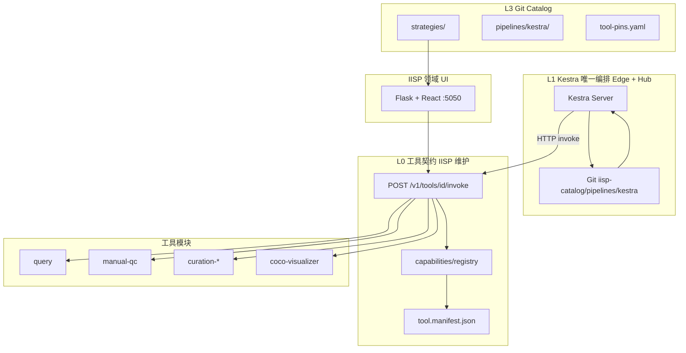

# IISP 工具箱与编排体系

**版本**：v2.3  
**状态**：Tool Contract 细则；**定稿以 [IISP_DESIGN_FINAL.md](./IISP_DESIGN_FINAL.md) v2.2 为准**  
**编排决策**：**Edge + Hub 统一使用 [Kestra](https://kestra.io)**；Windmill、cron、`iisp flow run` 生产路径已废弃。

**关联**：[**最终架构定稿**](./IISP_DESIGN_FINAL.md) · [平台完整说明](./IISP_PLATFORM.md) · [Catalog 配置中心](./CATALOG_CENTER.md) · [Skills 共建规范](./SKILL_TO_TOOL.md)

---

## 1. 架构决策（已确认）

**不自研编排 DAG 引擎。** 调度、依赖、重试、定时、人工等待 **全部交给 Kestra**；IISP 只维护**工具契约**与**领域执行**。

| 层级 | 选型 | 职责 |
|------|------|------|
| **编排（Edge + Hub）** | **[Kestra](https://github.com/kestra-io/kestra)** | Cron、DAG、Pause/Webhook、Git 同步、执行历史 |
| **工具运行时** | **IISP Tool Gateway** | 统一 `invoke` API、Registry、Manifest 校验 |
| **配置源** | **Git `iisp-catalog`** + Provider | `strategies/`、`pipelines/kestra/`、`releases.yaml` |
| **领域 UI** | **IISP :5050**（React + Vite） | 查询、质检、筛选、工具箱、流水线观测 |
| **旁路（可选）** | n8n | Webhook、飞书通知（**非主编排**） |
| **设计态（可选）** | Dify / Cursor | 生成 Kestra Flow 或 Pipeline DSL 草稿 → Catalog PR |
| **本地 dev** | `iisp flow run` | **仅** dry-run / CI；**不**承担生产定时 |

**废弃方向**（不再扩展）：
- 自研 [`workflow_engine.py`](../studio/forge/workflow_engine.py)
- **Windmill** 作为备选编排
- **cron + `iisp flow run`** 作为 Edge 生产调度
- `STEP_HANDLERS` 内直接 `import studio.*`（过渡期保留，默认 `IISP_USE_REGISTRY=1`）

---

## 2. 分层架构



| 层 | 目录 | 谁维护 |
|----|------|--------|
| L0 工具箱 | `capabilities/`、`tool.manifest.json` | IISP 团队 |
| L1 编排 | **Kestra**（外部服务，Edge 单机 / Hub 集群） | 运维 + 平台；Flow 在 Catalog |
| L2 共建 | `skills/`、`tools/*` | L2 配置者 PR |
| L3 配置 | `iisp-catalog/` | 全员 PR + CODEOWNERS |

---

## 3. Tool Contract v1（固定调用方式）

所有工具模块**必须**实现同一 JSON 契约。编排引擎（Kestra）**只**通过 HTTP 调用此契约，不感知 Python import 路径。

### 3.1 Invoke 请求

```http
POST /v1/tools/{tool_id}/invoke
Content-Type: application/json
```

```json
{
  "run_id": "wf-20260609-001",
  "step_id": "query",
  "params": {
    "strategy_id": "daily_trawl",
    "time_window": { "preset": "yesterday" },
    "data_source": "detail"
  },
  "inputs": {
    "upstream": {}
  }
}
```

| 字段 | 说明 |
|------|------|
| `run_id` | 编排侧执行 ID（Kestra `execution.id`） |
| `step_id` | 当前步骤 ID |
| `params` | 本步配置（来自 Flow YAML / 模板） |
| `inputs` | 上游步骤聚合的 `outputs`（由编排引擎注入） |

### 3.2 Invoke 响应

```json
{
  "status": "done",
  "outputs": {
    "task_id": "abc-123",
    "row_count": 128,
    "count": 128
  },
  "artifacts": [
    { "kind": "csv", "uri": "exports/abc-123/result.csv", "meta": {} }
  ],
  "error": null
}
```

`status` 枚举（固定，不可扩展新值 without 版本升级）：

| status | 含义 | 编排侧行为 |
|--------|------|------------|
| `done` | 成功 | 继续下游 |
| `skipped` | 空结果等可跳过 | 按 Flow 分支策略处理 |
| `waiting_human` | 需人工操作 | Kestra `Pause` / Webhook resume |
| `failed` | 失败 | 重试或告警 |

### 3.3 与现有 Manifest 的关系

[`tool.manifest.json`](../tool.manifest.json) 扩展约定：

```json
{
  "id": "query",
  "version": "1.0.0",
  "label": "数据查询",
  "kind": "capability",
  "contract_version": "v1",
  "entry": {
    "invoke": "/v1/tools/query/invoke",
    "capability": "studio.query.capabilities:QueryCapability",
    "cli": "python -m studio.query.cli invoke",
    "blueprint": null
  },
  "params_schema": { "type": "object", "properties": { "strategy_id": { "type": "string" } } },
  "inputs": [],
  "outputs": ["task_id", "row_count", "count"],
  "artifacts": ["csv"]
}
```

- **编排引擎只读**：`id`、`params_schema`、`inputs`、`outputs`、`entry.invoke`
- **实现方式**（`capability` / `cli` / 独立 HTTP）对 Kestra 不可见

### 3.4 三种实现通道（模块内选一种，对外契约相同）

| 通道 | 适用 | 说明 |
|------|------|------|
| **HTTP** | 编排默认 | Gateway 路由到 Registry `execute()` |
| **CLI** | CI、批处理 | `echo '{...}' \| iisp tool invoke query`，stdout 同 JSON |
| **MCP** | Cursor/Agent | 可选；inputs/outputs 与 v1 一致 |

---

## 4. Kestra 唯一编排（Edge + Hub）

### 4.1 职责边界

| Kestra 做 | IISP 不做 |
|-----------|-----------|
| 步骤调度、依赖、并行 | 自研 DAG `advance_run` |
| Cron / 事件触发（**含 Edge 定时**） | 自研 `workflow_scheduler`、**cron 主编排** |
| Pause、Webhook resume（人工卡点） | 引擎内 `waiting_human` 状态机 |
| 执行历史、重试、告警 | `workflow_run` 表（可只读镜像或废弃） |
| 从 Git 加载 Flow | 内置 `workflow_templates` 种子 |

| IISP 做 | Kestra 不做 |
|---------|-------------|
| 查询、质检、归档、预测 | 平台 DB、策略执行 |
| Tool Gateway + Manifest | 领域业务逻辑 |
| 策略 JSON（`strategies/`） | 策略内容定义 |
| 业务 UI（查询页、质检台） | 交互式标注、COCO 编辑 |

**Edge 部署**：Kestra 单机（嵌入式 H2 或轻量 Postgres）；与 Hub 共用同一 Flow Git 源。

### 4.2 Flow 存放位置

```text
iisp-catalog/
├── pipelines/
│   ├── kestra/                    # **运行时权威** Kestra Flow YAML
│   │   └── daily_ng_curation.yaml
│   └── legacy/                    # 设计态 Pipeline DSL（编译 → kestra/）
├── strategies/
└── tool-pins.yaml
```

Kestra 通过 [Git 同步](https://kestra.io/docs/developer-guide/git) 拉取 `pipelines/kestra/`（Edge / Hub 相同）。

示例 Flow：[`docs/examples/kestra/daily_ng_curation.yaml`](./examples/kestra/daily_ng_curation.yaml)

### 4.3 单步调用模式（Kestra HTTP Request）

```yaml
tasks:
  - id: query
    type: io.kestra.plugin.core.http.Request
    uri: "{{ vars.iisp_base }}/v1/tools/query/invoke"
    method: POST
    headers:
      Content-Type: application/json
    body: |
      {{ json({
        "run_id": execution.id,
        "step_id": "query",
        "params": {
          "strategy_id": inputs.strategy_id,
          "time_window": inputs.time_window,
          "data_source": "detail"
        },
        "inputs": { "upstream": {} }
      }) }}
```

### 4.4 人工卡点

| 场景 | Kestra 做法 |
|------|-------------|
| 等待上传 COCO | `io.kestra.plugin.core.flow.Pause` 或 Webhook `onResume` |
| 用户在 IISP 质检页完成操作 | `POST /v1/orchestration/resume` → Kestra resume API |
| `gate-human` 工具 | 返回 `waiting_human` 后 Flow 进入 Pause |

### 4.5 环境变量

| 变量 | 说明 |
|------|------|
| `IISP_BASE_URL` | Kestra Flow 内 `vars.iisp_base` |
| `KESTRA_URL` | IISP 展示执行状态、resume 回调 |
| `IISP_CATALOG_REPO` | 策略与 Flow 的 Git 源 |

---

## 5. 可选旁路

### 5.1 n8n（集成态）

- Catalog PR 合并 → Webhook → `POST /api/catalog/refresh`
- Flow 完成/失败 → 飞书通知
- **不**承担主编排

### 5.2 Dify（设计态）

- 自然语言 → 生成 Kestra Flow YAML 草稿 → Catalog PR
- **不**执行 `invoke`

### 5.3 `iisp flow run`（仅 dev/CI）

- 本地 dry-run、单测、无 Kestra 环境的 CI
- **禁止**作为 Edge 生产定时替代

---

## 6. 内置工具与 Kestra 步骤映射

| tool_id | 标签 | 典型 outputs | 备注 |
|---------|------|--------------|------|
| `query` | 数据查询 | `task_id`, `row_count` | |
| `predict` | 批量预测 | `job_id`, `status` | |
| `curation-create` | 创建筛选批次 | `batch_id` | |
| `curation-export` | 导出出站包 | `export_dir` | |
| `gate-human` | 人工卡点 | `batch_id`, `waiting` | 配合 Pause |
| `curation-import` | 导入 COCO | `keep_count` | |
| `curation-archive` | 归档 | `archive_dir` | |
| `manual-qc` | 人工质检 | `records`, `count` | |

---

## 7. 迁移路线

| 阶段 | 交付 |
|------|------|
| **M2** | Edge + Hub Kestra Git sync、`daily_ng_curation` 跑通 |
| **M3** | 新 Flow **只**进 `pipelines/kestra/` |
| **M4** | 删 `workflow_engine` / `workflow_scheduler` |

---

## 8. 文档修订记录

| 版本 | 日期 | 说明 |
|------|------|------|
| v2.3 | 2026-06-09 | **编排统一 Kestra**（Edge+Hub）；废弃 Windmill、cron 生产路径 |
| v2.0 | 2026-06-09 | Kestra 主编排 + Tool Contract v1 |
