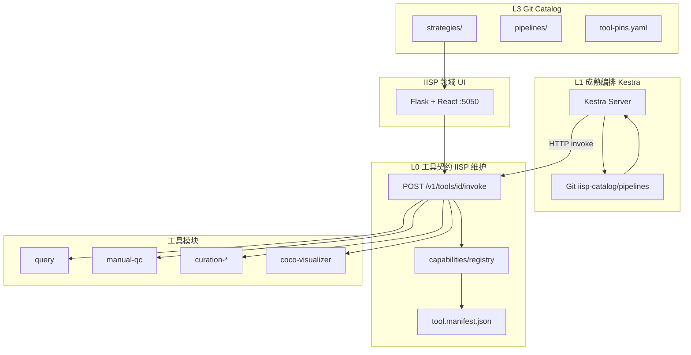
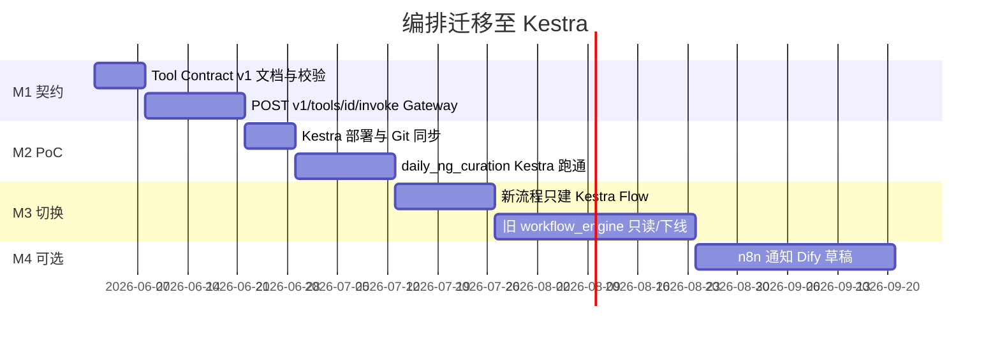

# IISP 工具箱与编排体系

**版本**：v2.2  
**状态**：Tool Contract 细则；**定稿以 [IISP_DESIGN_FINAL.md](./IISP_DESIGN_FINAL.md) 为准**  
**关联**：[**最终架构定稿**](./ARCHITECTURE_FINAL.md) · [平台完整说明](./IISP_PLATFORM.md) · [Catalog 配置中心](./CATALOG_CENTER.md) · [可拆解架构](./ARCHITECTURE_DECOUPLED.md) · [绿场重构方案](./ARCHITECTURE_GREENFIELD.md) · [Skills 共建规范](./SKILL_TO_TOOL.md)

---

## 1. 架构决策（已确认）

**不自研编排 DAG 引擎。** 调度、依赖、重试、定时、人工等待由成熟产品或轻量 CLI 承担；IISP 只维护**工具契约**与**领域执行**。

| 层级 | 选型 | 职责 |
|------|------|------|
| **Edge 编排** | **`iisp flow run` + cron** | 读 Catalog Pipeline YAML，顺序 HTTP invoke |
| **Hub 编排** | **[Kestra](https://github.com/kestra-io/kestra)**（首选）或 Windmill | DAG、定时、Pause/Webhook、Git 同步 |
| **工具运行时** | **IISP Tool Gateway** | 统一 `invoke` API、Registry、Manifest 校验 |
| **配置源** | **Git `iisp-catalog`** + Provider | `strategies/`、`pipelines/`、`releases.yaml` |
| **领域 UI** | **IISP :5050**（React + Vite） | 查询、质检、筛选、工具箱；**非 Electron** |
| **旁路（可选）** | n8n | Webhook、飞书通知 |
| **设计态（可选）** | Dify | 自然语言生成 Pipeline 草稿 → Catalog PR |

**备选编排**：若人工卡点与长事务要求极高，可将主编排换为 [Temporal](https://github.com/temporalio/temporal)；流程定义偏代码，业务同学改 YAML 成本更高。

**废弃方向**（不再扩展）：
- 自研 [`workflow_engine.py`](../studio/forge/workflow_engine.py) 作为主调度器
- `STEP_HANDLERS` 内直接 `import studio.*`（过渡期保留，默认 `IISP_USE_REGISTRY=1`）

---

## 2. 分层架构



| 层 | 目录 | 谁维护 |
|----|------|--------|
| L0 工具箱 | `capabilities/`、`tool.manifest.json` | IISP 团队 |
| L1 编排 | Kestra（外部服务） | 运维 + 平台；Flow 定义在 Catalog |
| L2 共建 | `skills/`、`packages/*` | 全员 PR |
| L3 配置 | `iisp-catalog/` | 全员 PR + CODEOWNERS |

---

## 3. Tool Contract v1（固定调用方式）

所有工具模块**必须**实现同一 JSON 契约。编排引擎（Kestra）**只**通过 HTTP 调用此契约，不感知 Python import 路径。

### 3.1 Invoke 请求

```http
POST /v1/tools/{tool_id}/invoke
Content-Type: application/json
```

```json
{
  "run_id": "wf-20260609-001",
  "step_id": "query",
  "params": {
    "strategy_id": "daily_trawl",
    "time_window": { "preset": "yesterday" },
    "data_source": "detail"
  },
  "inputs": {
    "upstream": {}
  }
}
```

| 字段 | 说明 |
|------|------|
| `run_id` | 编排侧执行 ID（Kestra `execution.id`） |
| `step_id` | 当前步骤 ID |
| `params` | 本步配置（来自 Flow YAML / 模板） |
| `inputs` | 上游步骤聚合的 `outputs`（由编排引擎注入） |

### 3.2 Invoke 响应

```json
{
  "status": "done",
  "outputs": {
    "task_id": "abc-123",
    "row_count": 128,
    "count": 128
  },
  "artifacts": [
    { "kind": "csv", "uri": "exports/abc-123/result.csv", "meta": {} }
  ],
  "error": null
}
```

`status` 枚举（固定，不可扩展新值 without 版本升级）：

| status | 含义 | 编排侧行为 |
|--------|------|------------|
| `done` | 成功 | 继续下游 |
| `skipped` | 空结果等可跳过 | 按 Flow 分支策略处理 |
| `waiting_human` | 需人工操作 | Kestra `Pause` / Webhook resume |
| `failed` | 失败 | 重试或告警 |

### 3.3 与现有 Manifest 的关系

[`tool.manifest.json`](../tool.manifest.json) 扩展约定：

```json
{
  "id": "query",
  "version": "1.0.0",
  "label": "数据查询",
  "kind": "capability",
  "contract_version": "v1",
  "entry": {
    "invoke": "/v1/tools/query/invoke",
    "capability": "studio.query.capabilities:QueryCapability",
    "cli": "python -m studio.query.cli invoke",
    "blueprint": null
  },
  "params_schema": { "type": "object", "properties": { "strategy_id": { "type": "string" } } },
  "inputs": [],
  "outputs": ["task_id", "row_count", "count"],
  "artifacts": ["csv"]
}
```

- **编排引擎只读**：`id`、`params_schema`、`inputs`、`outputs`、`entry.invoke`
- **实现方式**（`capability` / `cli` / 独立 HTTP）对 Kestra 不可见

### 3.4 三种实现通道（模块内选一种，对外契约相同）

| 通道 | 适用 | 说明 |
|------|------|------|
| **HTTP** | 编排默认 | Gateway 路由到 Registry `execute()` |
| **CLI** | CI、批处理 | `echo '{...}' \| iisp tool invoke query`，stdout 同 JSON |
| **MCP** | Cursor/Agent | 可选；inputs/outputs 与 v1 一致 |

---

## 4. Kestra 主编排

### 4.1 职责边界

| Kestra 做 | IISP 不做 |
|-----------|-----------|
| 步骤调度、依赖、并行 | 自研 DAG `advance_run` |
| Cron / 事件触发 | 自研 `workflow_scheduler`（逐步下线） |
| Pause、Webhook resume（人工卡点） | 引擎内 `waiting_human` 状态机（委托给 Kestra） |
| 执行历史、重试、告警 | `workflow_run` 表（可只读镜像或废弃） |
| 从 Git 加载 Flow | 内置 `workflow_templates` 种子（迁移到 Catalog） |

| IISP 做 | Kestra 不做 |
|---------|-------------|
| 查询、质检、归档、预测 | 平台 DB、策略执行 |
| Tool Gateway + Manifest | 领域业务逻辑 |
| 策略 JSON（`strategies/`） | 策略内容定义 |
| 业务 UI（查询页、质检台） | 交互式标注、COCO 编辑 |

### 4.2 Flow 存放位置

```
iisp-catalog/
├── pipelines/
│   ├── kestra/                    # Kestra 原生 Flow YAML（推荐）
│   │   └── daily_ng_curation.yaml
│   └── legacy/                    # 旧 IISP Pipeline DSL（迁移期）
│       └── daily_ng_curation.yaml
├── strategies/
└── tool-pins.yaml
```

Kestra 通过 [Git 同步](https://kestra.io/docs/developer-guide/git) 或 CI 部署拉取 `pipelines/kestra/`。

示例 Flow：[`docs/examples/kestra/daily_ng_curation.yaml`](./examples/kestra/daily_ng_curation.yaml)

### 4.3 单步调用模式（Kestra HTTP Request）

```yaml
tasks:
  - id: query
    type: io.kestra.plugin.core.http.Request
    uri: "{{ vars.iisp_base }}/v1/tools/query/invoke"
    method: POST
    headers:
      Content-Type: application/json
    body: |
      {{ json({
        "run_id": execution.id,
        "step_id": "query",
        "params": {
          "strategy_id": inputs.strategy_id,
          "time_window": inputs.time_window,
          "data_source": "detail"
        },
        "inputs": { "upstream": {} }
      }) }}
```

下一步将上一步响应中的 `outputs` 注入 `params` / `inputs`（见示例文件）。

### 4.4 人工卡点

| 场景 | Kestra 做法 |
|------|-------------|
| 等待上传 COCO | `io.kestra.plugin.core.flow.Pause` 或带 `onResume` 的 Webhook |
| 用户在 IISP 质检页完成操作 | IISP 回调 Kestra resume API（或 n8n 中转） |
| `gate-human` 工具 | 返回 `waiting_human` 后，Flow 进入 Pause 而非轮询 DB |

### 4.5 环境变量

| 变量 | 说明 |
|------|------|
| `IISP_BASE_URL` | Kestra Flow 内 `vars.iisp_base`，如 `http://iisp:5050` |
| `KESTRA_URL` | IISP 可选：展示执行状态、接收 resume 回调 |
| `IISP_CATALOG_REPO` | 策略与 Flow 的 Git 源（与现有一致） |

---

## 5. 可选旁路

### 5.1 n8n（集成态）

- Catalog PR 合并 → Webhook → `POST /api/catalog/refresh`
- `workflow_done` / 失败 → 飞书通知
- **不**承担主编排

### 5.2 Dify（设计态）

- 自然语言 → 生成 Kestra Flow YAML 草稿
- 人工审核后提交 `iisp-catalog` PR
- **不**执行 `invoke`；执行仍在 Kestra + IISP

---

## 6. 内置工具与 Kestra 步骤映射

| tool_id | 标签 | 典型 outputs | 备注 |
|---------|------|--------------|------|
| `query` | 数据查询 | `task_id`, `row_count` | |
| `predict` | 批量预测 | `job_id`, `status` | |
| `curation-create` | 创建筛选批次 | `batch_id` | |
| `curation-export` | 导出出站包 | `export_dir` | |
| `gate-human` | 人工卡点 | `batch_id`, `waiting` | 配合 Kestra Pause |
| `curation-import` | 导入 COCO | `keep_count` | |
| `curation-archive` | 归档 | `archive_dir` | |
| `notify` | 通知 | `event` | 可改为 n8n |
| `manual-qc` | 人工质检 | `records`, `count` | 独立业务工具 |
| `coco-visualizer` | 看图 | — | Blueprint `/viz`，非 Flow 步骤 |
| `detunify` | 预测 UI | — | Blueprint `/unify` |

---

## 7. 迁移路线



| 阶段 | 交付 | 验收 |
|------|------|------|
| **M1** | `/v1/tools/{id}/invoke`、Manifest `contract_version` | 工具箱页与 Kestra 用同一 API |
| **M2** | `docs/examples/kestra/daily_ng_curation.yaml` 生产可用 | 与旧内置模板结果一致 |
| **M3** | Catalog 内 Flow 为 Kestra 格式；定时任务迁到 Kestra | 新需求不再改 `workflow_templates.py` |
| **M4** | n8n/Dify 旁路 | 团队按需 |

**过渡期**：
- `IISP_USE_REGISTRY=1` 保留，兼容旧 `workflow_engine` 调用同一 Registry
- `iisp-catalog/pipelines/legacy/` 保留旧 DSL 直至 M3 完成

---

## 8. 已实现资产（v1.0 基础）

| 资产 | 路径 | 迁移后角色 |
|------|------|------------|
| Registry | `capabilities/registry.py` | Gateway 后端 |
| Manifest | `**/tool.manifest.json` | 契约声明 |
| Catalog | `iisp-catalog/` | 策略 + **Kestra Flow** |
| CLI | `scripts/iisp` | `tool invoke`、`catalog sync` |
| 工具箱 UI | `/toolbox` | 试运行 `invoke` |
| 工作流助手 | `/workflows` → 助手 Tab | 改为输出 Kestra YAML |

---

## 9. CLI 速查

```bash
# 工具
python scripts/iisp tool list
python scripts/iisp tool validate

# Catalog（策略；Flow 由 Kestra Git 同步或共用同一仓）
python scripts/iisp catalog sync

# 校验 Kestra Flow（待实现：kestra validate 包装）
# kestra flow validate docs/examples/kestra/daily_ng_curation.yaml

# Skills → Tool
python scripts/iisp tool init-from-skill skills/yf-door-panel-query/SKILL.md --out packages/my_tool
```

---

## 10. 文档修订记录

| 版本 | 日期 | 说明 |
|------|------|------|
| v1.0 | 2026-06-09 | 初版：Registry、Catalog、内置 workflow_engine |
| v2.0 | 2026-06-09 | **定稿**：Kestra 主编排 + Tool Contract v1；废弃自研引擎扩展；n8n/Dify 旁路 |

---

*实施 M1 时同步更新 [ARCHITECTURE_DECOUPLED.md](./ARCHITECTURE_DECOUPLED.md) §9 与 [TEST_MATRIX.md](./TEST_MATRIX.md)。*
