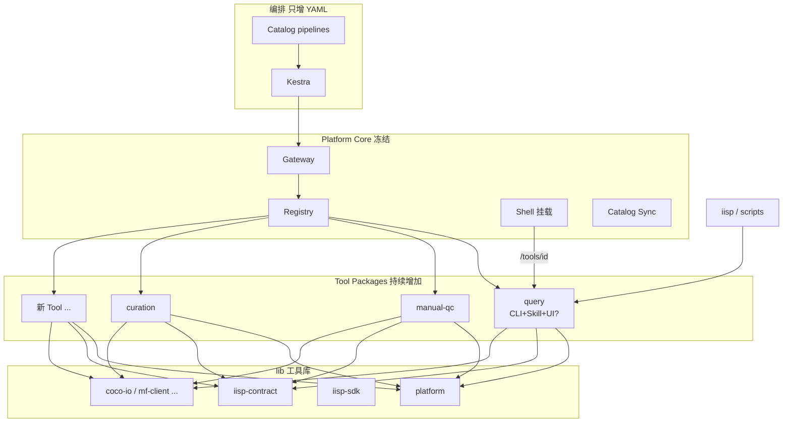

# IISP 工具插件模型（终态）

**版本**：v1.1  
**日期**：2026-06-09  
**状态**：定稿 — 平台 Core 冻结后 **(+ Tool)** / **(+ Pipeline)**  
**标准**：[`IISP_DESIGN_FINAL.md`](./IISP_DESIGN_FINAL.md) v2.2 · [`DOCS_INDEX.md`](./DOCS_INDEX.md)  
**终极目标**：平台 Core 冻结后，只做 **(+ Tool)** 与 **(+ Pipeline)**，各模块独立开发、独立发版、独立 UI。

**关联**：[`IISP_DESIGN_FINAL.md`](./IISP_DESIGN_FINAL.md) · [`CODING_STANDARDS.md`](./CODING_STANDARDS.md) · [`SKILL_PLATFORM.md`](./SKILL_PLATFORM.md) · [`SKILL_TO_TOOL.md`](./SKILL_TO_TOOL.md) · [`SECURITY.md`](./SECURITY.md)

---

## 1. 一句话

**每个能力 = 一个工具包（Tool Package）**，对外统一 **Tool Contract v1**；提供 **CLI + Skill +（可选）独立 UI +（可选）Blueprint HTTP** 四种入口，共享同一套 `service.py` 业务内核；通用逻辑沉入 **`lib/*` 工具库**；平台只负责注册、路由、挂载，不再为单个业务改 Core。

### 1.1 默认开发形态（Skill-first，L2）

**L2 扩展 Tool 默认路径**（L1 不参与）：

```text
skills/<id>/SKILL.md  (+ 可选 scripts/*.py)
        ↓  iisp skill pack（规划）/ init-from-skill（现有）
tools/<id>/           ← 自动生成 Manifest、CLI、invoke、默认 UI 描述
        ↓  validate → PR
Registry / 工具箱 / Pipeline
```

- **L2 作者**：维护 **Platform Skill v1**；UI 默认 **schema 表单**  
- **平台封装**：`iisp-skill-pack` / `iisp skill pack`  
- **专业兜底**：`iisp-tool-package`（custom UI / 复杂 service）  
- **编排**：**Kestra** `pipelines/kestra/`（见 [`TOOLBOX_ORCHESTRATION.md`](./TOOLBOX_ORCHESTRATION.md)）

---

## 2. 终态 vs 现状

| 维度 | 现状 | 终态 |
|------|------|------|
| 查询/质检/归档 | 绑在 `studio/` + 5050 路由 | `tools/<id>/` 或 `packages/<id>/` |
| 组合 | workflow_engine（迁移中） | Catalog `pipelines/kestra/` + **Kestra** |
| viz/unify | submodule，可独立端口 | **插件范例**（CLI+UI+挂载） |
| CLI | 部分 + `cli_adapter` | **每个 Tool 标配** |
| Skill | 少量 `skills/` | **每个 Tool 标配** `.cursor/skills` 或 `skills/<id>/` |
| 独立 UI | viz/unify 有 | 任意 Tool 可选 `ui/` 或 Blueprint |
| 底层复用 | `packages/platform` 雏形 | 分层 `lib/`（见 §5） |

---

## 3. 工具包标准结构（强制模板）

```text
tools/<tool_id>/                    # 或 packages/<tool_id>/（独立 git submodule）
├── tool.manifest.json              # 注册表唯一入口
├── README.md                       # 人类可读：用途、CLI 示例、独立运行
├── skills/
│   └── SKILL.md                    # Cursor Vibe 操作手册（或链到 repo skills/<id>/）
├── cli.py                          # stdin/stdout JSON（Tool Contract 同构）
├── invoke.py                       # Gateway inprocess 入口 → service
├── service.py                      # 纯业务，无 Flask
├── schemas/
│   ├── params.json
│   └── invoke-response.json
├── tests/
│   ├── test_service.py
│   ├── test_invoke.py
│   └── test_cli_golden.json        # CLI 金样例
├── ui/                             # 可选：嵌入 Shell 或独立 SPA
│   ├── routes.py                   # 注册 /tools/<id>/*
│   └── ...                         # 或 Vite 子应用 build → static/
├── blueprint/                      # 可选：独立 Flask/FastAPI 微服务
│   ├── app.py                      # 仅暴露 POST /invoke + 健康检查
│   └── Dockerfile
└── pyproject.toml                  # 可选：pip 可安装 iisp-tool-<id>
```

**一个 `service.py`，四个入口**：

```text
CLI stdin JSON  ──┐
HTTP /invoke  ──┼──► service.run(params, inputs) ──► JSON outputs
Gateway inprocess ┘
UI 按钮        ──► 调 platform api 或本地 blueprint
```

---

## 4. 四种运行形态

| 形态 | 适用 | Manifest `runtime` | 端口 |
|------|------|-------------------|------|
| **A. 内嵌 inprocess** | Edge 轻量、低延迟 | `inprocess` | 5050 Gateway |
| **B. CLI 子进程** | 脚本、cron、CI、隔离内存 | `cli` | 无（Gateway spawn） |
| **C. Blueprint HTTP** | 重依赖/GPU/独立团队 | `http` | 如 `:6020` |
| **D. 独立 UI 应用** | 复杂交互（viz 类） | `http` + `ui.mount` | 独立或 `/tools/id` |

### 4.1 CLI 契约（与 invoke 同构）

**stdin**（单行或整段 JSON）：

```json
{
  "run_id": "cli-local",
  "step_id": "main",
  "params": { "strategy_id": "daily_trawl" },
  "inputs": { "upstream": {} }
}
```

**stdout**（仅一行 JSON 对象）：

```json
{
  "status": "done",
  "outputs": { "task_id": "abc" },
  "artifacts": [{ "kind": "csv", "uri": "exports/abc/result.csv" }]
}
```

**退出码**：0 = done/skipped；非 0 = failed（stderr 人类可读）。

**调用示例**：

```bash
echo '{"params":{"strategy_id":"daily_trawl"}}' | python -m tools.query.cli
# 或
iisp tool run query --param strategy_id=daily_trawl   # 规划统一 CLI
```

现有 [`capabilities/adapters/cli_adapter.py`](../capabilities/adapters/cli_adapter.py) 已支持 Manifest 声明 CLI；终态每个 Tool 自带 `cli.py` 并纳入 `iisp tool validate`。

### 4.2 独立 Blueprint

```text
python tools/query/blueprint/app.py   # :6020
POST http://127.0.0.1:6020/v1/invoke  # 与 Gateway 相同 body
GET  /health
```

Gateway `runtime: http` + `base_url` 反向代理；Kestra 可直接打 Blueprint（不经过 5050）。

### 4.3 独立 UI

| 模式 | 说明 |
|------|------|
| **挂载** | Shell 路由 `/tools/<id>/*` → Tool 的 `ui/routes` 或静态 `ui/dist` |
| **外链** | 工具箱卡片「在新窗口打开」→ `:6010` 类独立端口 |
| **契约** | UI 只调 `/v1/tools/<id>/invoke` 或本 Blueprint，**不** import 其他 Tool |

UI 鉴权：继承 Shell Token / OIDC Cookie（见 [`SECURITY.md`](./SECURITY.md) S5）。

### 4.4 配套 Skill（每个 Tool 必配）

| 位置 | 用途 |
|------|------|
| `tools/<id>/skills/SKILL.md` | 开发、参数说明、CLI 示例、常见错误 |
| 或 `skills/<id>/SKILL.md` | 主仓索引，Catalog `skills-index.yaml` 登记 |

Skill 必含：**何时使用、params、outputs、CLI 一行示例、禁止事项**。  
Scaffold：`iisp tool init-from-skill` 生成骨架。

---

## 5. 底层工具库分层（通用能力抽出）

**原则**：业务 Tool 不互相依赖；只依赖 **`lib/*` 公开包**。

```text
lib/
├── platform/           # 已有方向：db、img_path、sn_query、timezone
├── iisp-contract/      # ToolResult、RunContext、status 枚举、JSON Schema 常量
├── iisp-cli/           # CLI stdin/stdout 框架、exit code 映射
├── iisp-sdk/           # 远程 invoke 客户端（Kestra 脚本、本地调试）
├── coco-io/            # 规划：COCO 读写、URI 规范（多 Tool 共用）
├── mf-client/          # 规划：Magic-Fox API 薄客户端
└── metrics/            # 规划：轻量打点接口
```

| 库 | 谁用 | 禁止 |
|----|------|------|
| `platform` | 所有连 DB/路径的 Tool | 写业务规则 |
| `iisp-contract` | invoke/cli/测试 | 依赖 Flask |
| `iisp-sdk` | 外部脚本、n8n | 依赖 studio |
| 领域 lib（coco-io） | curation、export 类 | import 具体 Tool |

**升格规则**：第二处 Tool 复制同一段代码 → 抽 `lib/` PR，而非 copy-paste。

---

## 6. 注册、发现与安装

### 6.1 发现顺序（Registry）

```text
1. tools/*/tool.manifest.json
2. packages/*/tool.manifest.json（submodule）
3. ~/.iisp/tools/*（用户安装）
4. catalog 声明的 remote blueprint URL（只注册不打包）
```

### 6.2 安装形态（规划）

| 形态 | 场景 |
|------|------|
| **内置** | 主仓 `tools/` |
| **git submodule** | `packages/<name>` 独立仓库 |
| **`.iisp-tool` tar** | 内网分发；含 manifest + wheel |
| **`pip install iisp-tool-xxx`** | 开源/私服 PyPI |

### 6.3 Manifest 扩展字段（终态）

```json
{
  "id": "query",
  "contract_version": "v1",
  "runtime": "inprocess",
  "cli": { "module": "tools.query.cli:main" },
  "http": { "base_url": "http://127.0.0.1:6020" },
  "ui": { "mount": "/tools/query", "standalone_port": null },
  "lib_deps": ["platform", "iisp-contract"],
  "min_platform_version": "2.0.0",
  "timeout_sec": 600,
  "resources": { "memory_mb_hint": 256 }
}
```

### 6.4 版本与兼容

- Tool：`semver`，Catalog **`tool-pins.yaml`** pin 到 minor  
- Platform：大版本极少变；`contract_version: v1` 长期稳定  
- 破坏性变更 → 新 `tool_id` 或 `contract_version: v2`，**不** silent 改 outputs  

---

## 7. 平台 Core 冻结边界（此后不改）

| Core 只做 | Core 永不做 |
|-----------|-------------|
| Gateway `/v1/tools/{id}/invoke` | 新业务步骤 |
| Registry 扫描/安装 | 业务 if-else 组合 |
| Catalog sync | 策略/Flow 权威写 DB |
| Shell 壳 + 工具箱列表 | 每个 Tool 的表单逻辑 |
| `lib/platform` 维护 | 领域算法 |
| MCP list/validate | 运行时 LLM 编排 |
| UI 挂载协议 `/tools/*` | 替 Tool 写 UI |

**新功能 = 新 Tool 包 + Skill + Pipeline PR**。

---

## 8. 工作流如何只增不改

```text
新场景：
  1. 已有 Tool？→ 只写 Pipeline YAML
  2. 缺 Tool？→ tools/new-id/ + validate + PR
  3. 组合？→ iisp-catalog/pipelines/ + validate + PR
  4. 定时？→ cron 或 Kestra，不改 Python
```

平台发版频率 → **低**（安全、Gateway、lib）；Tool 发版 → **高**（各自 repo/tag）。

---

## 9. 还需一次性考虑清的议题（Checklist）

以下是为「不再大迭代」必须提前定规的；细则见 [`PLATFORM_RISK_REGISTER.md`](./PLATFORM_RISK_REGISTER.md)、[`SECURITY.md`](./SECURITY.md)。

### 9.1 工具生命周期

| 议题 | 定规 |
|------|------|
| 废弃 | Manifest `deprecated: true` + 替代 `id` + Catalog 迁移期 |
| 数据库表 | 前缀 `tool_<id>_` 或 schema，Tool 自己 migration |
| 配置 | Tool 私有 config 键 `tools.query.*`，不进全局杂项 |
| 文档 | 每 Tool README + Skill；工具箱卡片链 README |

### 9.2 质量门禁（每个 Tool PR）

- [ ] `iisp tool validate`  
- [ ] `test_invoke` + CLI golden JSON  
- [ ] Skill 已更新  
- [ ] 无 import 其他 Tool  
- [ ] `skills-index.yaml` / Catalog（若新场景）  
- [ ] OpenAPI fragment 生成（从 manifest）  

### 9.3 安全

| 议题 | 定规 |
|------|------|
| CLI 白名单 | 扩展 `cli_adapter` 允许 `iisp-tool-*` |
| Blueprint | 独立 Token scope `invoke-only` |
| UI iframe | postMessage 源校验 |
| 供应链 | `.iisp-tool` 哈希 + 可选签名 |

### 9.4 可观测

- 每 Tool 自动带 log 字段：`tool_id`, `run_id`, `step_id`  
- Metrics：`iisp_invoke_duration_seconds{tool_id}`  
- 工具箱展示：最近失败次数（读 audit 表，S4 后）  

### 9.5 开发体验（Vibe Coding）

| 议题 | 定规 |
|------|------|
| Scaffold | `iisp tool init` 生成 §3 全套含 Skill+CLI+tests |
| 本地跑 | `iisp tool run <id>` = CLI；`iisp tool serve <id>` = Blueprint |
| 调试 | 同一 JSON 文件喂 CLI / POST invoke  
| Cursor | 每 Tool 目录 `.cursor/rules` 可选覆盖 |

### 9.6 数据与文件

- 跨 Tool 只传 **ID + URI**  
- artifact 根目录统一 `exports/`、`uploads/` 规范  
- Tool 私有缓存 `exports/.tool_<id>/`  

### 9.7 编排与 Tool 边界

- Pipeline **不得**假设 Tool 内部实现，只认 Manifest `outputs`  
- 人工步骤 Tool 返回 `waiting_human` + `resume.ui_url`  
- 长任务 → `accepted` + `job_id`，Worker 与 Tool 同包或共用 RQ  

### 9.8 前端 Shell

- 工具箱：卡片展示 runtime 标签（CLI / HTTP / 内置）、复制 CLI 命令  
- 新 Tool UI：**默认无 UI** 也可上线（仅 invoke + CLI）  
- 领域页迁移：旧 React 页逐步改为 `ui/` 子应用，**行为**仍走 invoke  

### 9.9 组织与仓库

| 类型 | 仓库 |
|------|------|
| Platform Core | `DetForge-Studio` 主仓 |
| 通用 lib | 主仓 `lib/*` 或独立 `iisp-lib` |
| 业务 Tool | `packages/<tool>` submodule 或 `tools/<tool>` |
| Flow/策略 | `iisp-catalog` |
| 客户定制 Tool | 客户 fork catalog + 私有 tools 仓 |

CODEOWNERS：`tools/*` 业务负责人；`core/` 平台组。

### 9.10 仍依赖 Platform 一次交付的能力（非 Tool 插件）

这些属于 **Core 或 Hub 基础设施**，做完后不再动：

- Gateway + OpenAPI + 鉴权 S1–S5  
- Catalog Provider + sync  
- Registry + `.iisp-tool` 安装器  
- Shell 四域 IA + 工作台  
- Kestra/cron 集成模板  
- `iisp tool` / `iisp workflow` CLI  
- MCP list/validate  

---

## 10. 架构图（插件终态）



---

## 11. 迁移路径（studio → tools）

| 阶段 | 内容 |
|------|------|
| **T0** | 定本文 + scaffold + query 样板 Tool 包 |
| **T1** | manual-qc、curation 迁入 `tools/`；legacy 路由调 invoke |
| **T2** | 删 workflow_engine；Studio 页变壳 |
| **T3** | viz/unify 对齐 Manifest（已是 submodule 范例） |
| **T4** | `.iisp-tool` 安装；工具箱一键复制 CLI |

---

## 12. 成功标准（「不再大迭代」）

1. 上新业务 **零** Platform Core PR（除 Registry 扫描路径配置）  
2. 每个 Tool **自带 CLI + Skill + validate**，可脱离 5050 本地跑通  
3. 组合只改 **Catalog YAML**  
4. `contract_version v1` **3 年不变**  
5. 新人按 Skill + scaffold **1 天** 交付首个 Tool  

---

## 13. 修订记录

| 版本 | 日期 | 说明 |
|------|------|------|
| v1.1 | 2026-06-09 | L2 Skill-first、Kestra 编排、DOCS_INDEX |
| v1.0 | 2026-06-09 | 工具包标准、四形态、lib 分层 |
